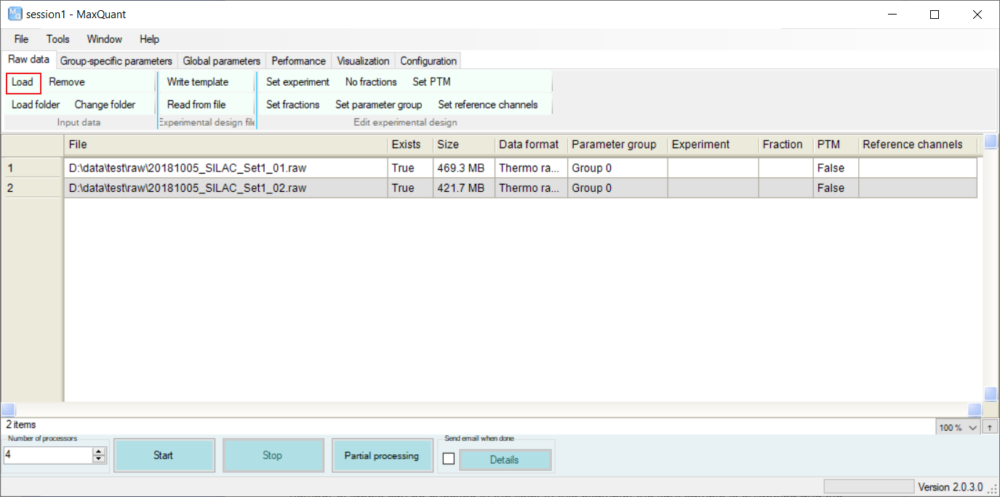
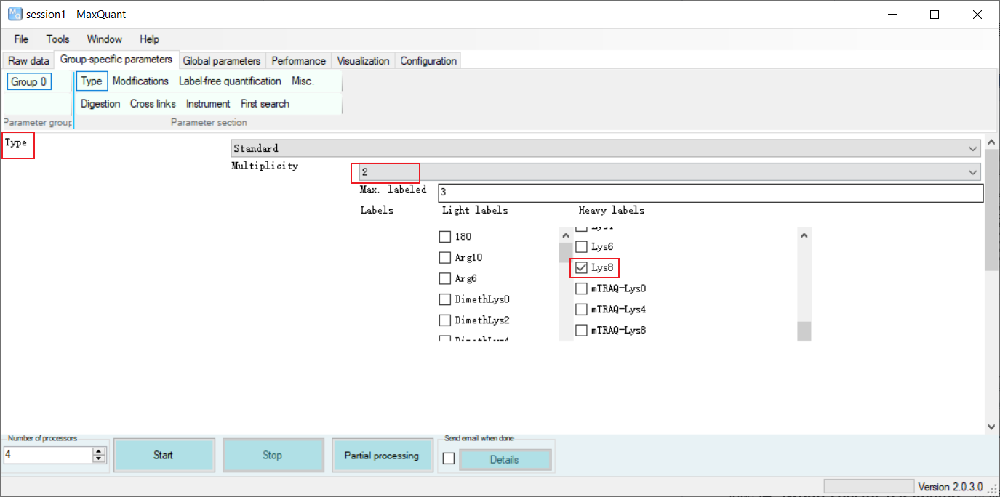

# MaxQuant 快速入门

- [MaxQuant 快速入门](#maxquant-快速入门)
  - [简介](#简介)
  - [参数设置](#参数设置)
    - [设置 Raw data](#设置-raw-data)
    - [设置标记](#设置标记)
    - [设置酶切](#设置酶切)
  - [参考](#参考)

2021-11-08, 10:06
@email 
***

## 简介

MaxQuant 有相当多的参数，不过在大多数应用场景，大多参数使用标准值就足够了，只需要调整少数参数。而且对界面中的每个参数，将鼠标悬停在参数字符串上能够看到提示信息，帮助了解参数的含义。

必须要设置的参数包括：

- Raw 文件位置；
- 标记；
- 酶切信息。

在 90% 的情况下，设置这些信息就足够了，余下参数使用默认值即可。

> 以下截图使用的 MaxQuant 2.0.3.0。

## 参数设置

### 设置 Raw data

在 GUI 顶部有 6 个选项卡，第一个是 "Raw files"：

- 选择该选项卡，然后点击 **"Load"** 按钮打开文件选择对话框，可以选择一个或多个 raw 数据文件；
- 点击 **"Load folder"** 可以一次选择文件夹中的所哟 raw 数据文件。

下图中载入了两个 raw 数据文件：

### 设置标记

GUI 中的第二个选项卡为 "**Group-specific parameters**"，可以在这里指定标记。

- "Type" 一般为 "Standard"；
- "Multiplicity"
  - 无标定量为 1；
  - 轻、重标定量为 2；
  - 轻、中、重标定量为 3；

在列表中可以指定任意数量的标记。在下图中，轻标样本无标记，重标样本为 Arg10 和 Lys8.

### 设置酶切

同样在 "**Group-specific parameters**" 选项卡的 

## 参考

- http://coxdocs.org/doku.php?id=maxquant:start
