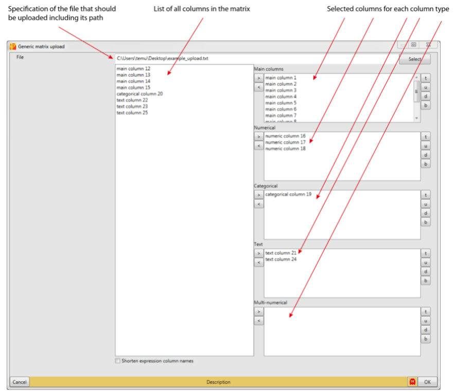
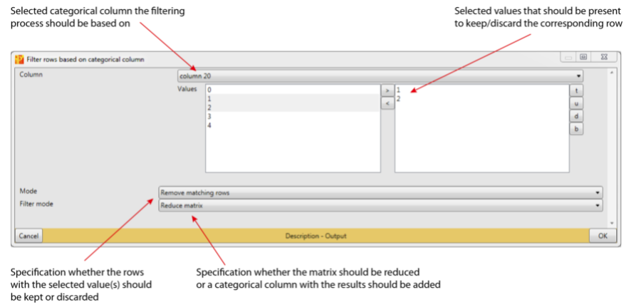

# Perseus

- [Perseus](#perseus)
  - [使用流程](#使用流程)
    - [载入数据](#载入数据)
  - [过滤](#过滤)
    - [基于 categorical column 过滤 row](#基于-categorical-column-过滤-row)
    - [Filter rows based on valid values](#filter-rows-based-on-valid-values)
  - [差异表达分析](#差异表达分析)
  - [Categorical annnotation rows](#categorical-annnotation-rows)

2021-11-15, 12:18
***

## 使用流程

### 载入数据

载入数据步骤：

1. 在 "Matrix" 页面点击 "Generic matrix upload"；
2. 在弹出的页面选择需要载入的文件；

Perseus 要求 tab-delimited 文本文件，第一行为标题。

3. 数据分类

在 Perseus 中可以导入不同的表达数据。常见的表达数据有 normalized intensities（如 LFQ 强度，iBAQ）以及轻、中、重标样本之间的比例等。

   - 将左侧的 expression columns 移到 "Main" 窗口 ；
   - 将数值 column 移到 "Numerical" 窗口；
   - 将包含识别符的 column（如 protein IDs）移到 "Text" 窗口。
   - 店家确定

如下图所示：

左侧面板中包含需要载入的 columns，基于分析需求将其转到右侧对应的类型中。

## 过滤

### 基于 categorical column 过滤 row

对选定的 categorical column，根据指定值保留或删除包含特定分类的 row。

在该步骤后，创建包含指定值得新的 matrix。

如图所示：

**Column** 选择用于过滤的 categorical column，默认为 matrix 的第一个 categoricall column。

**Values** 用于选择值，包含该值得 row 被保留或删除。

**Mode** 指定模式：

- "Remove matching rows"，移除包含指定值的 row;
- "Keep matching rows"，保留包含指定值得 row。

**Filter mode** 指定对矩阵的操作方式：

- "Reduce matrix"，默认，在输入矩阵上操作；
- "Add categorical column"，添加新的 column，值为 "Keep" 或 "Discard"；
- "Split Matrix"，根据匹配将输入数据分为两个数据矩阵。

### Filter rows based on valid values

对 expression matrix 的 rows 进行过滤，

## 差异表达分析

蛋白的差异表达分析取决于比较条件的数量、潜在分布特性和生物学重复。例如，单条件的重复样本选择 One-sample tests，两个条件的用 Two-sample tet，多 conditions 用 Multiple-sample tests。

## Categorical annnotation rows

管理 categorical annotation rows。一个重要的应用是定义一个分组用于后续的 t-test 或 ANOVA。

输出包含 categorical annotation 的 matrix。
