# SILAC 数据演示

- [SILAC 数据演示](#silac-数据演示)
  - [数据集](#数据集)
  - [准备数据](#准备数据)
    - [载入数据](#载入数据)
    - [过滤](#过滤)
    - [Ratio transformation](#ratio-transformation)
    - [Renaming columns](#renaming-columns)
  - [添加注释](#添加注释)
  - [Scatter plot](#scatter-plot)
  - [Density scatter plot](#density-scatter-plot)
  - [Grouping of samples](#grouping-of-samples)
  - [参考](#参考)

## 数据集

该数据集包含三个乳腺癌细胞系，三次测量重复。每个样本分为 12 个馏分。12x3x3，对应 108 个 LC-MS 分析。样本以 SILAC 标记，轻标为 Lys-0/Arg-0，重标为 Lys-8/Arg-10。

## 准备数据

### 载入数据

载入 "combined/txt" 目录下的 "proteinGroups.txt" 文件。使用 "Load -> Generic matrix upload" 载入数据，如下图所示：

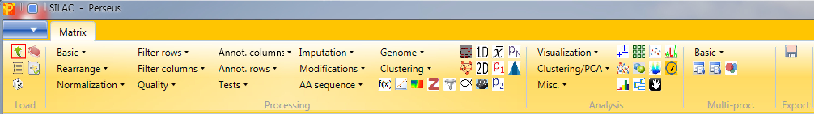

确保选择了 9 个 "Ratio H/L Normalized ..." columns 作为 main columns。

> 每次操作都会生成一个新的 matrix，可以使用 "Export -> Generic matrix export" 导出矩阵，并使用 "Load -> Generic matrix upload" 重新导入。

### 过滤

1. 载入数据后，我们首先去掉 reverse 蛋白，选择 "Processing -> Filter rows -> Filter rows based on categorical column"：

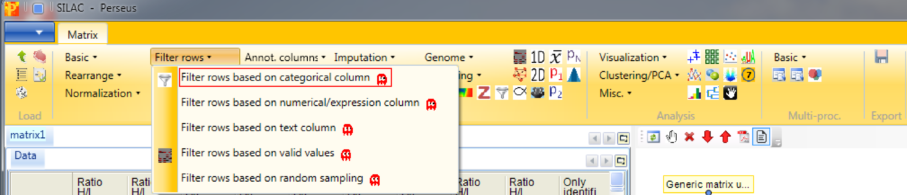

反库蛋白的 "Reverse" 值为 "+"，移除反库蛋白后，所有的 "Reverse" column 值为空：

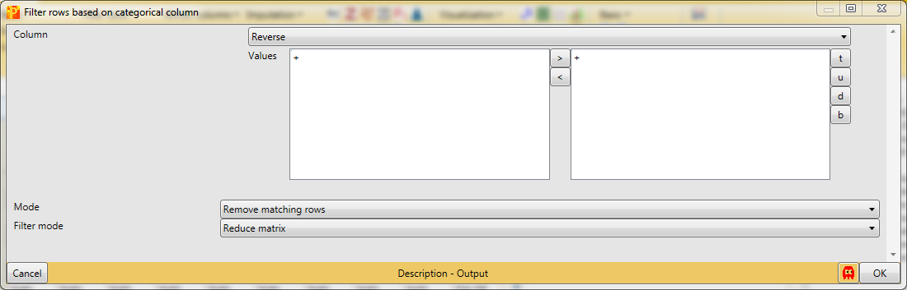

2. 然后去掉只鉴定到一次的蛋白

"Only identified by site" 列有两个值：TRUE 和 FALSE。去掉值为 TRUE 的行。

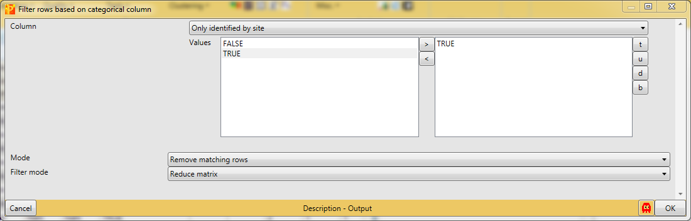

> V1.6.15.0 "Only identified by site" 也是用 "+" 标识，移除值为 "+" 的行。

3. 接下来去除 9 个强度中有效值小于 6 个的（不为 NaN）

处理方法 "Processing -> Filter rows -> Filter rows based on valid values"。

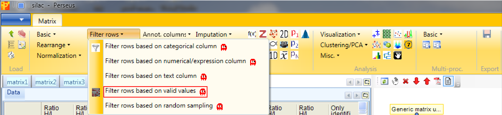

每行有效值的比例因研究而异。在部分研究中，仅有几个重复中包含有效值可能是重要发现，因此不应该丢弃。该 filter 可以单独应用于不同 column。下面我们只想确保一行中 9 个强度中有至少有 6 个有效值：

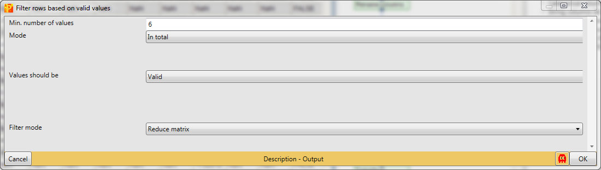

### Ratio transformation

由于真实样品在轻标 SILAC 通道中，参照样品在重标通道中，因此我们转换比例："Processing -> Basic -> Transform"。

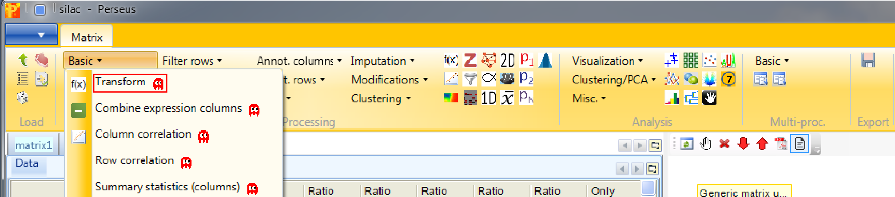

将公式 "1/x" 输入到 "Transformation" 字段中即可。

然后对 ratio 值取 log: "Processing -> Basic -> Transform"：

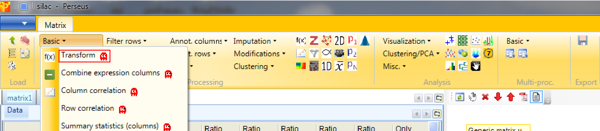

此时应该使用 "log2(x)" 函数，如下：

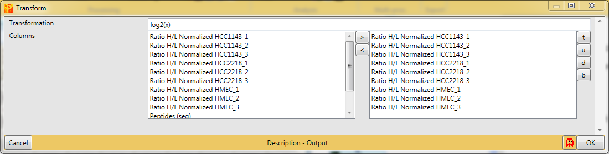

### Renaming columns

main columns 的名称 "Ratio H/L Normalized..." 有点长，因此对其进行重命名:"Processing -> Rearrange -> Rename columns [Reg. ex.]"

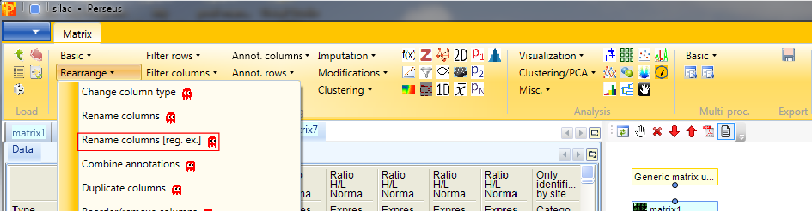

可以使用正则表达式 "Ratio H/L Normalized(.*)" 删除名称里的重复部分。该方法会生成一个 matrix，此时 ratio 的名称是 cell line 和重复的组合。

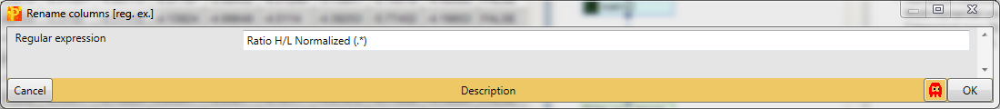

也可以手动重名 "Processing -> Rearrange -> Rename columns"

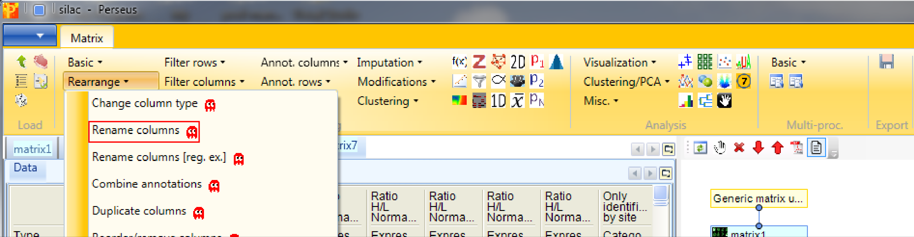

可以在对应位置输入名称；

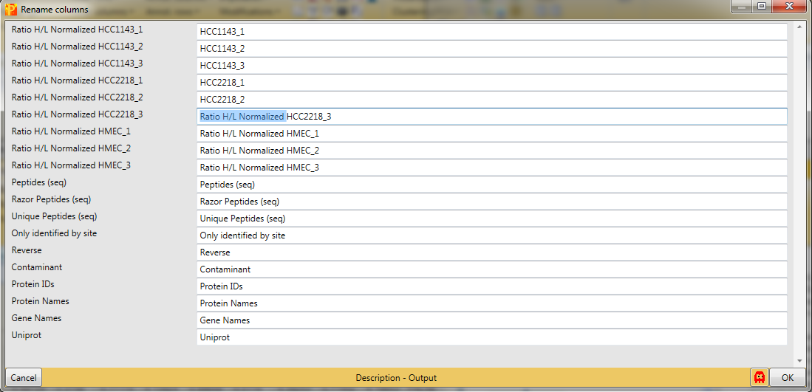

## 添加注释

使用 "Processing -> Annot.columns -> Add annotation" 添加注释。可添加 "Perseus/conf/annotations/" 目录下：

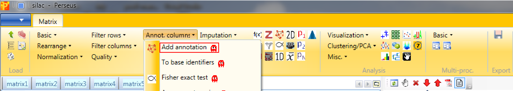

获得最新注释的标准方式，包括 GO、KEGG、Pfam、GSEA、Keywords、CORUM以及在 UniProt 中发现的其它属于，可以直接在 dropbox 下载 mainPerseusAnnot.txt.gz 文件。按如下 4 步：

1. 点击 Tools 下的 "Annotation download"

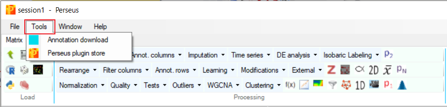

2. 此时会弹出下载链接

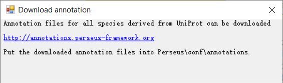

3. 下载 mainPerseusAnnot.txt.gz 文件
4. 将文件放到 "Peerseus/conf/annotations/" 文件夹

## Scatter plot

使用 'Analysis -> Visualization -> Scatter plot' 绘制散点图：

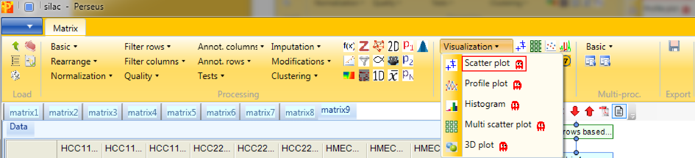

然后我们把不同重复结果画在一起。为此将 "Matrix access" 设置为 "Columns"：

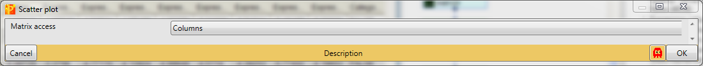

确保将同一细胞系的结果画在一起。

## Density scatter plot

## Grouping of samples

现在我们需要找出哪些蛋白质在细胞系之间差异表达。为此，我们必须对重复实验进行分组。Processing -> Annot.rows -> Categorical annotation rows:

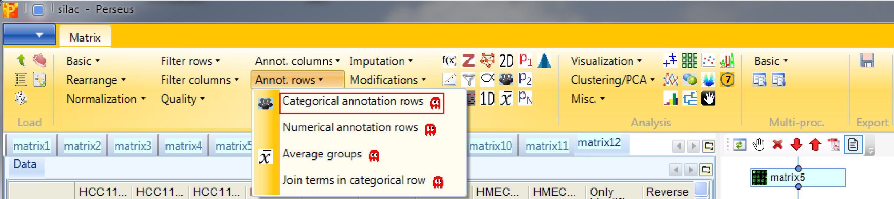

根据重复次数定义 3 组。

## 参考

- http://www.coxdocs.org/doku.php?id=perseus:user:use_cases:silac