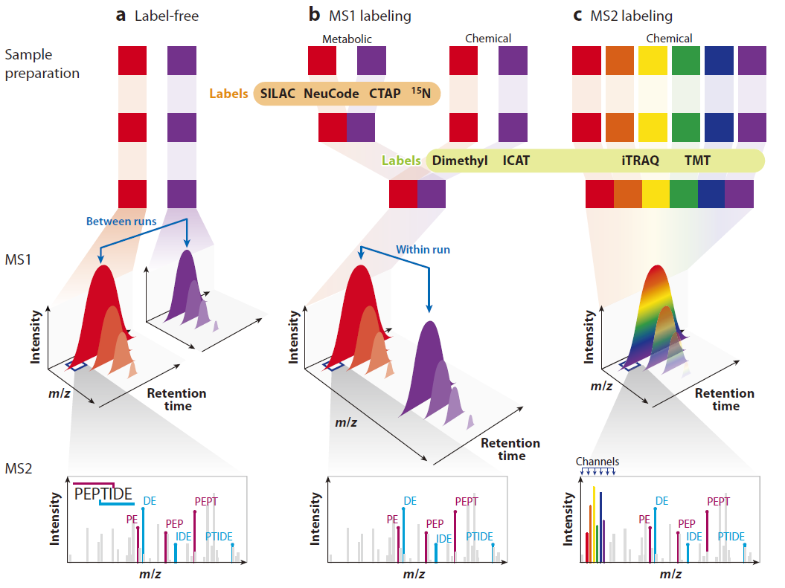

# 定量

- [定量](#定量)
  - [相对定量](#相对定量)
  - [无标定量](#无标定量)

## 相对定量

相对定量方法如下：

> CTAP, cell type-specific labeling using amino acid precursors; ICAT, isotope-coded affinity tags; iTRAQ, isobaric tags for relative and absolute quantification; LC, liquid chromatography; MS1, first-stage MS; MS2, second-stage MS; SILAC, stable isotope labeling with amino acid in cell culture; TMT, tandem mass tags.

相对定量可以通过吴彪定量、代谢标记或化学标记方法实现。从计算角度看，MS1 标记（b）和 MS2（等重）标记（c）的区分更重要。

无标定量（a）通过从不同 LC-MS run 中提取的肽段离子色谱图实现。

在基于 MS1 标记定量中（如 SILAC、dimethyl, NeuCode），不同样本在 MS1 谱图中以差异标记的同位素峰出现。

在基于 MS2 的等重标记中（如 iTRAQ, TMT），定向信号在 MS2 谱图中低质量范围以报告例子的形式出现。

## 无标定量

无标定量优势：

- 动态范围宽；
- 对样品量无限制；
- 化学性质相同的肽段也能比对。