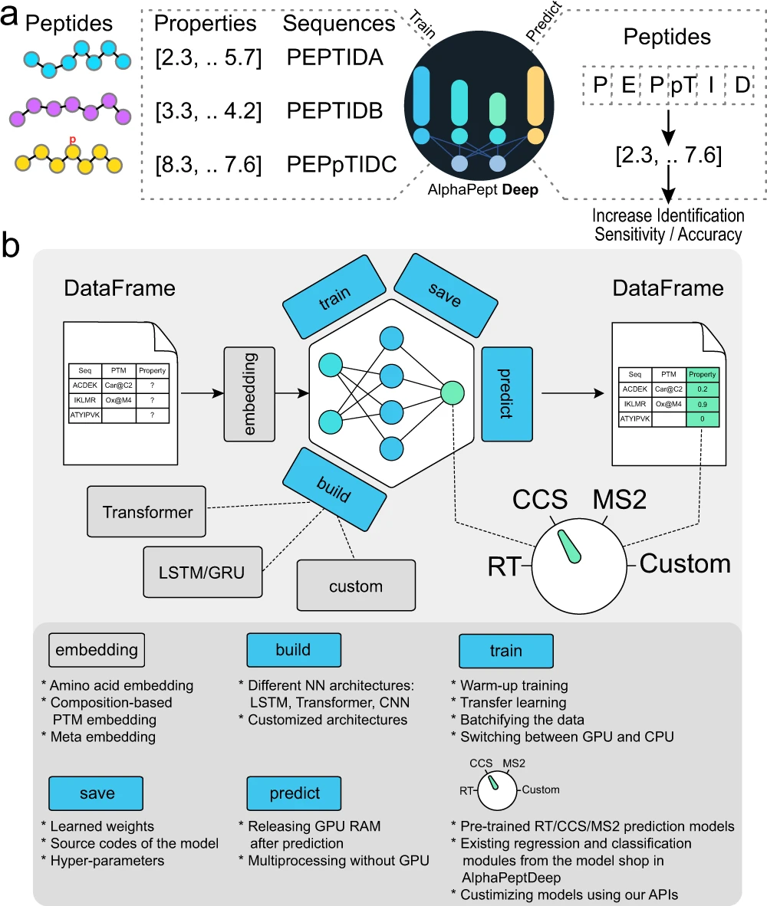
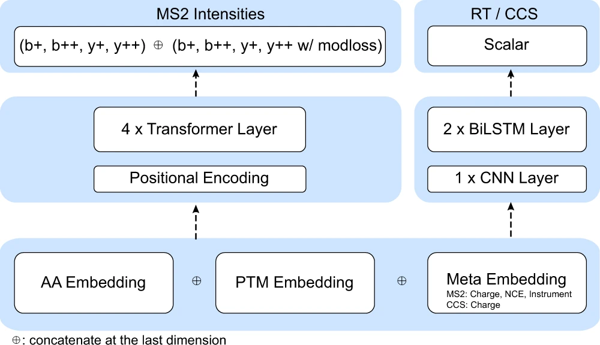
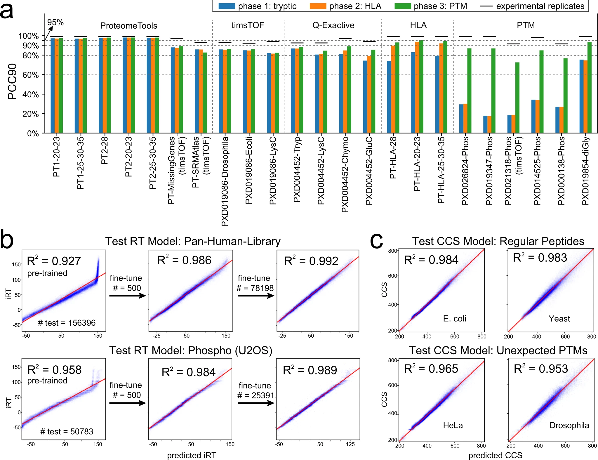
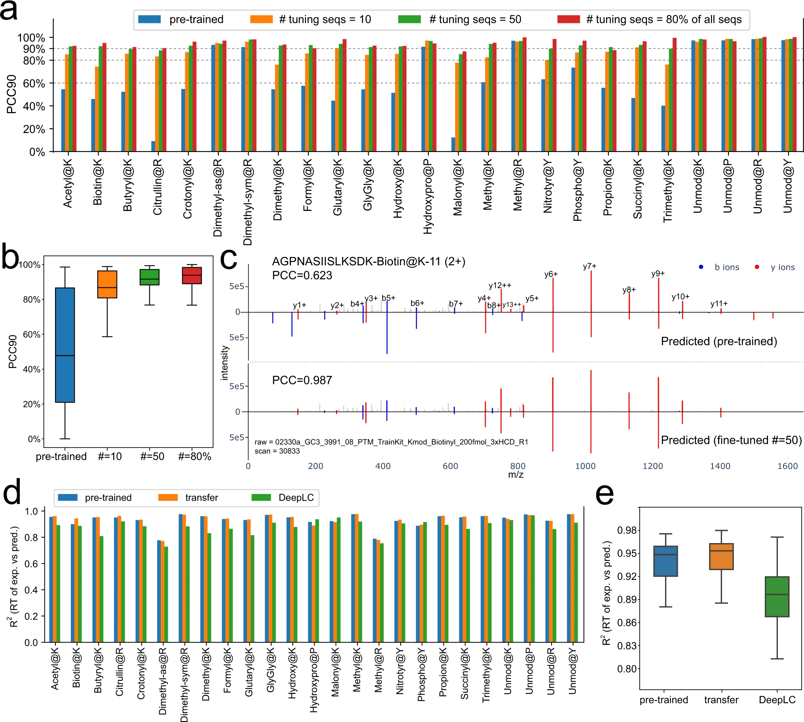
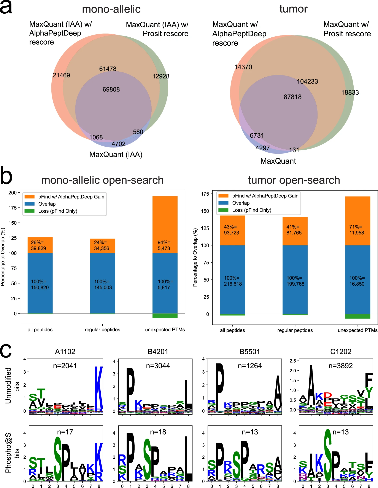
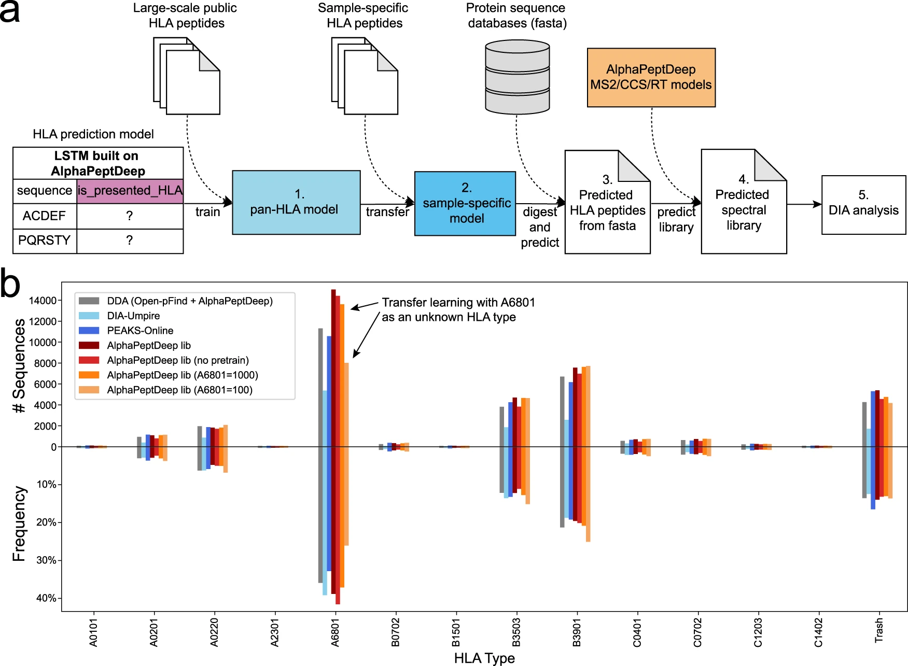
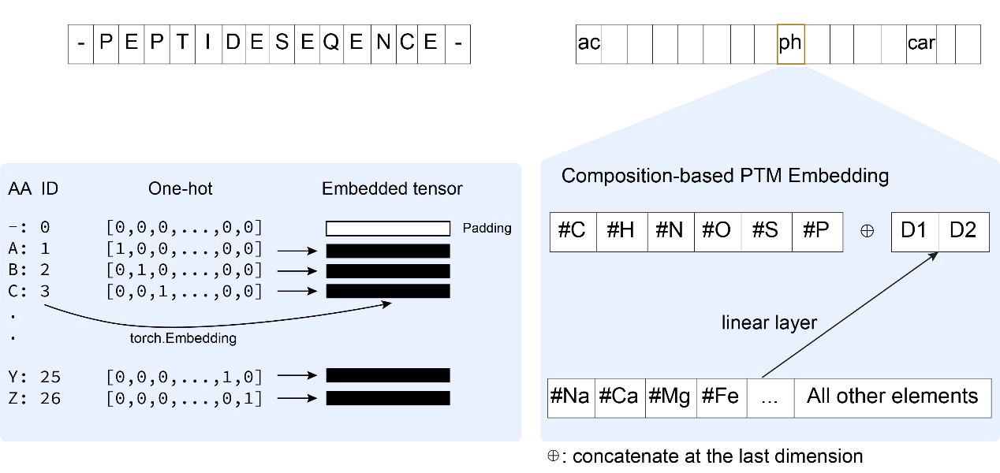
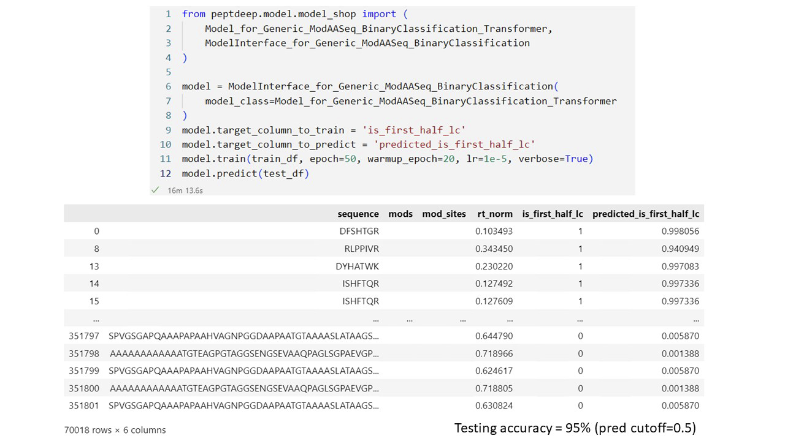
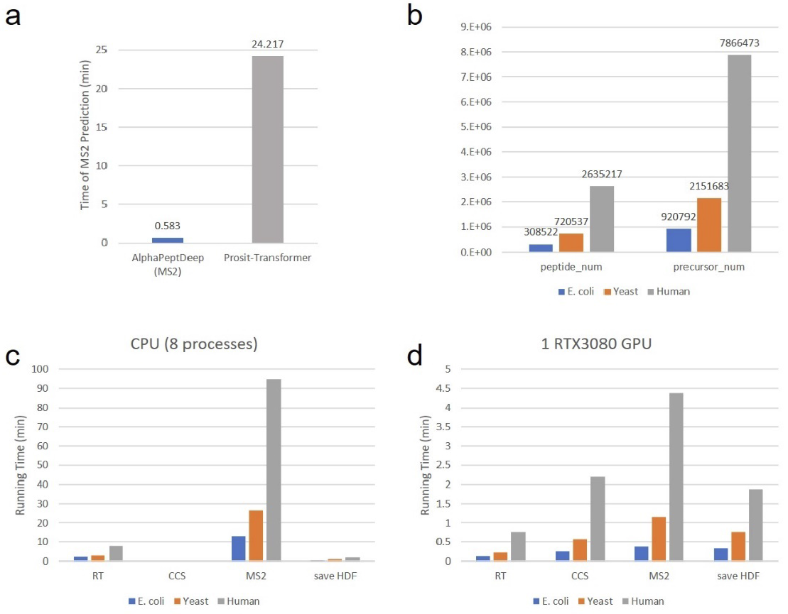

# AlphaPeptDeep

- [AlphaPeptDeep](#alphapeptdeep)
  - [摘要](#摘要)
  - [简介](#简介)
  - [结果](#结果)
    - [AlphaPeptDeep 概述和模型训练](#alphapeptdeep-概述和模型训练)
    - [MS2 预测性能](#ms2-预测性能)
    - [RT 和 CCS 预测性能](#rt-和-ccs-预测性能)
    - [使用迁移学习的 21 个PTMs预测性能](#使用迁移学习的-21-个ptms预测性能)
    - [提高 HLA 肽段的 DDA 鉴定](#提高-hla-肽段的-dda-鉴定)
    - [构建 HLA DIA 搜索的 HLA 预测模型](#构建-hla-dia-搜索的-hla-预测模型)
  - [讨论](#讨论)
  - [方法](#方法)
    - [Infrastructure 开发](#infrastructure-开发)
    - [氨基酸嵌入](#氨基酸嵌入)
    - [PTM 嵌入](#ptm-嵌入)
    - [MS2 模型](#ms2-模型)
    - [RT 模型](#rt-模型)
    - [CCS 模型](#ccs-模型)
    - [Rescoring](#rescoring)
    - [HLA 预测模型](#hla-预测模型)
    - [Open-search for Orbitrap and dda-PASEF data](#open-search-for-orbitrap-and-dda-pasef-data)
    - [谱图库](#谱图库)
  - [补充](#补充)
  - [参考](#参考)

***

## 摘要

## 简介

## 结果

### AlphaPeptDeep 概述和模型训练

AlphaPeptDeep 框架的目标是能够**轻松构建和训练深度学习模型**，预测依赖于肽段序列的属性。

> **Fig.1 AlphaPeptDeep 框架概述**。**a.** 用氨基酸序列编码肽段属性，在 AlphaPeptDeep 中用来训练网络（左）。训练好的模型可提高肽段鉴定灵敏度和准确度。**b.** AlphaPeptDeep 框架读取并嵌入肽段序列。其中 Meta embedding 指元数据嵌入，包括母离子价态、碰撞能量，仪器类型和其它非序列输入。表盘表示可预测不同的性质（RT，CCS，MS2 强度），Custom 指其它肽段属性。底部列出了 AlphaPeptDeep 框架更详细的功能。

第一个难点是嵌入，即将氨基酸序列和 PTM 映射到张量空间。

- 氨基酸，使用长为 27 的 one-hot 编码
- PTM，使用 C, H, N, O, S, P 原子数构成 6D 向量，其它原子使用线性层映射到 2D 向量，最后用 8D 向量表示 PTM。

对构建模型，AlphaPeptDeep 提供了的 API，支持常见的 LSTM、CNN 和 Transformer 等。

对训练和迁移学习，AlphaPeptDeep 提供了通用的训练接口 `model.train()`，对训练后模型的保存，提供了 `model.save()` 方法。AlphaPeptDeep 会同时保存 NN 架构的源码和超参数。

AlphaPeptDeep 在 model shop 模块中提供了多个基于 transformer 和 LSTM 的模型模板。为了演示如何使用 AlphaPeptDeep，建立了一个分类器来预测肽段在 LC 梯度的前半部分还是后半部分出来，训练花了 ~ 16 min，采用标准 HeLa 数据集接近 350K PSMs，模型精度达到 95%（SFig.2）。

> **Fig.2** MS2 模型包含 4 个 transformeer 层，RT/CCS 模型由一个 CNN 层与两个

### MS2 预测性能

> **Fig.3 MS2/RT/CCS 模型性能.** (a) 

### RT 和 CCS 预测性能

### 使用迁移学习的 21 个PTMs预测性能

> Fig.4

### 提高 HLA 肽段的 DDA 鉴定

> Fig.5

> Fig.6

### 构建 HLA DIA 搜索的 HLA 预测模型

## 讨论

## 方法

### Infrastructure 开发

为了开发 AlphaPeptDeep，构建了 [AlphaBase](https://github.com/MannLabs/alphabase) 基础库，包含蛋白、肽段、PTMs 和谱图库的许多必要功能。AlphaBase 使用 pandas DataFrame 作为基础数据结构，AlphaPeptDeep 使用 AlphaBase DataFrame 作为输入构建模型。氨基酸和 PTM 嵌入直接使用肽段 DataFrame 的 'sequence', 'mods' 和 'mod_sites' columns 执行。

AlphaBase 使用 UniMod 修饰名称表示修饰，并用 @ 表示修饰的氨基酸，例如 Oxidation@M, Acetyl@Protein N-term 等。提供导入 DDA 和 DIA 检索结果，如 AlphaPept, MaxQuant, DIA-NN, Spectronaut 等，并将常见的修饰名称（如 oxidation, acetylation, carbamidomethylation, phosphorylation, di-gly）转换为 AlphaBase 格式。还可以提供 modification dict，告诉 AlphaBase 如何转换其它修饰。由于 pFind 已经使用 UniMod 名称，因此 AlphaBase 支持所有 pFind 修饰，所以解析 pFind 的 open search 结果很简单。

### 氨基酸嵌入

肽段序列的每个氨基酸被转换成整数，例如用 1 表示 'A'，2 代表 'B',..., 26 代表 'Z'。0 用作 N-端和 C-端的 padding。因此，用 27 个整数表示氨基酸整数，然后用 one-hot 编码将整数映射为 27-D 向量。再用线性层将这些向量映射为 N 维嵌入向量（SFig.1）。 为此，使用 `torch.Embedding` 更高效灵活，且能支持更多字母，如所有 128 ASCII 字符。

### PTM 嵌入

对每个 PTM，使用 6D 嵌入向量表示 C,H,N,O,S,P 原子。PTM 的其它原子使用 FC layer 嵌入到 2D 向量。将 6D 和 2D 向量拼接成 8D 向量来表示 PTM（SFig.1）。

### MS2 模型

MS2 模型由嵌入层，位置编码层，4 个 transformer 层以及 2 个 FC 层组成。嵌入层除了包含氨基酸序列和修饰，还包含其它元数据，如电荷、NCE 和仪器类型。所有这些嵌入向量拼接在一起连接到下一层。

增加了额外的 transformer 层来预测 'modloss'，即 PTM 中性丢失的强度，如磷酸的 -98 Da。将 `mask_modloss` 设置为 `True` 可以关闭 modloss layer。输出层大小为 $(n-1)\times 8$，其中 $n$ 表示肽段长度，8 表示 8 种碎片离子类型：b+, b++, y+, y++, b_modloss+, b_modloss++, y_modloss+, y_modlosss++。当设置 `mask_modloss=True`，禁用 modloss 层，预测的 modloss 强度始终为 0。transformer 的 hidden layer 大小为 256.模型总参数量为 3,988,974。

训练集和测试集中所有匹配的 b/y 离子强度除以谱图匹配的最高强度来归一化。MS2 模型用归一化强度进行训练。对预测，负值被裁剪为 0，因此预测值在 0 到 1 之间。

在训练第一阶段，只使用训练集中的 tryptic 肽段。训练参数：epoch=100, warmup epoch=20, learning rate (lr)=1e–5, dropout=0.1。

在训练第二阶段，加入 HLA 肽段，参数为：epoch=20, warmup epoch=5, lr=1e–5, dropout=0.1, mini-batch size=256。

在训练第三阶段，加入磷酸化和泛素化肽段，只考虑定位概率 >0.75 的磷酸化位点。训练参数：epoch=20, warmup epoch=5, lr=1e–5, dropout=0.1, mini-batch size=256。

对 21 个 PTM 的迁移学习，参数为：epoch=10, warmup epoch=5, lr=1e–5, dropout=0.1, mini-batch size depends on the peptide length。

所有训练都使用 L1 loss。使用 HuggingFace 中实现的 `cosine schedule with warmup` 方法对这些模型及下面所有模型进行 warmup 训练。

对 Thermo Orbitrap 仪器，鉴定 PSM 的碎片强度直接而从 raw 数据提取。为实现该功能，我们使用集成在 AlphaPept 中的 Thermo’s RawFileReader API 导入  centroided MS2 谱图，因此提取的强度可以在不同搜索引擎重现。对 dda-PASEF 数据，b/y 离子强度直接从 MaxQuant 结果 msms.txt 文件提取。不同搜索引擎对 dda-PASEF 的 centroiding 算法可能不通过，导致碎片强度不同，因此对不同软件分析的 dda-PASEF 数据，强烈建议进行微调。

使用 DataFrame 保存预测的强度。column 为碎片类型（如 'b_z1', "y_z2"），rows 对应不同碎片位置。'frag_start_idx' 和 'frag_end_idx' 指示肽段的位置。该 DataFrame 只在预测前为所有肽段创建一次。在预测时，肽段的预测值放在 'frag_start_idx' 和 'frag_end_idx' 指定的区域。 

### RT 模型

RT 模型由序列和修饰的嵌入层，1 个 CNN 层和 2 个 LSTM 层（hidden_size=128）组成。最后一个 LSTM 层的输出为肽段长度，后接输出大小为 64 和 1 的两个 FC 层。模型总参数 708,224。

训练集所有 PSM 的 RT 值除以 LC 梯度时间长度进行归一化，得到 0-1 的归一化 RT 值。因此，预测的 RT 值也是归一化的。

- 训练参数：epoch=300, warmup epoch=30, lr=1e–4, dropout=0.1, mini-batch size=256。
- 微调参数：epoch=30, warmup epoch=10, lr=1e–4, dropout=0.1, mini-batch size=256。
- 使用 L1 loss。

为了比较预测的 RT 和实验 RT，预测 RT 要提前乘以 LC 梯度长。对具有 iRT 值的肽段，使用 11 个已知 iRT 值的肽段构建 iRT 和预测 RT 值之间的线性模型。使用该线性模型将测试集中所有预测的 RT 值转换为 iRT 值。

### CCS 模型

CCS 模型包含序列、修饰和价态的嵌入层，一个 CNN 层，2 个 LSTM 层（128）。最后一层 LSTM 输出长度为肽段长度，后接两个 FC 层，输出分别为 64 和 1.总参数量：713,452。

训练参数：epoch=300, warmup epoch=30, lr=1e–4, dropout=0.1, mini-batch size=256。训练使用 L1 loss.预测的 CCS 值使用 Mason Schamp 方程转换为 Bruker timsTOF 迁移率（mobilities）。

### Rescoring

Rescoring 包含三步：

1. 模型微调。为了减少过拟合，对搜索引擎检索结果（1% FDR），从最多 8 个 RAW 文件随机提取 5,000 个 PSM 对 MS2、RT 和 CCS 模型进行微调。此外，还从 8 个 RAW 文件中选择最常见的 top-10 修饰进行微调。对每个修饰最多采样 100 个 PSM。因此，微调同时覆盖未修饰和修饰肽段。
2. 深度学习特征提取。用 tuned MS2, RT 和 CCS 模型预测所有的 PSM，包括 decoy PSM。所有 PSM 和 RAW 文件中的 MS2 谱图进行匹配，提取碎片离子强度。然后根据预测值和检测值计算 61 个 score features，包括碎片相关性，RT 差异，mobility 差异等。
3. Percolator for rescoring. 使用交叉验证执行半监督 Percolator 算法。

### HLA 预测模型

### Open-search for Orbitrap and dda-PASEF data

### 谱图库

## 补充

> SFig.1 AlphaPeptDeep 提供了两种嵌入氨基酸的方式：（1）one-hot;（2）torch.Embedding。one-hot 编码先将氨基酸进行 one-hot 编码，然后通过 linear layer 映射到嵌入张量；torch.Embedding 直接从氨基酸 ID 映射到嵌入张量。
> 使用化学组成表示修饰。对 PTM 的嵌入，前面 6 个为C, H, N, O, S 和 P 原子数，对其它原子，则使用一个 linear layer 映射到 2D 向量，所以修饰最后表示为 8-D 向量。

> SFig.2 建立深度学习模型，预测肽段在 LC 梯度的前半段还是后半段洗脱（`is_first_half_lc`）。使用 MaxQuant 1% FDR 搜库结果共 351,804 PSM，2h 梯度。如果 PSM 在前 1h 出来，`is_first_half_lc` 设为 1，否则设为 0。将 PSM 分为两部分，80% 用于训练，20% 用于测试，保证序列层次没有交集。16 min 完成训练，在 70,018 测试 PSM 精度达到 95%。

> SFig.3 (a) 为了对比 AlphaPeptDeep 的速度，首先对比 Prosit-Transformer 中的 [1,419,705 肽段](https://figshare.com/articles/dataset/LMDB_data_Tape_Input_Files/16688905) MS2 碎片强度预测时间。在 RTX3080 GPU，AlphaPeptDeep 比 Prosit-Transformer 快近 40 倍，这是因为 GPU，AlphaPeptDeep 的 MS2 模型比 Prosit-Transformer 小很多（4M NN 参数 vs. 64M NN 参数）。另外，AlphaPeptDeep 扩展了基于肽段长度的 Transformer，对短肽段节省了预测时间。而 Prosit 和 Prosit-Transformer 将所有氨基酸序列转换为长度为 30 的 tokens，不管肽段有多短。
> 为了进一步测试预测速度，使用 AlphaPeptDeep 预测蛋白质组库。

## 参考

- Zeng,W.-F. et al. (2022) AlphaPeptDeep: a modular deep learning framework to predict peptide properties for proteomics. Nat Commun, 13, 7238.
