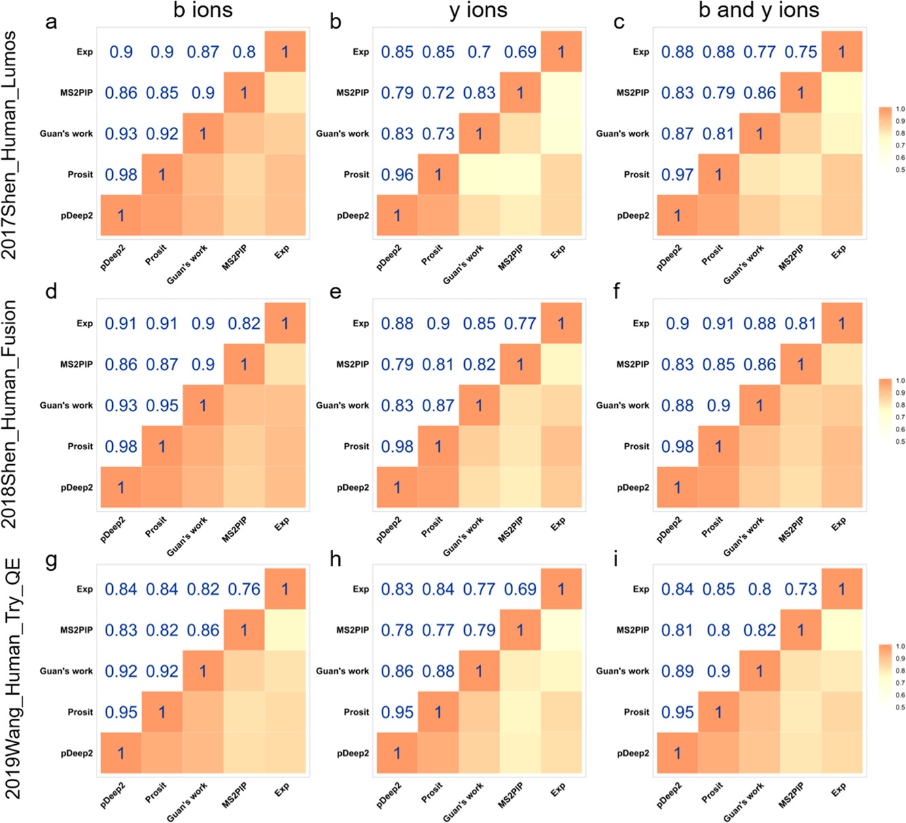
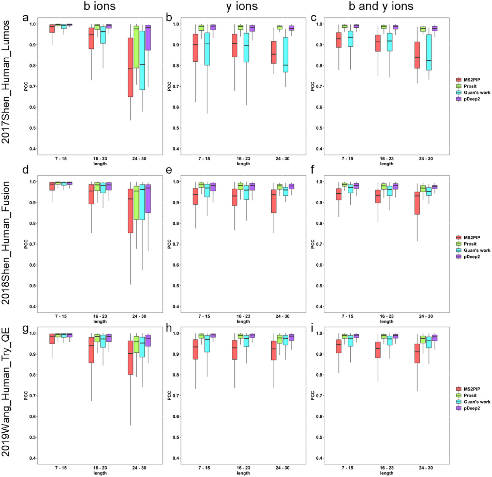
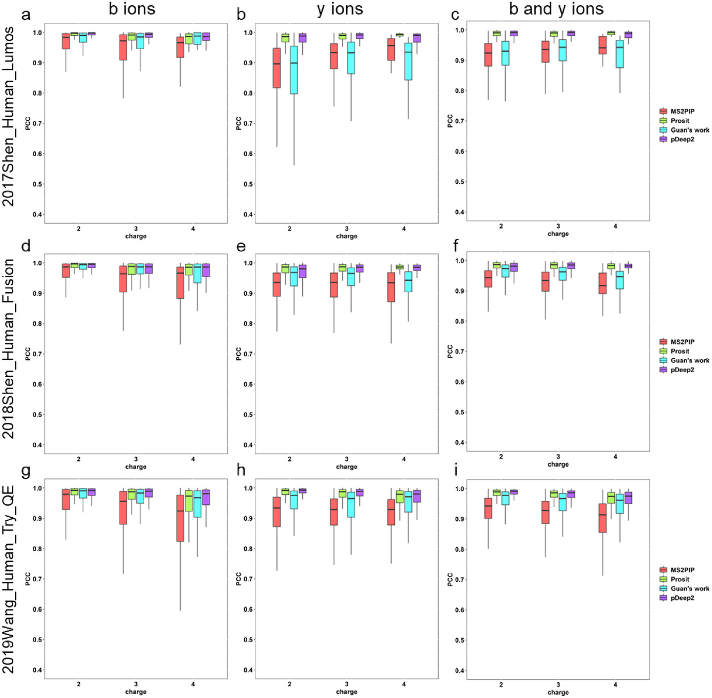
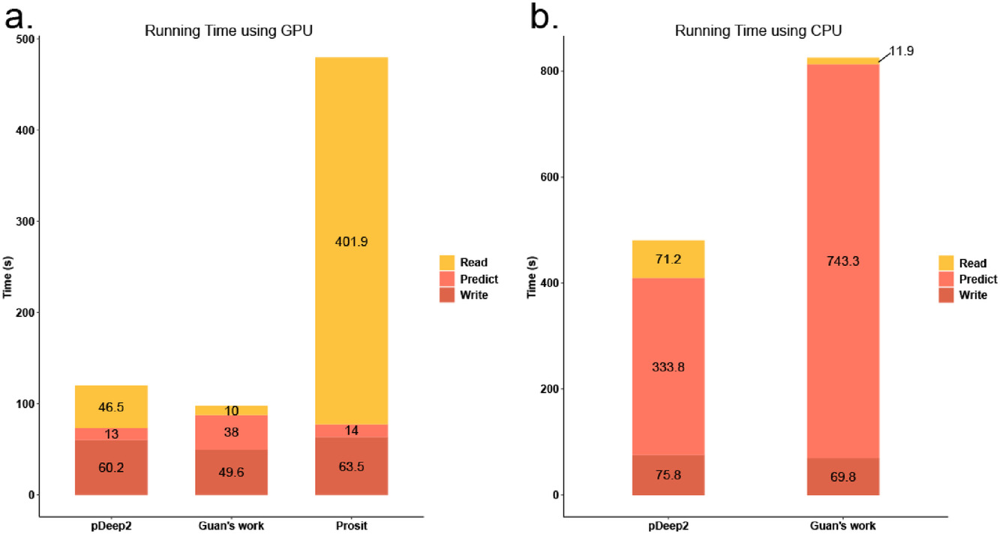

# 谱图预测工具对比

- [谱图预测工具对比](#谱图预测工具对比)
  - [概述](#概述)
  - [引言](#引言)
  - [结果](#结果)
    - [预测工具的相关分析](#预测工具的相关分析)
    - [肽段水平对比](#肽段水平对比)
    - [不同长度不同价态的对比](#不同长度不同价态的对比)
    - [运行时间评估](#运行时间评估)

2021-12-29, 14:03
@author Jiawei Mao
***

## 概述

Sheng, J.; Bai, M.; Shu, K.; Zhu, Y.; Chang, C. A Comprehensive Evaluation of MS/MS Spectrum Prediction Tools for Shotgun Proteomics. PROTEOMICS 2020, 20 (21–22), 1900345. https://doi.org/10.1002/pmic.201900345.

大家好，今天跟大家分享一篇发表在 Proteomics 上的综述，通讯作者 [朱云平](http://www.ncpsb.org.cn/news/view?type=15&id=117)和 Cheng Chang 均来自[国家蛋白质科学中心](http://www.ncpsb.org.cn/)，[舒坤贤](http://ibio.cqupt.edu.cn/kytd.htm)来自重庆邮电大学，大数据与生物智能重庆市重点实验室主任。

使用机器学习或深度学习进行肽段谱图预测是计算蛋白质组学中一种新兴技术。目前已有几款基于深度学习的肽段质谱图预测工具，它们不仅可以提高 DDA（data-dependent acquisition）搜索引擎的灵敏度和准确性，还可用于建立 DIA（data-independent acquisition）所需的谱图库。不同工具由于采用的算法和具体实现不同，在性能上会有所差异，因此有必要系统地评估这些工具，以了解它们的特性和差异。在这篇文献中国，使用不同碰撞能量、酶、仪器和不同物种样品的数据集评估不同工具。

## 引言

今年来，基于质谱的蛋白质组学已成为分子和细胞生物学研究的热门领域。基于质谱的蛋白质组学的一个关键步骤是使用搜索引擎从串联谱图中识别蛋白质或多肽。现代搜索引擎的目标是在预定义错误发现率（false discovery rate, FDR）下尽可能多地鉴定蛋白质。要提供灵敏度和准确性，就需要一个更好的打分方案，从而准确地区域真阳性和真阴性结果，而打分方案需要一个好的谱图预测工具，这样才能计算实验谱图和理论谱图之间的相似度。因此，准确地预测肽段谱图对于肽段和蛋白鉴定是必要的。

机器学习，特别是深度学习的发展给了准确预测糖肽谱图的机会。MS2PIP 是最著名的基于机器学习的谱图预测方法，它最初使用随机森林算法构建，后又使用 XGBoost 算法进行了改进。MS2PIP 提供了易于使用的网络接口 [https://iomics.ugent.be/ms2pip/](https://iomics.ugent.be/ms2pip/)。pDeep 是第一个使用深度学习预测肽段谱图的工具，它使用 BLSTM（双向长短时记忆）捕获氨基酸之间的相互作用。pDeep 第一版使用 Keras 构建，预测肽段的长度不能超过20，pDeep2 使用 TensorFlow 重新构建动态 BLSTM 模型，不再限制肽段长度。Prosit 是另一个基于深度学习的 MS/MS 谱图预测工具，它使用双向门控循环单元（bidirectional gated recurrent unit, BGRU）构建模型，肽段长度限制为 30。Prosit 也提供了一个网络服务器 [https://www.proteomicsdb.org/prosit/](https://www.proteomicsdb.org/prosit/)供使用。DeepMass:Prism 也是基于 BLSTM 的谱图预测方法，不过其模型依托于 Google Cloud 服务器。Guan 等发布的另一个基于 BLSTM 模型，他们的工作很有意思，主要是想说明使用深度学习预测谱图并不复杂。从目前来看，MS2PIP 模型的预测结果 $median PCC > 0.9$，而基于深度学习的模型的精度更高。将预测的谱图集成到搜索引擎，Prosit 和 DeepMass:Prism 都显著提高了 Andromeda 的灵敏度。pValid 使用 pDeep 过滤不可靠的匹配来提高 pFind 鉴定结果的准确性。另外，预测谱图还可以提供 de novo 测序算法的准确度。总而言之，谱图预测工具有很大的应用潜力。

以上提到的基于深度学习的方法都使用循环神经网络（recurrent neural network, RNN）作为模型，不过在实现细节上有所差别。pDeep2 使用动态 BLSTM，Guan 使用定长 BLSTM，不过使用的 features 相对 pDeep 来说也更简单；Prosit 使用基于 BGRU 的 encoder-decoder 架构；DeepMasss:Prism 也使用的 encoder-decoer 架构，但是使用 BLSTM 层作为 encoder，全连接层作为 decoder。不同实现性能不同，因此系统地评估这些方法是必要的。

## 结果

### 预测工具的相关分析

> 不同数据集上各个预测工具在碎片离子层次的 PCC 热图。Exp 表示实验谱图，用来代表真实结果。第一列 a,d,g 表示 b 离子的 PCC；第二列 b,e,h 表示 y 离子的 PCC；第三列 c,f,i 表示 b,y 一起的 PCC。

这四款工具预测的谱图与实验谱图都有很高的相关性。总的来说，基于深度学习的工具（pDeep2, Prosit 和 Guan）比基于机器学习的工具（MS2PIP）PCC 更高一些。而在基于深度学习的工具中，pDeep2 和 Prosit 在大多数数据集上比 Guan 性能更好。

### 肽段水平对比

计算所有 10 个数据集中，所有工具的预测谱图和实验谱图的 PCC。如下表所示：

|Dataset name|Instrument|Total PSMs|Median PCC between the same peptides (baseline)|Tool|PSMs with PCC > 0.8|PSMs with PCC > 0.9|Median PCC|
|---|---|---|---|---|---|---|---|
|2016Schmidt_Ecoli_Elite|Orbitrap Elite|409398|0.9956|MS2PIP|0.8568|0.5035|0.9006|
|||||Prosit|0.9968|0.9736|0.9839|
|||||Guan's work|0.8365|0.4950|0.8990|
|||||pDeep2|0.9956|0.9613|0.9793|
|2019Chang_Yeast_QE|Orbitrap Q Exactive|10 625|0.9967|MS2PIP|96.01%|73.83%|0.9366|
|||||Prosit|98.55%|89.50%|0.9712|
|||||Guan's work|93.25%|76.56%|0.9516|
|||||pDeep2|99.32%|96.44%|0.9804|
|2020Mergner_Arabidopsis_HF|Orbitrap Q Exactive HF|84 629|0.9947|MS2PIP|93.37%|79.67%|0.9457|
|||||Prosit|99.72%|98.58%|0.9895|
|||||Guan's work|97.91%|91.89%|0.9819|
|||||pDeep2|99.70%|98.37%|0.9887|
|2016Malmstrom_Mouse_QE|Orbitrap Q Exactive plus|99 734|0.9944|MS2PIP|95.97%|75.16%|0.9381|
|||||Prosit|9853%|96.28%|0.9894|
|||||Guan's work|93.72%|77.63%|0.9488|
|||||pDeep2|98.48%|93.51%|0.9724|
|2017Shen_Human_Lumos|Orbitrap Fusion Lumos|21 069|0.9974|MS2PIP|94.73%|66.44%|0.9253|
|||||Prosit|99.79%|98.48%|0.9907|
|||||Guan's work|93.75%|68.68%|0.9322|
|||||pDeep2|99.76%|98.15%|0.9915|
|2018Shen_Human_Fusion|Orbitrap Fusion|14 574|0.9970|MS2PIP|97.56%|78.87%|0.9414|
|||||Prosit|99.92%|98.75%|0.9861|
|||||Guan's work|97.99%|89.58%|0.9700|
|||||pDeep2|99.94%|98.60%|0.9823|
|2019Wang_Human_Try_QE|Orbitrap Q Exactive plus|109 164|0.9941|MS2PIP|93.58%|72.95%|0.9380|
|||||Prosit|99.42%|97.22%|0.9878|
|||||Guan's work|93.75%|84.89%|0.9742|
|||||pDeep2|99.42%|97.51%|0.9895|
|2019Wang_Human_LysC_HF|Orbitrap Q Exactive HF|20 373|0.9921|MS2PIP|92.20%|66.36%|0.9269|
|||||Prosit|99.27%|96.69%|0.9879|
|||||Guan's work|93.03%|80.66%|0.9649|
|||||pDeep2|99.36%|96.91%|0.9864|
|2019Wang_Human_LysN_HF|Orbitrap Q Exactive HF|12 300|0.9879|MS2PIP|71.19%|37.39%|0.8673|
|||||Prosit|96.02%|81.74%|0.9614|
|||||Guan's work|80.46%|59.81%|0.9277|
|||||pDeep2|95.20%|80.28%|0.9615|
|2019Miller_Human_Velos|Orbitrap Velos|8829|0.9986|MS2PIP|81.29%|51.91%|0.9035|
|||||Prosit|99.72%|95.36%|0.9789|
|||||Guan's work|78.41%|54.39%|0.9126|
|||||pDeep2|99.92%|98.74%|0.9857|

在所有数据集中，每个工具的几乎所有 median PCC 都大于 0.9，有些甚至超过 0.95，说明这些预测工具准确性很高。其中，pDeep2 和 Prosit 在大多数情况 median PCC 最高（几乎达到基线水平）。在 Fusion 数据集中，Prosit 的 median PCC 最高，这可能是因为 Prosit 使用 ProteomeTools 数据集训练的，该数据集是用 Orbitrap Fusion (Lumos) 生成的。

值得注意的是，尽管所有工具都是在 trypsin 数据集上训练的，但 PCC 在 LysN (2019Wang_Human_LysN_HF) 和 LysC (2019Wang_Human_LysC_HF) 数据集上依然很高。

除了提高 PSM 鉴定灵敏度，准确预测 MS/MS 谱图还有助于生成 DIA 谱图库。一般谱图库只考虑几个最强的谱峰，这里对 top N 谱峰（N 为 6,8,11,15）计算 PCC。基于深度学习的工具 top N 谱峰的所有 median PCC 都大于 0.9，显著高于基于机器学习的工具 MS2PIP。目前 Prosit 和 MS2PIP 支持生成用于 DIA 分析的预测谱图库。

### 不同长度不同价态的对比

计算不同长度，不同价态的肽段 PCC 分布，如下图所示：

> 第一列和第二列分别不同长度肽段的 b/y 离子的 PCC 分布的箱线图。

> 不同母离子价态的肽段的 b/y 离子的 PCC 分布的箱线图。

在大多数数据集中，pDeep2 和 Prosit 优于 Guan 和 MS2PIP。使用最佳 NCE，pDeep2和 Prosit 在 Q Exactive 数据集上对 b/y 离子 median PCC 均 >0.95，不受肽段长度影响。此外，Prosit 在Fusion 数据集上表现更好，尤其对短的肽段（7-15， median PCC > 0.98）。在 Lumos 数据集上，pDeep2 和 Prosit 相对其它工具具有显著优势。这可能是因为它们两个都使用了 ProteomeTools 数据集训练模型，而该数据集主要是 Fusion Lumos。Guan 和 MS2PIP，随着肽段长度增加，b 离子的 median PCC 随之降低，而 y 离子的 average PCC 在部分数据集上显示相反的趋势。

对不同价态的肽段，随着电荷增加，预测精度下降。这可能是因为训练集中缺乏较高电荷的肽段谱图。另外，大多时候 Prosit 和 pDeep2 具有较高的 PCC。Guan 对 b 离子的预测精度貌似优于 y 离子。

### 运行时间评估

这项研究使用配置 Titan Xp GPU 的工作站来评估运行时间。如下图所示：

预测 2019Wang_Human_Try_QE 数据集，pDeep2 需要 ≈13s，每秒 24303 条肽段；Guan 需要 ≈38s，每秒 8314 条肽段；Prosit 需要 ≈14s，每秒 22566 条肽段。需要注意的是，Prosit 使用 Keras API GRU，可以在 GPU 中处理 GRU 层，因此使用 GRU 时，其速度非常快，但是如果没有 GPU，该 API 无法使用。pDeep2 使用动态 LSTM，根据肽段长度展开 LSTM，从而避免不必要的计算，从而加快预测。Guan 使用

