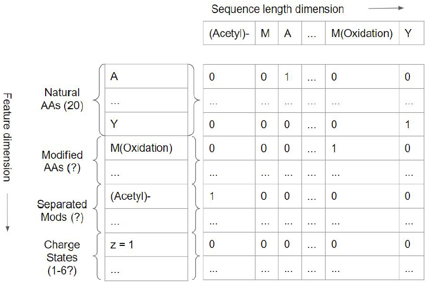
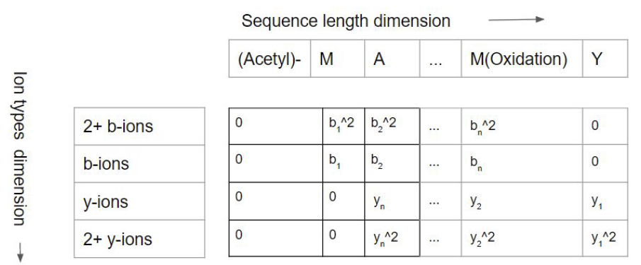
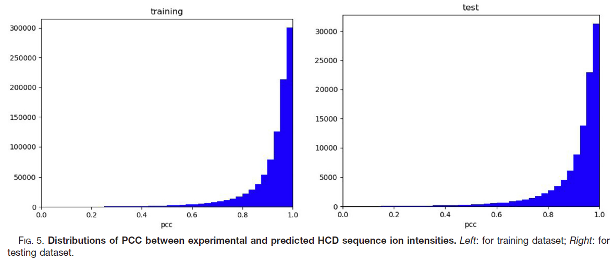
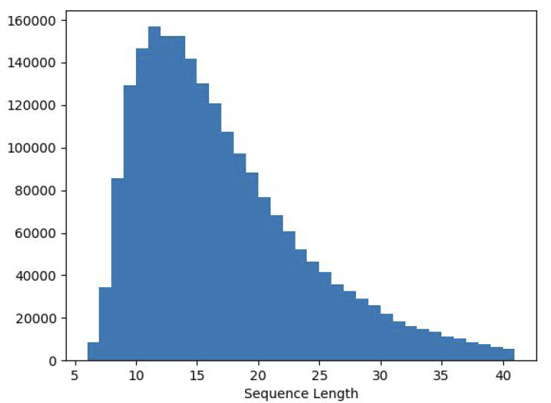
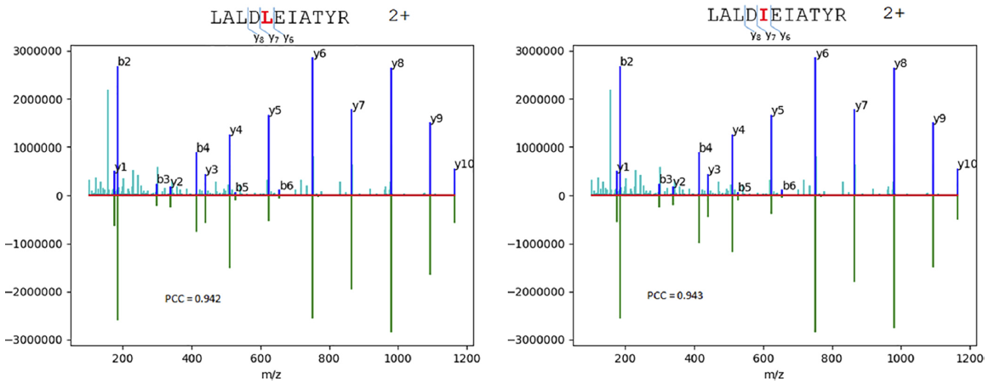

# 使用深度学习从肽段序列预测肽段的 LC-MS/MS 属性

- [使用深度学习从肽段序列预测肽段的 LC-MS/MS 属性](#使用深度学习从肽段序列预测肽段的-lc-msms-属性)
  - [摘要](#摘要)
  - [简介](#简介)
  - [实验步骤](#实验步骤)
    - [数据来源](#数据来源)
    - [特征结构](#特征结构)
    - [模型](#模型)
  - [结果](#结果)
    - [iRT 预测](#irt-预测)
    - [离子强度预测](#离子强度预测)
  - 
  - [参考](#参考)

2022-02-07, 19:18
***

## 摘要

使用 LSTM 循环神经网络模型预测：

- 索引保留时间（Indexed retention times, iRT）
- MS1 价态分布（SM1 charge state distribution）
- MS/MS谱峰强度。

使用 $10^5$ 量级的数据集用于训练 iRT 和价态分布模型。使用 $2\times 10^6$ 实验谱图预测 HCD 碎片例子强度。采用简单的深度学习结构模型就能高精度地预测这三种关键的 LC-MS/MS 属性。

提出两种特征化方案，并证明能有效编码修饰。iRT 预测模型和 HCD 离子强度预测模型的精度已达到目前文献报道的最先进水平。MS1 价态分布预测模型也具有较高水平。这些预测模型可用来提高 DDA 和 DIA中 肽段的鉴定和定量，也可以辅助 MRM 和 PRM 实验设计。

## 简介

从肽段的氨基酸序列直接预测 LC-MS/MS 行为将为下一代蛋白质组研究的发展提供动力。目前主要用实验手段获得 LC-MS/MS 特征，其成本高，精度也不均一。这项工作旨在使用常见的深度学习模型来解决这些问题，通过实验数据来训练模型。使用深度学习模型预测三个关键的 LC-MS/MS 特征：

- indexed retention times (iRT)
- precursor charge state distributions
- MS/MS sequence ion intensities

这些属性可以直接用于增强 DDA 和 DIA 肽段鉴定和定量，也可以辅助 MRM 和 PRM 实验设计。

这项工作的核心是判断完全由肽段决定的 LC-MS/MS 关键属性。所选择的三个属性符号标准。

- 母离子价态分布还没有被广泛用于肽段的鉴定和定量。
- iRT 校准策略可用于建立一个通用的尺度来校准实验保留时间。溶剂梯度、柱温、进样量等实验条件可以整合到 iRT 与 RT 的校准函数中。
- MS1 价态分布会随着实验条件而变化。其中质量分析仪的电荷检测方法影响最大。不过，对常见的质量分析仪，MS1 价态分布相对其它许多实验条件都是稳定的。
- 对 MS/MS 序列离子强度的预测，不同的离子类型在质谱中的碎裂方法可能不同，碎片例子强度还会随着质量分析仪的变化而变化。谱图还会受激发能量（activation energe）和激发时间的影响。不过，在常用仪器和标准方法下，MS/MS 谱图是稳定的。

深度监督学习模型能够完成分类和回归任务，iRT 和谱图预测模型是典型的回归离子，电荷状态预测模型可以看作电荷分类概率的分类方法。这里展示的三个预测模型代表了 LC-MS/MS 中三个数据级别：

- 用于 LC 行为的 iRT
- 用于 MS1 的电荷状态分布
- MS/MS 水平的 HCD 序列离子强度

它们的输出维度也不同：iRT 是标量，电荷状态分布是向量，HCD 序列离子强度是二维矩阵，其中一个维度取决于肽段长度。这三个模型的核心都是双向 LSTM 层，证明深度学习模型对各种问题的适用性。和其它领域一样，基于深度学习的肽段性质预测模型的性能主要取决于大量、高质量数据的可用性。例如，我们的 HCD 序列离子强度预测模型是建立在从整个蛋白质组学界收集的大量高质量谱图上。

## 实验步骤

### 数据来源

**iRT 数据** 用于训练 iRT 模型的数据。HeLa 和 HEK293 细胞裂解液样品进行三次 DIA 技术重复获得，柱长 1m，采集时间 4h。鉴定假阳性 1%，将重复鉴定的肽段（包括不同电荷）使用总体 iRT 的中位数。去掉肽段长度大于 40 的结果，iRT 模型总的肽段数为 125,793，随机选择 10% 作为测试集，余下 90% 作为训练集。

**电荷分布数据**：价态分布模型的数据是从 ProteomeExchange 下载的 DDA 数据。这些数据包括 0.5-4h 单针数据和高 pH 分级样本数据。使用 PAVA （一个 Visual Basic 程序）将raw 数据文件导出为 peak list。然后用 MSGF+ 搜索二级谱：

- 蛋白质序列库采用 human proteome (UP000005640)，包含 71,778 条序列（下载时间 20180206）；
- Trypsin 最大漏切数设为 5（搜库后过滤）；
- Cys 固定修饰 carbamidomethylation；
- Met 可变修饰 oxidation，肽段 N-端 glutamine 可变修饰 pyro-glu，蛋白 N-端可变修饰 acetylation，Glu 和 Asp 的 deamidation 可变修饰；
- 母离子 tolerance 10 ppm，仪器设置为 "Q Exactive"。
- 将 peptide EValue 阈值设置为 0.045，使得肽段 FDR 为 1%。

对鉴定的肽段，提取谱图 1-5 价的离子色谱，并使用多项式方差高斯函数（polynomial variance Gaussian）拟合 XIC（extracted ion chromatograms）。肽段的指定价态强度使用强度加和归一化。电荷分布模型总的肽段数为 126,876，随机选择 10% 用作测试集。

**HCD 序列离子强度数据**：Wang 等编译的包含 2,154,269 条肽段的 HCD 谱图（Wang, M. et al. Cell Systems 7, 412-421.e5 (2018).）。使用 in-house 代码注释碎片例子，数据保存为 National Institute of Standards and Technology (NIST) MSP 格式。注释的离子包括：

- 1价和2价的 b-, y- 离子，internal ions，H2O 和 NH3 中性丢失离子，母离子以及母离子的中性丢失离子。
- 如果母离子为 2 价，则只收集 1 价的 b, y 离子
- 如果母离子为 3-6 价，则收集 1，2 价的 b,y 离子
- 谱峰强度以最高峰强度归一化

受限于 GPU 显存大小，将数据分为两个部分，分别包含 1,074,898 张谱图。使用两个子集依次训练 HCD 预测模型。将第二个数据集的 10% 用作测试集。

### 特征结构

肽段序列特征：

肽段序列 "(Acetyl)-MA...M(Oxidation)Y" 使用二维 one-hot 矩阵表示，分别为序列和特征维度。目前实现，最大序列长度为 40，对 HCD 序列离子强度，特征维度长度为 30，包括天然氨基酸残基 20，2个氨基酸修饰（Pyro-Glu, Oxidation），2 个单独修饰（Acetyl, Carbamyl），6 为价态（1-6）。

### 模型

所有的模型都包含一个恶 masking layer 和两个 BiLSTM 层。

- 正则化：同时采用 dropout 和 reecurrent dropout；
- 输出层有所不同
  - iRT 模型，输出标量，最后没有激活函数。使用两个 tanh 激活的 dense 层，最后输出一个值；
  - 电荷分布模型，两个 dense 层，输出 size 5 数组，对应电荷 1-5，输出激活函数 softmax；
  - 谱图预测模型：采用 sigmoid 激活的 time distributed dense layer。

HCD 序列离子强度预测模型的标签结构。

和 pDeep 不同，该工作中使用的模型 b-, y- 离子都和肽段序列对齐。修饰特征在训练时设置为 0，在预测时跳过。b, b^2, y, y^2 末尾训练时设置为 0，预测时丢弃。如果母离子电荷不大于2，在训练时 b^2, y^2 设置为0，预测时舍弃。标签维度为 $4\times (peptide length (n+1) + 单独编码修饰数)$。有效输出长度为 4n（舍弃 0 值）。

所有 LSTM 模型使用 Keras 框架实现，在 11GB 显存的 RTX 2080 Ti GPU 上训练，对单个训练集（1,074,898）HCD序列离子预测模型的最长训练时间为 7.2 h。

## 结果

### iRT 预测

深度学习模型的本质是捕获数据生成分布。然而，我们没有关于 iRT 数据集底层分布的独立信息。iRT 值是从 DIA 实验中获得，可能将多个误差来源合并到数据集中。

- 首先，肽段的 FDR 为 1%，这表示至少有 1% 的 iRT 值不正确，那这些不正确的 iRT 值可能会产生异常值（outlier）。
- 其次，RT 与 iRT 的校准会引入一些不确定性

### 离子强度预测

训练谱图强度预测的数据集包含两个子集，各有 1,074,898 张 HCD 谱图。HCD 预测模型使用两个子集依次训练。第二个子集的 10% 用作测试集。在训练时，20% 的训练子集用来验证模型。对整个数据集，3.85% 包含 n-terminal acetylation，8.10% 包含 methionine oxidation, 2.00% 包含 prro-glutamine，5.68% 包含 n-terminal carbamylation.

如图所示，训练和测试的 PCC 分布非常相似，表明模型没有太大的过拟合。训练和测试的 PCC 中位数分别为 0.955 和 0.953。我们测试集的 PCC 中位数略好于 pDeep 的结果。

性能的分解分析：

|Median PCC/# of spectra|6 - 20 AAs|21 - 40 AAs|
|---|---|---|
|No modification|0.965/56,932|0.912/16,197|
|Has modification(s)|0.957/24,293|0.908/10,068|

对未修饰的长度不大于 20 的肽段，其测试 PCC 中位数为 0.965，显著优于 pDeep 模型（0.950）。但是，我们的数据集支持肽段长度到 40，pDeep 只支持到 20.对人蛋白质组，这增加了大约 25% 的unique 肽段，下图是人蛋白质组肽段长度分布：

此外，pDeep 的数据不包含修饰肽段，而我们的数据集包含如下修饰：甲硫氨酸氧化、肽段N端 pyro-glutamic acid，肽段N端 carbamylation 以及蛋白N端乙酰化。除了增加了肽段长度，支持常见的修饰，我们的模型在特征上与 pDeep 上也不同：我们的模型使用的特征更少。深度学习相对传统机器学习的核心优势是它使用多层来学习特征。因此，深度学习的特征工程要简单多。

我们使用最简单的架构，只需要 30 个特征维度，包括 20 个天然氨基酸，2 个修饰氨基酸残基，2个单独修饰，以及 6 个电荷，而 pDeep 模型需要 88 个。

我们的模型还将 N 端（b）和 C 端（y）离子与肽段序列对齐，而 pDeep 模型中离子序列长度（19）小于肽段序列长度（20）。

HCD 序列离子强度预测的一个应用是协助鉴定异构肽段。这里涉及的同分异构肽段具有完全相同的化学组成，而几乎相同的肽段序列。序列的微小差异使得它们的 MS2 谱图很难区分。pDeep 模型的作者研究了他们的模型区分三类相似肽段：

(a) 异亮氨酸替换为亮氨酸
(b) 不同氨基酸组合，如 GG 和 N
(c) 局部氨基酸排列，如 FA 和 AF

> 对比两个异构序列的实验谱图和预测谱图的差异，左（亮氨酸），右（异亮氨酸）。下面是预测谱图，上面为相同实验谱图，深蓝色为注释匹配谱峰，浅蓝为没注释上的谱峰。可以看到，y6 离子的相对强度有明显变化，不过这种差异使用局部离子 PCC 更容易量化。

在上图中，一个 HCD 实验谱图，MSGF+ 将其鉴定为 LALDLEIATYR 或 LALDIEIATYR 序列。两者 EValue 值相同（$4.2\times 10^{-6}$），即 MSGF+ 无法区分是哪条序列。当将实验谱图与两条序列的预测离子强度进行匹配时，如果使用序列的全部离子计算 PCC，实验数据与预测数据之间的 PCC 差异很小，LALDLEIATYR 为 0.942 LALDIEIATYR 为 0.943。如果只使用局部离子，例如 y6, y7, y8，则可以看出明显差异。LALDLEIATYR 的局部离子 PCC 为  0.870，而 LALDIEIATYR 为 0.994。显然，使用差异位点附近的局部碎片离子可以更显著的看出差异。谱图计数也支持异亮氨酸肽段 LALDIEIATYR。在相同的 RAW 文件中，有 137 张谱图归属于该异亮氨酸肽段（4 张）归属的蛋白（P04264），只有 11 张谱图支持包含亮氨酸肽段的蛋白（P05787）。

11 张谱图中的 4 张被分配给亮氨酸肽段。预测离子强度的匹配分析和谱图计数冯恩熙都支持 LALDIEIATYR.

分辨能力最强的局部离子的选择方式：

1. 选择差异位点附近的离子
2. 检查预测离子强度和异构序列的局部 PCC 值的差异

如果观察到残基组合之间的肽键碎片离子，则(b) 和 （c）这两类近似肽段很好区分。如果没有，则可以使用预测的离子强度来区分。对 (b) GG vs. N 这类，pDeep 能够很好的区分 ProteomeTools 中的实验谱图 GGFFSFGDLTK (PCC=0.98) 和 NFFSFGDLTK（PCC=0.87）。使用我们的 HCD 序列离子强度预测模型，这个区分更大（0.994 vs. 0.838）。

## 

## 参考

- Guan,S. et al. (2019) Prediction of LC-MS/MS Properties of Peptides from Sequence by Deep Learning. Molecular & Cellular Proteomics, 18, 2099–2107.
- Xu,R. et al. (2020) A Comprehensive Evaluation of MS/MS Spectrum Prediction Tools for Shotgun Proteomics. PROTEOMICS, 20, 1900345.
- Bruderer,R. et al. (2017) Optimization of Experimental Parameters in Data-Independent Mass Spectrometry Significantly Increases Depth and Reproducibility of Results*. Molecular & Cellular Proteomics, 16, 2296–2309.
