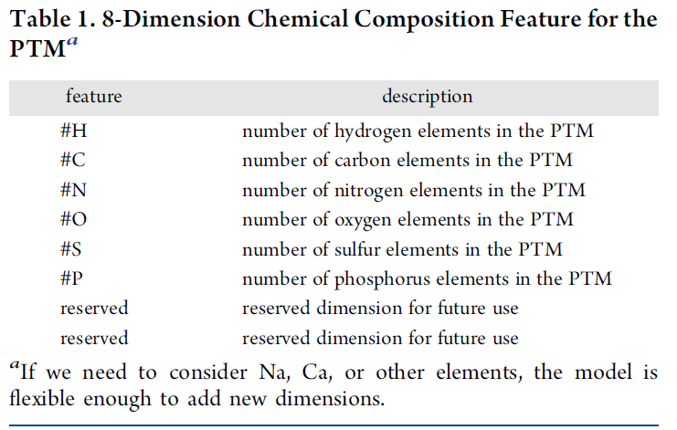
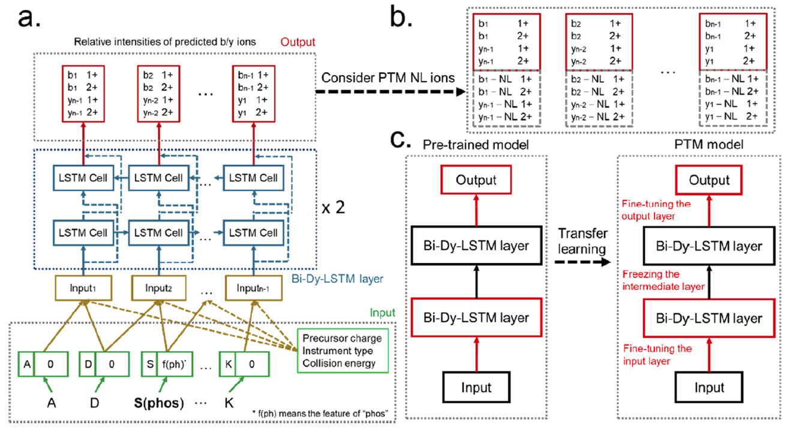
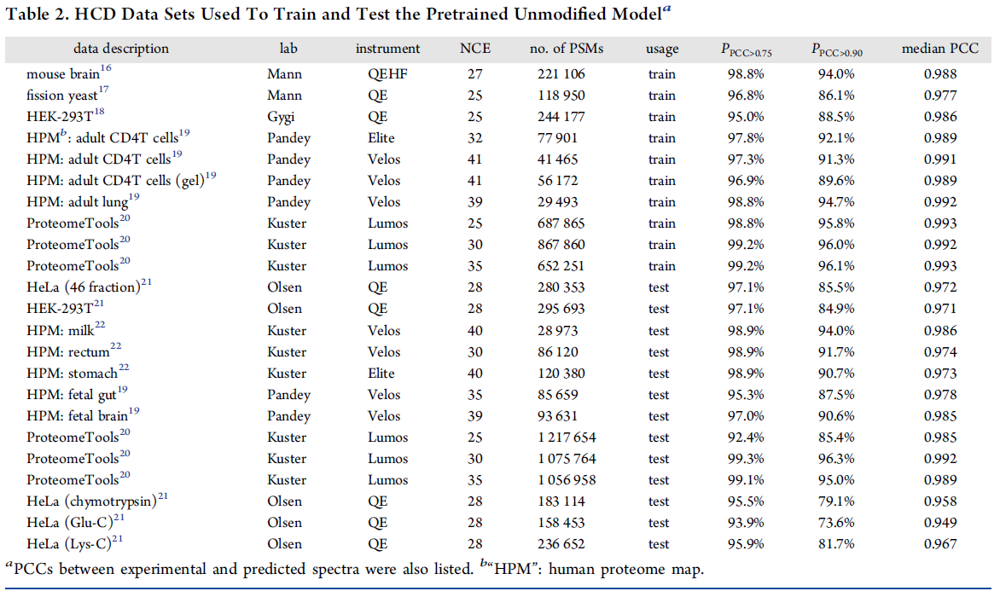

# pDeep2

- [pDeep2](#pdeep2)
  - [概述](#概述)
  - [摘要](#摘要)
  - [前言](#前言)
  - [方法](#方法)
    - [修饰肽段 feature 设计](#修饰肽段-feature-设计)
    - [pDeep2 相对 pDeep 的改进](#pdeep2-相对-pdeep-的改进)
    - [修饰肽段的迁移学习](#修饰肽段的迁移学习)
  - [结果](#结果)
    - [准备预训练模型](#准备预训练模型)
    - [常见 PTM 模型](#常见-ptm-模型)
    - [21 个合成 PTM迁移学习性能](#21-个合成-ptm迁移学习性能)

2022-03-04, 01:22
***

## 概述

Zeng, W.-F.; Zhou, X.-X.; Zhou, W.-J.; Chi, H.; Zhan, J.; He, S.-M. MS/MS Spectrum Prediction for Modified Peptides Using PDeep2 Trained by Transfer Learning. Anal. Chem. 2019, 91 (15), 9724–9731. https://doi.org/10.1021/acs.analchem.9b01262.

pDeep2 发表在 analytical chemistry 上的文章，通讯作者 [贺思敏](http://www.ict.cas.cn/sourcedb_2018_ict_cas/cn/jssrck/200909/t20090917_2496629.html) 研究院来自中国科学院计算技术研究所，他们课题组主要研究蛋白质鉴定和定量算法。

## 摘要

近十年来，基于串联质谱（MS/MS）的自下而上的蛋白质组学已成为分析复杂蛋白质混合物中翻译后修饰（post-translational modifications, PTMs）的首选方法。鉴定带 PTM 肽段和 PTM 位点定位的关键是衡量理论谱图和实验谱图的相似性。准确预测修饰肽段的理论 MS/MS 谱图可以改善计算的相似度。pFind 团队提出了一个基于深度学习的模型 pDeep2。pDeep2 采用迁移学习进行训练，以促进在有限的基准 PTM 数据下的学习。利用公开的 PTM 数据集，包括合成磷酸肽和来自 ProteomeTools 的 21 个合成 PTMs，发现通过迁移学习训练的模型比较准确（>80% Pearson 相关系数大于 0.9），明显优于没有使用迁移学习的模型。他们还发现，准确预测 PTM 中性丢失碎片例子强度，如磷酸肽的磷酸中性丢失（-98 Da），可以提高识别磷酸化位点的能力。pDeep2 下载地址：https://github.com/pFindStudio/pDeep/tree/master/pDeep2 。

## 前言

大多受生物学过程都受到蛋白质翻译后修饰的调节。近十年来，基于串联质谱（MS/MS）的 bottom-up 蛋白质组学已成为分析生物样品中 PTMs 的首选方法。对 PTM 的自动和大规模分析，修饰肽段的鉴定和 PTM 位点定位依赖于理论谱图和实验谱图的比较。因此，准确预测修饰肽段的 MS/MS 谱图是非常必要的。已有许多预测肽段 MS/MS 谱图的工具，如 PeptideART, OpenMS-Similator, MS2PIP, MassAnalyzer 以及 MS2PBPI 等。也有尝试预测修饰肽段的工作，例如 MassAnalyzer 利用 PTM 的的质子移动特性，来辅助训练 PTM 模型，它支持相当多的 PTM；MS2PIP 基于 boosting 方法建立，它需要 PTM 质量来预测修饰肽段谱图，也支持一些常见的 PTM。对常见的 PTM，由于可以收集到足够多的谱图，所以用传统的机器学习方法可以训练出精确的模型，但对低丰度 PTM 很难训练出好的模型。因此，进一步开发针对常见和低丰度 PTM 的模型。

在他们的前期工作 pDeep 中，发现深度神经网络或深度学习可以捕获氨基酸的碎裂特征，从而显著地提高未修饰肽段谱图的预测精度。pDeep2 尝试深度学习是否可用于修饰肽段的谱图预测。为了建立适用于修饰肽段的深度学习模型，特别对于低丰度PTM的肽段，最大的问题之一是缺乏足够的PTM数据。低丰度 PTM 也存在假阳性率高的问题。因此，对模型训练来说，最理想的数据集是含有 PTM 的合成肽段。多亏了 ProteomeTools 项目，我们现在有相当多的各种 PTM 数据来训练和测试深度学习模型。尽管如此，合成 PTM 数据的规模还不够大，我们仍然需要新技术来训练准确的 PTM 模型。

对数据集有限的情况，迁移学习是一个很好的选择。迁移学习，顾名思义是将知识或学习参数从具有充足训练数据的领域迁移到另一个数据有限的相关领域。迁移学习已经在许多任务中得到应用，包括皮肤癌分类，眼病疾病的诊断等。大多数基于图像的模型首先使用 ImageNet 数据集（> 100万张图像）进行训练，然后使用仅数千张疾病图像根据迁移学习技术进行微调。这些模型可以达到相当高的精度。

在本文中，在预先训练的 pDeep2 模型基础上，使用迁移学习训练深度学习模型，在有限的数据条件下对修饰肽段进行谱图预测。使用公开的合成 PTM 数据集，包括合成磷酸肽和 ProteomeTools 中 21 个合成的PTM，发现基于迁移学习的模型的准确性优于没有使用迁移学习的模型。还发现，对于磷酸化分析，准确预测磷酸肽磷酸中性丢失（-98 Da）的例子强度有助于区分真实磷酸化位点预期临近位点。

## 方法

### 修饰肽段 feature 设计

在 pDeep 中，每个氨基酸由维度为 20 的 one-hot 向量表示。对 PTM，其主要特征是其化学结构，但对于复杂化学结构的特征嵌入问题不好解决。因此使用化学组成作为一个折中的解决方案来表示 PTM。大部分常见的 PTM，如氧化、磷酸化以及乙酰化，由 C, H, N, O, S 和 P 组成，少数 PTM 含有金属元素或其它元素，因此使用维度为 8 的向量表示 PTM。如下表所示：

例如，carbamidomethylation 的组成为 H3C2N1O1，因此其特征向量为 [3,2,1,1,0,0,0,0]。8 维 PTM feature 放在修饰氨基酸的特征后；如果氨基酸没有 PTM，则将 8 维 0 向量放在氨基酸特征后。需要注意的是，化学组成特征无法表示复杂的 PTM，如糖基化，因为不同糖修饰的化学组成可能一样。

### pDeep2 相对 pDeep 的改进

pDeep2 依然采用 2 层 BiLSTM，但是 pDeep2 更快更灵活，因为使用了新版 Tensorflow APIs.

(1) pDeep 只能预测长度不大于 20 的肽段。而 pDeep2 采用 Tensorflow 的 "dynamic_rnn" API，不限制肽段长度。另外，对于小于最大长度的肽段，"dynamic_rnn" 还可以避免超过肽段长度时间步的计算。

(2) 在 pDeep2 中考虑了 PTM 特征，从而可以预测修饰肽段谱图。

(3) 在模型中考虑了仪器类型和碰撞能量（或 normalized collision energy, NCE），使 pDeep2 能够适应不同的类型。使用 one-hot 编码仪器类型，目前 pDeep2 支持 Lumos, Elite, Velos, Q-Exactive。

pDeep2 的结构如图 1a 所示：

> 图1：pDeep2 模型和迁移学习。(a) pDeep2 包含输入层、输出层和两层双向动态 LSTM。输入层将氨基酸特征、PTM、母离子价态、仪器类型以及碰撞能量串联成一个数值向量。输出层是一个 time-distributed 全连接层，它将 Bi-Dy-LSTM 层的输出映射到碎片离子的相对强度上。（b）为了考虑 PTM 中性丢失离子，在输出层增加了 b/t-NL。（c）pDeep2 中的迁移学习。在使用迁移学习时，只对第一层 Bi-Dy-LSTM 和输出层的参数进行微调。

对一条肽段，其氨基酸特征、PTM 特征向量、母离子价态、仪器类型以及碰撞能量串联后输入 Bi-Dy-LSTM 层，输出的是 1+ 和 2+ b/y 离子相对强度。

无修饰 pDeep2 模型的训练参数：

- Bi-Dy-LSTM 2 层；
- LSTM 的 hidden layer size 为 256
- dropout=0.2
- epoch=100
- mini-batch size = 1024
- learning rate = 0.001
- loss function = mean absolute error

所有模型在 Lenovo ThinkStation P310 with an NVIDIA TITAN Xp GPU (12 GB 显存)。

### 修饰肽段的迁移学习

迁移学习非常适合训练 PTM 模型，因为对于一个修饰肽段，只有一个或少数几个被 PTM 修饰的氨基酸，大部分没有修饰。无修饰氨基酸的碎裂特性已经在大规模的无修饰肽段 PSM 中得到很好学习，将它们的属性和知识转移到 PTM 模型，这样对 PTM 数据量要求就降低了。该训练过程在深度学习中很容易实现。首先基于无修饰 PSM 数据集训练一个 pDeep2 模型，将其称为 pretrained model 或 unmodified model。然后利用迁移学习技术，在预训练模型的基础上训练 PTM 模型，如图 1c 所示。使用迁移学习时，对 Bi-Dy-LSTM 第一层的学习参数进行微调以事情输入 PTM 特征，对输出层进行微调以适应新的输出，冻结隐藏层。

迁移学习的训练参数：

- epoch = 20
- mini-batch size = 1024
- learning rate = 0.001
- loss function = mean absolute error

在 PTM 模型中，pDeep2 还可考虑 b/y 离子的中性丢失（NL）(图 1b)，如 Ser 和 Thr 上的磷酸化，Met上的氧化等。为了利用迁移学习预测 PTM NL 碎片离子强度，首先将所有 b/y 骨架的虚拟 PTM NL 碎片例子附加到预训练模型的输出向量中（图 1b），将其强度初始化为零。然后对 PTM 数据集中的每张谱图，提取 PTM NL 碎片离子强度用于训练。如果 PTM 上没有 NL，则所有 PTM NL 碎片离子强度为 0.

在本文中，使用皮尔逊相关系数（PCC）来衡量预测谱图与实验谱图的相似度。

## 结果

### 准备预训练模型

无修饰 pDeep2 模型在 ~8,000,000 来自不同实验室和仪器的高质量无修饰 PSM 上训练和测试。数据集信息如表2：

所有数据使用 pFind3 open-search mode (母离子和碎片离子 tolerance 均为 20 ppm)，在 0.01% FDR 下只保留无修饰 PSMs。对 ProteomeTools 中的 PSM 则进一步过滤，去掉肽段与合成模板不一致的PSM。对 ProteomeTools 中的肽段，根据不同的 RAW 文件将其随机拆分为训练集和测试集，traing RAWs/testing RAWs=4:6.

pDeep2 的测试结果（表2 usage='test'）比较好，且训练集和测试集的 $P_{PCC>0.75}$ 和 $P_{PCC}>0.90$ 非常接近，说明模型没有过拟合。

### 常见 PTM 模型

pDeep2 模型足够灵活，可以扩展到预测包含常见 PTM 肽段的 MS2 谱图。从常规 MS 数据中，我们可以收集到相当多的常见 PTM 的 PSM，如 oxidation on Met, deamidation on Asn, formylation at the N-terminus of peptides, and pyro-Glu on Gln at the Nterminus of peptides。这里，常见 PTM 的训练集和测试集与表 2 相同。在 pDeep2 中，将迁移学习用于常见的 PTMs 通常可以获得最高的准确率，当我们有足够的 PTM 数据进行训练时，我们可以在不使用迁移学习的情况下获得相当好的模型，但是对不常见的 PTM，由于数据有限，难以训练出一个准确模型，因此，迁移学习是必要的。

### 21 个合成 PTM迁移学习性能

使用两个已发表的基准 PTM 数据集进一步训练和测试 pDeep2：

- 21 synthesized PTMs from ProteomeTools (data generated by Lumos)
- synthesized phosphopeptides (data generated by Velos

如表3所示：

RAW 文件用 pFind3 restricted search mode 检索，母离子和碎片离子 tolerance 设置为 20 ppm，peptide level FDR 设置为 0.1%。蛋白质序列库由合成模板肽段和 SwissProt 人类数据库的序列组合而成。合成肽模板可以从 PRIDE 下载（PXD009449 和 PXD000138）。

设置可变修饰carbamidomethylation on Cys，oxidation on Met，其它可变修饰则根据合成 PTM 设置。检索后，保留鉴定肽段和合成模板匹配的 PSM。此外，为了保证所有 PTM 谱图的匹配质量，如果匹配谱峰的数目小于其肽段长度，则去除。最后，对来自 ProteomeTools 的数据集，不同肽段按照 8:2 划分为训练集和测试集。对 PhosVelos 数据集的 96 个 RAW HCD 文件，77 个 RAW 文件的 PSM 用作训练集，余下 19个 RAW 文件用于测试。

文章链接：https://pubs.acs.org/doi/10.1021/acs.analchem.9b01262
