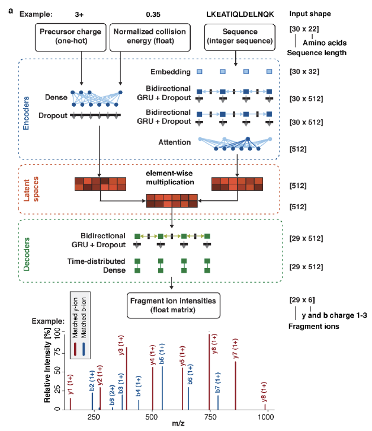

# Prosit

- [Prosit](#prosit)
  - [方法](#方法)
    - [合成肽段](#合成肽段)
      - [Generation](#generation)
      - [数据采集](#数据采集)
    - [统计](#统计)
    - [碎裂模型](#碎裂模型)
      - [模型架构](#模型架构)
      - [训练数据](#训练数据)
    - [保留时间模型](#保留时间模型)
    - [外部数据处理](#外部数据处理)
    - [DIA 数据分析](#dia-数据分析)
    - [Metaproteomics](#metaproteomics)

2022-02-07, 15:27
***

## 方法

### 合成肽段

Last updated: 2022-08-23, 13:13

#### Generation

为了实现对人类蛋白质组的广泛覆盖，本研究中创建并使用了 4 组肽段集：

1. Isoform 肽段集，对 Swiss-Prot 注释的所有 isoform 蛋白，生成长度 7-30 的特有肽段（和标准形式的差异肽段），该肽段集包含 **123,514** 条肽段，覆盖 9,354 个 isoforms；
2. Missing gene addon 肽段集，包含 **53,683** 条肽段（7-30 个残基），是对之前发表的 "Missing gene" set^[Li,J. et al. (2014) An integrated catalog of reference genes in the human gut microbiome. Nat Biotechnol, 32, 834–841.] 的扩展，肽段选择原则也相同，覆盖 ProteomicsDB 中没有充分证据的基因；
3. **29,141** 肽段集（7-40 个残基），在串联质量标签（TMT）中经常鉴定到的肽段，不过在本研究中没有对肽段进行标记；
4. 重新合成了 **12,760** 条肽段，这些肽段包含在 proteotypic 肽段集中，但是在 LC-MS/MS 中没检测到。

所有肽段序列和对应的蛋白在 [STable 1](D:\repo\prosit\STable-1.xlsx) 中。

肽段 Pool 的设计、肽段合成、样品制备和合成肽段的 LC-MS 分析的详情可以参考 ^[Zolg,D.P. et al. (2017) Building ProteomeTools based on a complete synthetic human proteome. Nat Methods, 14, 259–262.]。简而言之，合成和分析的每个肽段 pool 大约包含 1,000 条肽段。质量相近的肽段（± 10 p.p.m）尽可能分散到长度相近的不同肽段池中。所有的肽段都是在纤维素膜上使用基于 Fmoc 的固相合成策略合成。在预先设计的 1000 个肽池中，将粗肽从膜上分离并干燥。

将干燥的肽池在室温下涡旋 30min 溶于 100% 二甲亚砜（DMSO）至 10 pmol/µl。然后使用 1% 甲酸（HPLC 级水）将 DMSO 稀释到 10%，这样肽段浓度为 1 pmol/µl，储存在 -20 °C 备用。

#### 数据采集

将 10 µl 肽池原液转移到 96 孔板，每针加入 100 fmol 两种保留时间标准试剂（Pierce RT 标准和 PROCAL）。使用配备自制的 C18 色谱柱的 Dionex 3000 高效液相色谱系统（Thermo Fisher Scientific）对肽池中的每种肽段进行分析，每种肽段进样量估摸在 200 fmol。分离系统包括 75µmx2cm 的 trap 柱（填充 5µm 的 Reprosil Pur ODS-3，Dr. Maisch）和 75µmx40cm 的分析柱（填充 3µm 的 C18 Reprosil Gold 120, Dr. Maisch）。使用 0.1% 的甲酸水溶液将肽段上样到 trap 柱。使用 4% 到 35% 的线性梯度乙腈、 5% DMSO，0.1% 的甲酸水分离肽段 50 min，加上 10 min 的洗脱时间，共 60 min，流速 300 nl $min^{-1}$，柱温 50 °C. 

HLPC 系统与 Orbitrap Fusion Lumos 质谱在线连接。每个肽段池先用下面两种碎裂方法分析：

- HCD（NCE 28，FTMS）
- CID（NCE 35，ITMS）

对以上鉴定到的全长肽段，附加三种碎裂方法：

1. 3xHCD (NCE 25,30,35, FTMS)
2. 2xIT_2xHCD (CID NCE 35 ITMS, HCD NCE 28 ITMS, HCD NCE 20 FTMS, HCD NCE 23 FTMS)
3. EtciD NCE 35 FTMS, EthcD NCE 28 FTMS

获得的 RAW 文件用 **MaxQuant v1.5.3.30** 对 pool-specific 数据库检索（STable 1）。如果没有额外说明，搜库参数为：

- Cys 上 carbamidomethylated 固定修饰
- 可变修饰 methionine oxidation
- first search tolerance 20 ppm
- main search tolerance 4.5 ppm
- PSM 和 protein FDR 设置为 1%

合成肽段的质谱图：https://www.ebi.ac.uk/pride/archive/projects/PXD010595

### 统计

Last updated: 2022-08-23, 16:04

**谱图相似度计算**

使用所有理论上可能的碎片离子强度计算谱图相似度，忽略 m/z 维度。

假设两个谱图 $S_a$ 和 $S_b$，长度分别为 $n_a$ 和 $n_b$，母离子电荷为 $z_a$ 和 $z_b$，由向量 $V_a$ 和 $V_b$ 表示。$V_a$ 和 $V_b$ 长度相同，分别包含 $S_a$ 和 $S_b$ 中所有的 b, y 离子强度，每个价态的离子个数为 $max(n_a, n_b)-1$，碎片离子价态最大为 $min(max(z_a, z_b), 3)$。碎片例子强度以 base-peak 归一化，未观测或预测到的强度设置为 0。

例如，当 $S_a=PEPTIDE, z_a=2$, $S_b=PPTD, z_b=3$，则有 $n_a=7$, $n_b=4$, $V_a$ 和 $V_b$ 的长度均为 18 ($(7-1)\times 3$)。

对所有实验谱图和预测谱图构建该向量，并使用该向量计算相似度。计算方法如下：

L2 norm（平方和的均方差）：

$$\lvert V\rvert_2 = \sqrt{\sum_{i=0}^n \lvert V_i \rvert^2}$$

平均偏差（向量和均值的差值）：

$$\tilde{V}=V-\frac{1}{n}\sum_{i=0}^n V_i$$

L2 normed vector（平方根归一化）:

$$\hat{V}=\frac{V}{\lvert V\rvert _2}$$

使用 `scipy.stats.pearsonr` 实现的 Pearson correlation (R)，定义为：

$$R(V_a, V_b)=\frac{\tilde{V}_a\cdot\tilde{V}_b}{\lvert \tilde{V}_a \rvert _2 \cdot \lvert \tilde{V}_b \rvert _2}$$

根据文献 ^[Toprak,U.H. et al. (2014) Conserved Peptide Fragmentation as a Benchmarking Tool for Mass Spectrometers and a Discriminating Feature for Targeted Proteomics*. Mol Cell Proteomics, 13, 2056–2071.] 定义归一化谱图夹角（normalized spectral angle, SA），但是使用 `keras.backend.l2_normalize` 实现的 L2 norm。损失函数（normalized spectral contrast loss, SL）定义为调整的谱图家教，范围从 0（高相关性）到 2（低相关性），保留其特性：

$$SA=1-2\frac{cos^{-1}(\hat{V_a}\cdot \hat{V_b})}{\pi}$$

$$SL=2\frac{cos^{-1}(\hat{V_1}\cdot \hat{V_b})}{\pi}$$

为了避免在 GPU 上训练时的数值不稳定，对所有向量添加了常量 epsilon $1\times 10^{-7}$。

### 碎裂模型

#### 模型架构

peptide encoder 包含三层，如下图所示：

- BiGRU + Dropout
- BiGRU + Dropout
- Attention

RNN 层的 size 为 512，latent space 也是 512.

母离子价态和 NCE 的 encoder 是单个 Dense layer，输出 size 和 peptide encoder 相同。

latent 肽段向量通过逐元素乘法加上母离子价态和NCE信息。

模型使用 Keras 2.1.1 和 tensorflow 1.4.0 实现，GitHub 地址：

https://github.com/kusterlab/prosit/

#### 训练数据

使用公开的 ProteomeTools 数据（PRIDE [PXD004732](https://www.ebi.ac.uk/pride/archive/projects/PXD004732) 和 [PXD010595](https://www.ebi.ac.uk/pride/archive/projects/PXD010595)）。

使用 MaxQuant (v.1.5.3.30) 搜库，控制 1% FDR at PSM, protein or site level。数据库采用 dataset-specific 的肽段库，即只包含该肽段池可能包含的肽段序列，设置固定修饰 carbamidomethylated cysteine 和可变修饰 methionine oxidation。只保留 MaxQuant 的 top-ranking PSMs (msms.txt)。使用 Thermo Ffisher 的 RawFileReader 提取 RAW 文件的 MS2 谱图。然后注释谱图，即注释 1 到 3 价的 b,y 离子。对 FTMS 匹配 tolerance 为 25 ppm，对 ITMS 为 0.35 Da。包括肽段的所有 PSMs，肽段长度限制为 7-30，母离子价态 <7，Andromeda 打分 >50。

使用自定义的 Python 脚本将注释文件转换为适合机器学习的张量格式。谱峰强度为连续纸，并 base-peak normalized。每张谱图由 174 维向量表示（b/y 离子，3 charges, 29 fragment ions），按如下顺序：y1 (1+), y1 (2+), y1 (+3), b1 (1+), b1 (2+), b1 (3+), y2 (1+)等。对不可能位置的碎片离子强度（如 7-mer 不可能有 y20）设置为 -1.

### 保留时间模型

### 外部数据处理

### DIA 数据分析

### Metaproteomics

