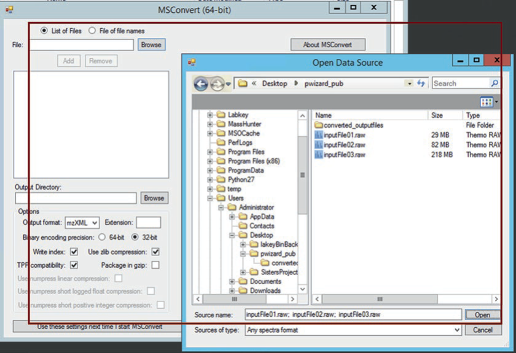

# msconvert

- [msconvert](#msconvert)
  - [简介](#简介)
  - [支持的格式](#支持的格式)
  - [选项](#选项)
    - [输出格式](#输出格式)
    - [编码选项](#编码选项)
    - [压缩选项](#压缩选项)
    - [配置文件](#配置文件)
  - [过滤器](#过滤器)
    - [index](#index)
    - [id](#id)
    - [peakPicking](#peakpicking)
    - [zeroSamples](#zerosamples)
    - [threshold](#threshold)
    - [scanNumber](#scannumber)
    - [precursorRecalculation](#precursorrecalculation)
    - [activation](#activation)
    - [ETDFilter](#etdfilter)
    - [titleMaker](#titlemaker)
    - [msLevel](#mslevel)
    - [chargeState](#chargestate)
    - [mzRefiner](#mzrefiner)
  - [示例](#示例)
    - [导出 mzML 配置](#导出-mzml-配置)
  - [图形化界面](#图形化界面)
    - [导入文件选项](#导入文件选项)
    - [Extension](#extension)
    - [Write index](#write-index)
    - [Use zlib compression](#use-zlib-compression)
    - [Package in gzip](#package-in-gzip)
  - [参考](#参考)

Last updated: 2022-07-04, 13:47
@author Jiawei Mao
****

## 简介

`msconvert` 是一个用于转换谱图文件格式的命令行工具。对 Windows 用户，可以用图形化界面程序 msConvertGUI。

msconvert 使用命令格式：

```sh
msconvert [options] [filemasks]
```

返回转换失败的文件个数。

## 支持的格式

文件格式分两种：

- 开发格式
- 供应商格式

msconvert 支持如下开放格式：

- mzML 1.1
- mzML 1.0
- mzXML
- MGF
- MS2/CMS2/BMS2
- mzIdentML

支持的供应商格式如下：

|供应商|格式|依赖软件|
|---|---|---|
|ABI|T2D|DataExplorer 4.0|
|Agilent|MassHunter .d|ProteoWizard 内嵌|
|Bruket|Compass .d, YEP, BAF, FID, TDF|ProteoWizard 内嵌|
|Sciex|WIFF/WIFF2|ProteoWizard 内嵌|
|Shimadzu|LCD|ProteoWizard 内嵌|
|Thermo Scientific|RAW|ProteoWizard 内嵌|
|Waters|MassLynx .raw/UNIFI|ProteoWizard 内嵌|

## 选项

|选项|说明|
|---|---|
|`-f [ --filelist ] arg`|指定包含文件名的文本文件|
|`-o [ --outdir ] arg (=.)`|设置输出目录，默认为当前目录。`-` 表示 stdout|
|`-c [ --config ] arg`|设置配置文件。(optionName=value)|
|`-v [--verbose]`|显示详细的进度信息|
|`--outfile arg`|覆盖输出文件名|
|`-e [ --ext ] arg`|设置输出文件扩展名 `[mzML|mzXML|mgf|txt|mz5]`|
|`-i [ --contactInfo ] arg`|包含联系人信息的文件名|
|`--noindex`|不写入索引|
|`--filter arg`|添加谱图过滤器|
|`--chromatogramFilter arg`|添加色谱过滤器|
|`--merge`|多个输入文件合并为单个输出文件|
|`--runIndexSet arg`|对多次运行 sources,选择指定 run indices|
|`--singleThreaded [=arg(=1)] (=2)`|true 表示单线程读写|
|`--help`|显示详细的帮助信息|

### 输出格式

**输出格式**通过标签指定。包括：

- `--mzML`，默认选项
- `--mzXML`
- `--mz5`
- `--mgf`
- `--txt`，ProteoWizard 的内部文本格式
- `--ms1`
- `--cms1`
- `--ms2`
- `--cms2` 

### 编码选项

|编码选项|说明|
|---|---|
|`--64`|默认二进制编码设置为 64-bit，默认选项|
|`--32`|默认二进制编码设置为 32-bit|
|`--mz64`|m/z 值编码为 64-bit，默认|
|`--mz32`|m/z 值编码为 32-bit|
|`--inten64`|intensity 值编码为 64-bit|
|`--inten32`|intensity 值编码为 32-bit，默认|

### 压缩选项

- `-z [ --zlib ]`

使用 zlib 压缩 binary data。

- `--numpressLinear [=arg(=2e-09)]`

使用 numpress linear prediction 算法压缩 mz 和 rt 数据（相对精度损失不超过给定的参数 arg，除非设置为 0）。

- `--numpressLinearAbsTol [=arg(=-1)]`

numpress linear prediction 使用的绝对 tolerance，例如，500 m/z 处 0.2 ppm 使用 1e-4，默认 -1.0 实现最大精度。使用该选项会大大减少文件大小，并覆盖相对 accuracy tolerance。

- `--numpressPic`

使用 numpress positive integer compression 压缩强度数据，绝对 accuracy loss 不超过0.5.

- `--numpressSlof [=arg(=0.0002)]`

使用 numpress short logged float compression 压缩强度数据，相对 accuracy loss 不超过指定的 `arg`，除非设置其为 0.

- `-n [ --numpressAll ]`

等价于 `--numpressLinear --numpressSlof`，具体参数 https://github.com/ms-numpress/ms-numpress 。

- `-g [ --gzip ]`

gzip 压缩输出文件。

### 配置文件

使用 `-c [ --config ]` 指定配置文件，例如：

```bash
msconvert data.RAW -c config.txt
```

配置文件，每行一个参数，用 `=` 分隔参数和值。例如：

```txt
mzXML=true
zlib=true
filter="index [3,7]"
filter="precursorRecalculation"
```

需要注意的是，在 `=` 前后不要有空格。

## 过滤器

过滤器的格式：

```bash
filtername filterargs
```

其中 `filtername` 为过滤器名称，`filterargs` 为过滤器参数。

例如，下面要介绍的 "index" 过滤器可以按如下格式指定：

```sh
--filter "index 1-15"
```

> [!IMPORTANT]
> 过滤器按照列出的顺序依次应用，列出过滤器的顺序不同，对结果影响很大。特别是要使用供应商提供的质心算法（centroiding），因为这些算法使用的是供应商的 dll，只能处理原始数据，所以要首先使用 peakPicking。

许多过滤器使用整数集合 `int_set` 参数，`int_set` 可以写成 `[a,b]` 或 `a[-][b]` 格式：

- 例如 '[0,3]' 和 '0-3' 都表示 0 到 3 的整数（inclusive）；
- '1-' 表示从 1 到允许的最大数的整数集合；
- '9' 也是集合，等价于 '[9,9]'；
- '[0,2] 5-7' 为集合 '0 1 2 5 6 7'。

### index

```bash
index <index_value_set>
```

通过索引选择谱图。索引是基于 0 的谱图在文件中出现的顺序。

`<index_value_set>` 是 `int_set` 格式的索引。

- 提取索引 5...10 和 20...25 的谱图

```bash
msconvert data.RAW --filter "index [5,10] [20,25]"
```

### id

```bash
id <id_set>
```

使用 native IDs 选择谱图，`<id_set>` 是分号 `;` 分隔的 ids。

### peakPicking

```bash
peakPicking [<PickerType> [snr=<minimum signal-to-noise ratio>] 
  [peakSpace=<minimum peak spacing>]
  [msLevel=<ms_levels>]]
```

对指定 `<ms_levels>` 谱图进行 centroiding 处理。

`<PickerType>` 值包括：

- "cwt"
- "vendor"，如果供应商的 DLL 可用

> 如果使用 "vendor" 选项，该过滤器使用供应商的 DLL 应用于原始数据，所以必须为第一个过滤器。

如果使用 "cwt"，则使用基于小波算法，其中 wavelet-space 信噪比为 `<minimum signal-to-noise ratio>`。

默认选项:

- `<PickerType>` 为非供应商提供的 low-quality local maximum 算法；
- `<signal-to-noise ratio> = 1.0`
- `<minimum peak spacing> = 0.1`
- `<ms_levels> = 1-`

### zeroSamples

```bash
zeroSamples <mode> [<MS_levels>]
```

处理谱图中的零值。

`<mode>` 为 `removeExtra` 或 `addMissing[=<flankingZeroCount>]`。

`<MS_levels>` 可选，用于指定应用过滤器的 MS levels。

- 如果 `<mode>` 为 "removeExtra"，则移除谱图中连续的强度为 0 的谱峰。例如，对 peak list：

```bash
"100.1,1000 100.2,0 100.3,0 100.4,0 100.5,0 100.6,1030"
```

处理后变为：

```bash
"100.1,1000 100.2,0 100.5,0 100.6,1030"
```

谱峰列表：

```bash
100.1,0 100.2,0 100.3,0 100.4,0 100.5,0 100.6,1030 100.7,0 100.8,1020 100.9,0 101.0,0
```

变为：

```bash
100.5,0 100.6,1030 100.7,0 100.8,1020 100.9,0
```

可以看到，移除了中间部分的 0 强度谱峰。

- 如果 `<mode>` 为 "addMissing"

自动检测每张谱图的采样率，然后在非零数据点周围插入零值点。选项 `[=<flankingZeroCount>]` 用于限制插入零的个数。例如：

- 移除 non-flanking zero

```bash
msconvert data.RAW --filter "zeroSamples removeExtra"
```

- 移除 MS2 和 MS3 的 non-flanking zero

```bash
msconvert data.RAW --filter "zeroSamples removeExtra 2 3"
```

- 保证 MS2 和 MS3 的非零数据点附近至少有 5 个 flanking zero

```bash
msconvert data.RAW --filter "zeroSamples addMissing=5 2 3"
```

### threshold

```sh
threshold <type> <threshold> <orientation> [<mslevels>]
```

保留满足各种阈值条件的数据点。

`<type>` must be one of:

- `count`，保留 `n=<threshold> [most|least]` 数据点，n 为整数，与第 n 个数据点强度相同的也移除；
- `count-after-ties`，类似 "count", 但保留和第 n 个数据点强度相同的谱峰；
- `absolute`，保留绝对强度 [more|less] 阈值的谱峰；
- `bpi-relative`, 以相对 base peak 的比例指定阈值，如 "0.75" 表示基峰的 75%；
- `tic-relative`，以相对 TIC 的比例指定阈值；
- `tic-cutoff`, 保留强度最高的谱峰，使保留谱峰的 TIC 相对原 TIC 达到该比值；

`<orientation>` 取值:

- `most-intense`，保留高于阈值的谱峰
- `least-intense`，保留低于阈值的谱峰

`<mslevels>`, 可选，if provided, only scans with those MS levels will be filtered, and others left untouched.

例如，只保留强度最高的 42 个谱峰：

```sh
--filter "threshold count 42 most-intense"
```

保留强度不小于基峰的 50% 的谱峰：

```sh
--filter "threshold bpi-relative .5 most-intense" 
```

### scanNumber

```sh
scanNumber <scan_numbers>
```

通过 scan number 选择谱图，保留指定 scan numbers 对应的谱图。

### precursorRecalculation

重新计算 MS2 谱图母离子的 m/z 和 charge。通过 MS1 谱图推断母离子质量。

虽然没有使用任何第三方的代码，但它仅适用于 orbitrap 和 FT 数据。自添加该功能之后，Thermo 已经修正了 precursor 问题，所以这个功能没有原来那么有用了。

### activation

```bash
activation <precursor_activation_type>
```

只保留 precursor 为指定 activation 类型的谱图。不影响非质谱图，不影响 MS1 谱图。

`<precursor_activation_type>` 可选类型包括：ETD CID SA HCD BIRD ECD IRMPD PD PSD PQD SID or SORI.

- 只保留 HCD 谱图

```bash
--filter "activation HCD"
```

### ETDFilter

```bash
ETDFilter [<removePrecursor> [<removeChargeReduced> [<removeNeutralLoss> [<blanketRemoval> [<matchingTolerance> ]]]]]
```

过滤 ETD Msn 谱图数据点，移除未反应的 precursors，charge-reduced precursors 和 neutral losses.

- `<removePrecursor>`，"true" 表示移除没有反应的母离子，默认 "true"；
- `<removeChargeReduced>`，"true" 移除低价态母离子，默认 "true"；
- `<removeNeutralLoss>`, "true" 移除低价态母离子的中性丢失，默认 "true"；
- `<blanketRemoval>`, "true" 表示移除 60 Da 范围 内的中性丢失，而不仅仅移除已知的中性丢失，默认 "true"；
- `<matchingTolerance>`，指定匹配的 tolerance，MZ 或 PPM，如 "3.1 mz" (the default) 或 "2.2 ppm"。

例如：

```sh
msconvert data.RAW --filter ETDFilter
```

### titleMaker

```sh
titleMaker <format_string>
```

根据 `<format_string>` 添加或替换谱图标题。如自定义 MGF 文件中的 TITLE 行。

支持如下关键字：

- `"<RunId>"` - prints the spectrum's Run id - for example, "Data.d" from "C:/Agilent/Data.d/AcqData/mspeak.bin"
- `"<Index>"` - prints the spectrum's index
- "<Id>" - prints the spectrum's nativeID
- "<SourcePath>" - prints the path of the spectrum's source data
- "<ScanNumber>" - if the nativeID can be represented as a single number, prints that number, else index+1
- "<ActivationType>" - for the first precursor, prints the spectrum's "dissociation method" value
- "<IsolationMz>" - for the first precursor, prints the the spectrum's "isolation target m/z" value
- "<PrecursorSpectrumId>" - prints the nativeID of the spectrum of the first precursor
- "<SelectedIonMz>" - prints the m/z value of the first selected ion of the first precursor
- "<ChargeState>" - prints the charge state for the first selected ion of the first precursor
- "<SpectrumType>" - prints the spectrum type
- "<ScanStartTimeInSeconds>" - prints the spectrum's first scan's start time, in seconds
- "<ScanStartTimeInMinutes>" - prints the spectrum's first scan's start time, in minutes
- "<BasePeakMz>" - prints the spectrum's base peak m/z
- "<BasePeakIntensity>" - prints the spectrum's base peak intensity
- "<TotalIonCurrent>" - prints the spectrum's total ion current
- "<MsLevel>" - prints the spectrum's MS level

例如，自定义 MGF 的 TITLE 行格式为："name.first_scan.last_scan.charge" 样式 (如 "mydata.145.145.2")：

```sh
--filter "titleMaker <RunId>.<ScanNumber>.<ScanNumber>.<ChargeState>"
```

### msLevel

```bash
msLevel <mslevels>
```

选择指定的 `<msleveels>`，以 `int_set` 格式指定谱图。

- 提取一级谱

```bash
--filter "msLevel 1"
```

- 提取二级谱和三级谱

```bash
--filter "msLevel 2-3"
```

完整命令：

```bash
msconvert data.RAW --filter "msLevel 2-3"
```

- 提取所有 n>1 的 MSn 谱图

```bash
--filter "msLvel 2-"
```

### chargeState

```bash
chargeState <charge_states>
```

选择指定价态的谱图。`<charge_states>` 为 int_set 格式。

0 表示包括没有价态的谱图。

### mzRefiner

```bash
mzRefiner input1.pepXML input2.mzid [msLevels=<1->] [thresholdScore=<CV_Score_Name>] [thresholdValue=<floatset>] [thresholdStep=<float>] [maxSteps=<count>]
```


## 示例

- 打印帮助信息

```bash
msconvert
```

输出的信息很多，首次使用可以好好看看。

- 打印帮助信息，额外输出 filters 信息

```bash
msconvert --help
```

输出的信息，比单独使用 `msconvert` 多一倍，msconvert 提供了大量的过滤器。

- 导出 mzML

```bash
msconvert data.RAW
```

在当前目录，将 `data.RAW` 转换为 `data.mzML`

- 导出 mzXML

```bash
msconvert data.RAW --mzXML
```

在当前目录创建 data.mzXML 文件。

- 批量导出

```bash
msconvert *.RAW -o my_output_dir
```

将所有 RAW 文件转换为 mzML，输出到 `my_output_dir` 目录。

- 指定压缩格式和过滤器

```bash
msconvert data.RAW --zlib --filter "peakPicking true [2,3]"
```

对 binary 数组使用 zlib 压缩，对 msLevels [2,3] 使用供应商的 centroiding。

- msLevel 过滤

```bash
msconvert data.RAW --filter "msLevel 2"
```

只输出 ms2 谱图。

- msLevel 过滤

```bash
msconvert data.RAW --filter "msLevel 2-"
```

输出 ms2 及以上的谱图。

- 零值样本过滤

```bash
msconvert data.RAW --filter "zeroSamples removeExtra"
```

忽略不靠近非零样本的零值样本。

- 例 10

```sh
msconvert data.RAW --32 --zlib --filter "peakPicking true 1-" --filter "zeroSamples removeExtra"
```

创建更小文件的一个设置，类似旧的 ReAdW 转换程序的输出。

- 多个过滤器

```sh
msconvert data.RAW --filter "peakPicking true 1-" --filter "threshold bpi-relative .5 most-intense"
```

应用多个过滤器：peak picking，强度不小于基峰的 50%。

- 多个过滤器

```sh
msconvert data.RAW --filter "peakPicking true 1-" --filter "threshold count 100 least-intense"
```

应用 peak picking，保留强度最小的 100 个谱峰。

- 多个过滤器

```bash
msconvert data.RAW --filter "scanNumber [500,1000]" --filter "precursorRecalculation"
```

选择 scan number 在 [500,1000] 之间的谱图，并校准母离子。

- threshold 过滤

```sh
msconvert data.RAW --filter "threshold count 42 most-intense"
```

选择强度最高的 42 个谱峰或 samples (取决于谱峰类型是 centroid 还是 profile)。

- 例 15

```sh
msconvert data.RAW --filter "activation HCD"
```

只保留 HCD 谱图。

### 导出 mzML 配置

```sh
mzML=true
filter="peakPicking vendor 1-"
filter="zeroSamples removeExtra"
```

## 图形化界面



对图形化界面，所有配置基本都很直观，并且命令行工具使用上比图形化界面更灵活，所以下面只对如下几点单独说明。

### 导入文件选项

导入文件有两种类型：

- List of Files
- File of file names

对 `List of Files`，直接选择需要转换格式的文件。

对 `File of file names`，则是将所有需要转换格式的文件路径放在一个文本文件中，选项该文件。

### Extension

设置导出文件后缀，比如导出 mzML 文件，默认后缀为 `.mzML`，如果需要添加额外的文件名表明，则可以自定义后缀，如 `.tag.mzML`。

### Write index

在输出文件中写入索引。

添加文件索引后可以更快速扫描文件结构，索引会导致文件增大，但是提供了从文件任意位置读取的功能。

### Use zlib compression

勾选后以 "zlib" 压缩输出文件。

将谱图用 zlib 压缩，从而压缩输出文件大小，但会降低其读取速度。另外，有些用户无法处理 zlib 压缩文件。

### Package in gzip

和 zlib 只压缩不同，gzip 压缩整个文件。文件大小一般减少 ~20-30%。

gzip 压缩后，文件需要解压后才能查看。ProteoWizard 和其它一些工具能够解析压缩后的文件，然而不再支持 random access。绝大多数开源工具不支持直接读取 gzip 文件。

## 参考

- https://proteowizard.sourceforge.io/tools/msconvert.html
- https://link.springer.com/protocol/10.1007%2F978-1-4939-6747-6_23
- https://proteowizard.sourceforge.io/tools/filters.html
