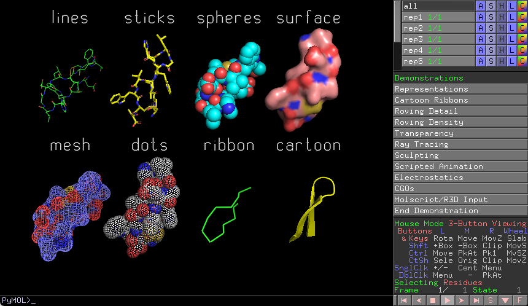
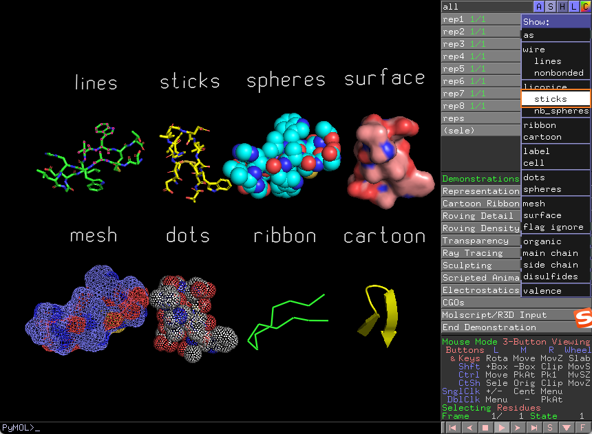
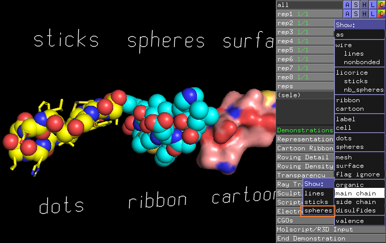
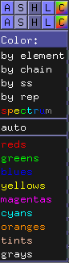
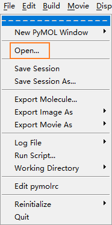
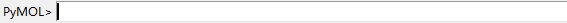
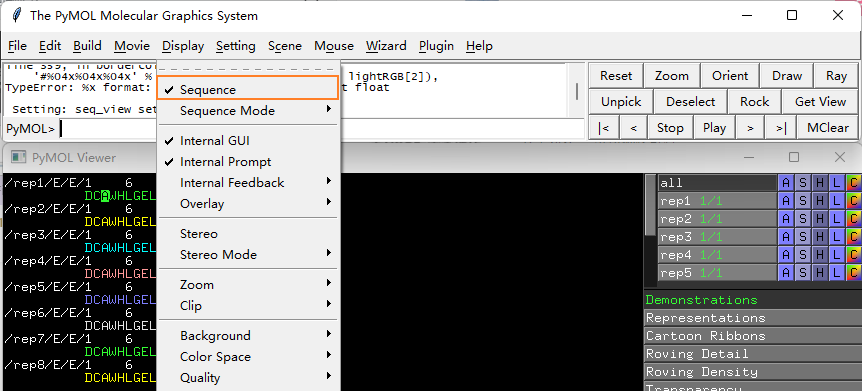
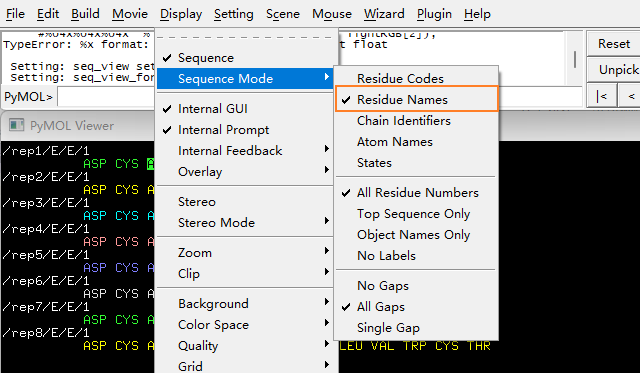
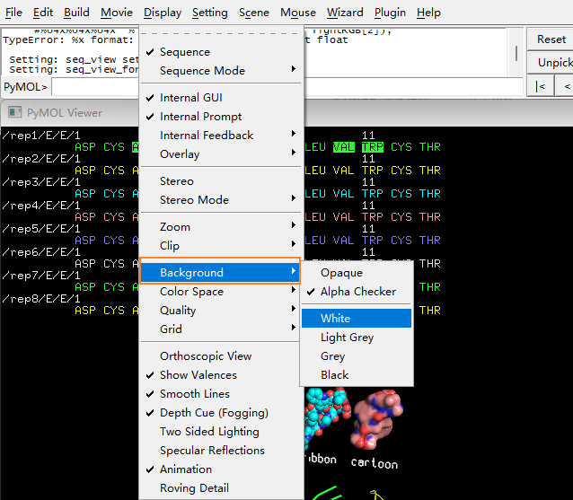

# Pymol 快速入门

- [Pymol 快速入门](#pymol-快速入门)
  - [结构类型](#结构类型)
    - [Hide](#hide)
    - [标签](#标签)
    - [颜色](#颜色)
  - [基本操作](#基本操作)
    - [加载 PDB 文件](#加载-pdb-文件)
    - [序列显示模式](#序列显示模式)
    - [背景](#背景)
  - [参考](#参考)

2022-01-17, 12:29
***

## 结构类型

如下图所示，PyMOL 支持如下结构展示：

使用推荐：

- 蛋白的二级结构一般用 cartoon 结构展示；
- 蛋白表面的口袋深浅，用 surface；
- 分子之间的相互作用，用 sticks 展示；

窗口右上角的 `S` 表示 `Show`，可用来在不同视图之间进行切换，例如，将第一个 `lines` 切换为 `sticks`：

- 将 rep2 的主链修改为球形显示

> `Show` 主菜单显示，会和之前的叠加起来；而使用 `Show - as`，则只以最新选择的模式展示，之前的则会被删掉。

### Hide

`Hide` 用来隐藏部分结构。

### 标签

### 颜色 

## 基本操作

|功能|操作|
|---|---|
|旋转|按住鼠标左键，拖动|
|缩放|按住鼠标右键，拖动|
|平移|按住鼠标滑轮，拖动|

### 加载 PDB 文件

- 方法一，使用菜单栏

- 方法二，使用 PDB id

在命令窗口输入 `fetch pdb_id` 回车。

### 序列显示模式

- 勾选 `Sequence` 可以在窗口展示序列

- 使用 `Sequence Mode` 可以切换序列显示方式，例如 `Residue Names` 以三个字母显示氨基酸

### 背景

在 `Display` -> `Background` 设置中切换背景，出版文章一般使用 `White` 背景。

## 参考

- https://www.bilibili.com/video/BV1fa4y1s7e6
