# PyMOL 入门

- [PyMOL 入门](#pymol-入门)
  - [用户界面](#用户界面)
    - [对象列表](#对象列表)
  - [查看内置 Demo](#查看内置-demo)
    - [Representations](#representations)
    - [Cartoon Ribbons](#cartoon-ribbons)
    - [Roving Detail](#roving-detail)
    - [Roving Density](#roving-density)
    - [Transparency](#transparency)
    - [Electrostatisc](#electrostatisc)
  - [工作目录](#工作目录)
  - [下载蛋白](#下载蛋白)
  - [查看蛋白](#查看蛋白)

## 用户界面

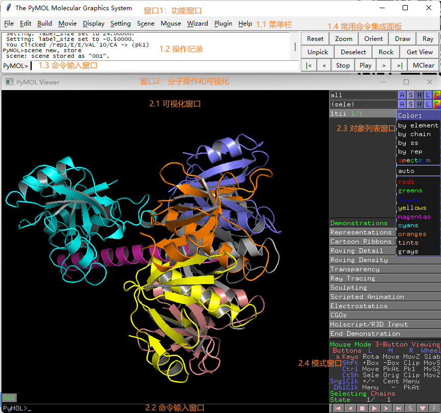

### 对象列表

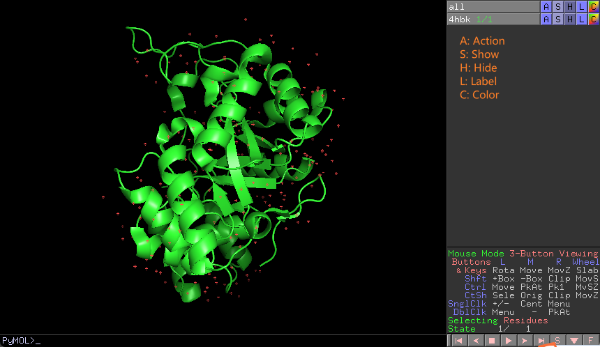

## 查看内置 Demo

选择菜单栏 `Wizard -> Demo` 可以查看内置的各种 Demo。

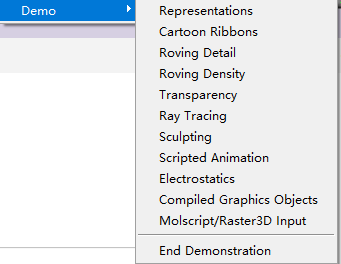

### Representations

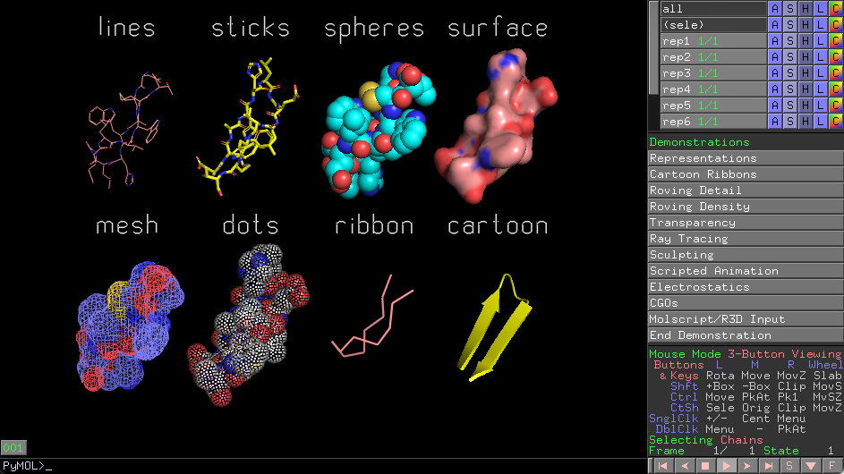

展示 PyMOL 支持的各种的结构模式。

### Cartoon Ribbons

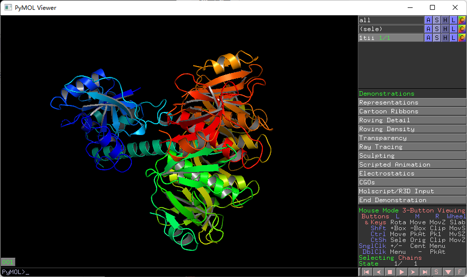

以条带的形式展示蛋白质结构。

### Roving Detail

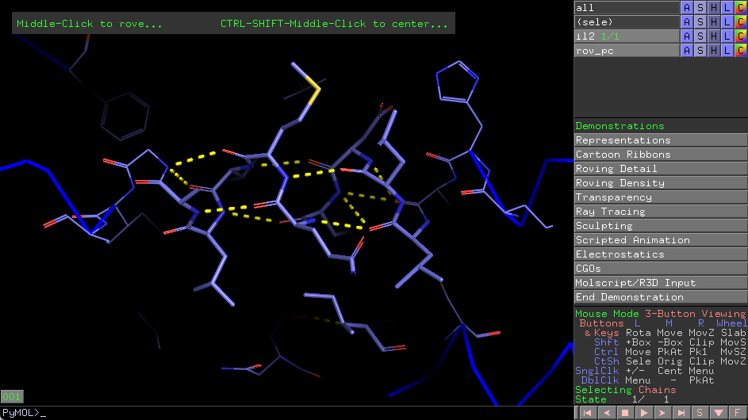

### Roving Density

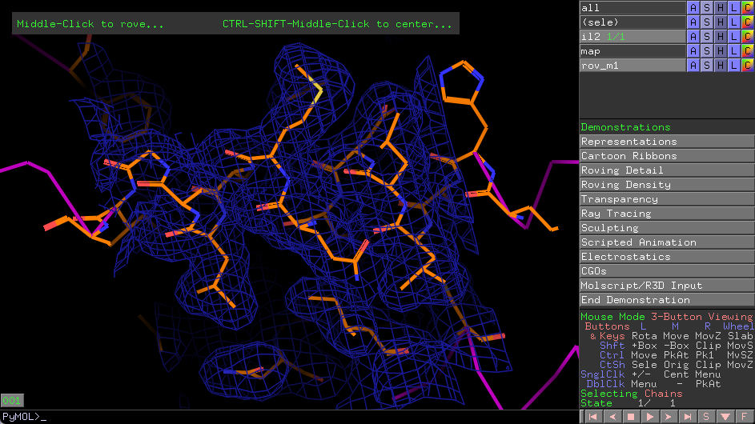

增加了密度图。

### Transparency

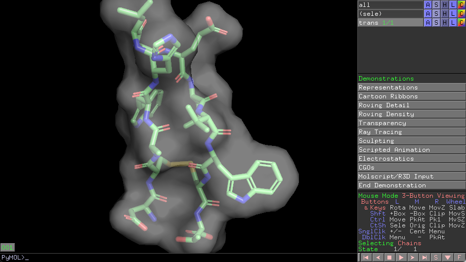

半透明表明。

### Electrostatisc

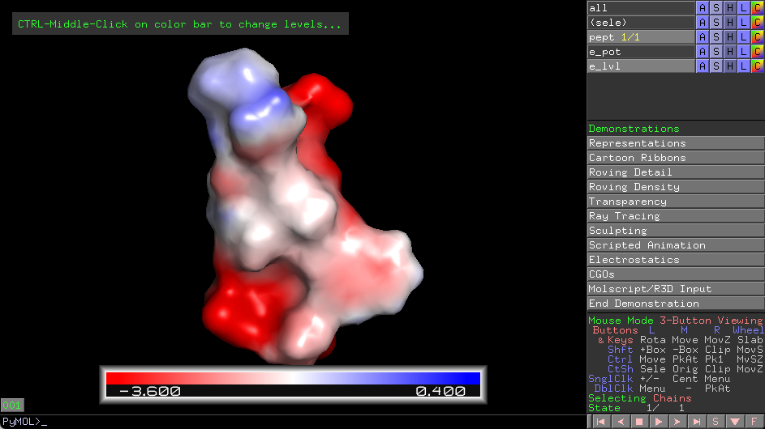

蛋白质表面静电图。

## 工作目录

点击菜单 `File -> Working Directory -> Change` 可以查看当前工作目录，也可以设置新的目录为工作目录。

也可以使用 `pwd` 查看工作目录：

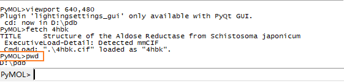

`ls`：查看目录内容。

工作目录作用：工作目录是默认文件打开和保存的目录，下载文件的保存目录也是在工作目录。

工作目录设置建议：

1. 不同项目设置不同工作目录
2. 设置一个默认工作目录
3. 不要把工作目录设置在软件安装目录

另外：

- 双击 PDB 文件打开 PyMOL，会自动切换工作目录到该 PDB 文件所在目录；
- 从软件安装处打开 PyMOL，则工作目录为软件安装目录。


## 查看蛋白

- 菜单选项：用 `File -> Open...` 菜单打开文件

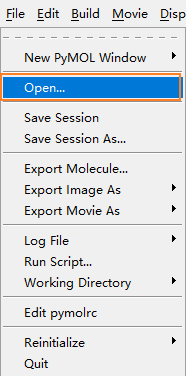

- `Load` 命令

```sh
load filename [,object [,state [,format [,finish [,discrete [,multiplex ]]]]]]
```

