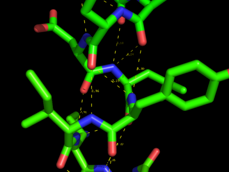

# 显示生化属性

## 化学键

PyMOL 可以从 PDB 结构文件推断出化学键，即使连接信息缺失。PyMOL 根据距离推断化学键，根据经验，两个给定半径的原子，只有在形成化学键的情况下，距离才会小于某个阈值。

### 显示双键

### 氢键和 Polar contacts



使用 `[A] -> find -> polar contacts -> <select from menu>` 显示氢键和 Polar Contacts.

该菜单选项背后其实是调用附加参数 `mode=2` 的 `distance` 命令。

控制氢键识别的参数定义如下：

```sh
set h_bond_cutoff_center, 3.6
```

特定原子之间的氢键：

```sh
dist name, sele1, sele2, mode=2
```


## 参考

- https://pymolwiki.org/index.php/Displaying_Biochemical_Properties
