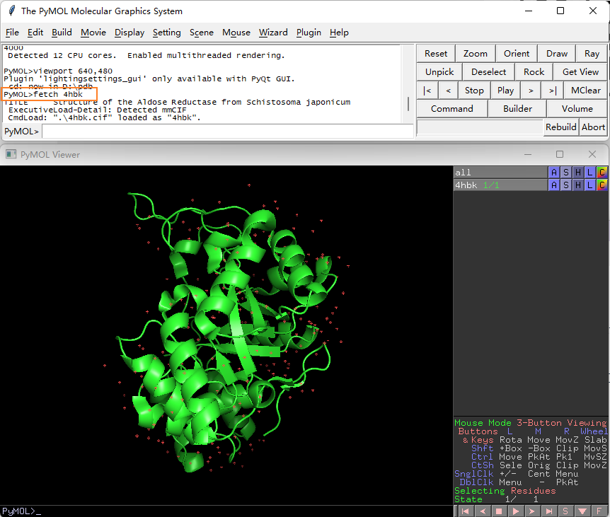

# Fetch

- [Fetch](#fetch)
  - [简介](#简介)
  - [示例](#示例)
  - [fetch_host](#fetch_host)
  - [参考](#参考)

2022-01-20, 09:37
***

## 简介

```sh
fetch codes [, name [, state [, finish [, discrete [, multiplex [, zoom [, type [, async ]]]]]]]]
```

`fetch` 命令根据 PDB ID 下载蛋白质结构到工作路径，并载入到 PyMOL 显示，在 PyMOL 中 object 的名字默认为 PDB ID，可通过 `name` 参数进行修改。

从 PyMOL 1.8 开始，默认下载的格式为 cif，可通过 `type` 参数修改文件格式。

也支持通过配体 ligand ID 下载小分子。

- `codes`

`str`: pdb accession，多个 accession 以空格分开。

- `name`

`str` 类型，加载文件后显示对象的名称，默认为 pdb accession。

- `type`

用于指定文件类型，可用值 `cif|mmtf|pdb|pdb1|2fofc|fofc|emd|cid|sid|cc`。

## 示例

**例1**，下载 `4hbk` 蛋白结构，直接在命令行输入如下命令，并回车：
 
```sh
fetch 4hbk
```

PyMOL 会自动下载该蛋白，格式为 cif，并图示化显示：



下载的文件 `4hbk.cif` 文件在工作目录。

PDB 格式原子个数不能超过 9999 个原子，随着结构越来越大，PDB 的局限性就暴露出来了，目前逐渐被 cif 格式取代。

**例2**，下载配体

```sh
fetch EBE
```

下载PDB 编号为 EBE 的配体小分子，操作一样。

**例3**，指定 object 名称和类型

```sh
fetch 4MVD, name="test", type=pdb
```

> type 后面不是字符串，不用加引号。

## fetch_host

`fetch` 命令默认从 pdb 网站下载数据，可以通过设置 fetch_host 修改下载源。可用选项包括：

- pdb, 标准 RCSB
- pdbe, 在 europe 的 pdb 镜像
- pdbj，在 Japan 的 pdb 镜像
- mirror URL with "divided" layout

例如：

```sh
set fetch_host, pdb
set fetch_host, pdbe
set fetch_host, pdbj
set fetch_host, http://ftp.wwpdb.org/pub/pdb
set fetch_host, file:///local/mirror/pub/pdb
```

## 参考

- https://pymolwiki.org/index.php/Fetch
- https://pymolwiki.org/index.php/Fetch_Host
