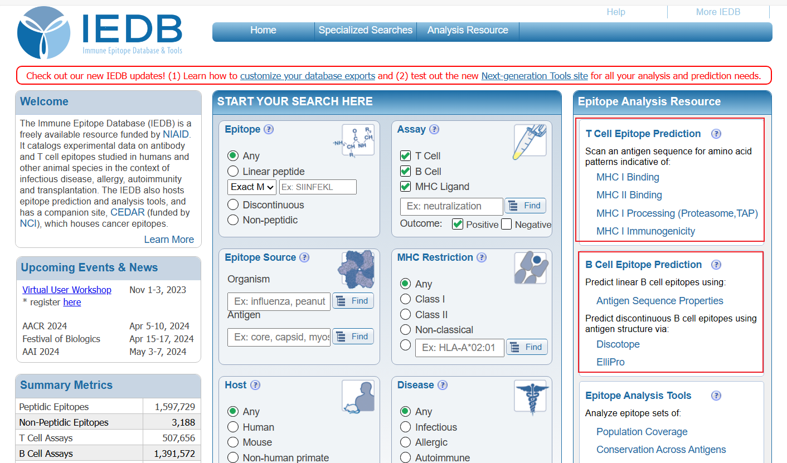

## IEDB

免疫表位数据库和工具 IEDB 的网址： 

https://www.iedb.org/

在网页右边，有表位预测工具：



对 T 细胞表位预测，目前丹麦技术大学（DTU）开发的 NetMHCpan (MHC-I)和 NetMHCIIpan (MHC-II) 性能最好，它们也有提供网页服务器免费使用，可以设置的参数更多，地址：https://services.healthtech.dtu.dk/ 。

## pyMOL

PyMOL 是可视化蛋白结构的商业软件，网址：https://pymol.org/2/ 。学生用教育邮箱可以申请免费使用一段时间。

**开源 PyMOL**

开源 PyMOL 可以免费使用，安装稍微麻烦一点。

下载地址： https://www.lfd.uci.edu/~gohlke/pythonlibs/

下载包：

- numpy+mkl
- PMW
- pymol

先安装 Python，使用 pip 依次安装上面三个包。

这样子 PyMOL 能使用，但是在界面上会缺少部分功能，因为 PyMOL 部分界面是用 PyQT5 构建的，所以最后还要安装 pyqt5:

```python
pip install pyqt5
```

Last updated: 2023-09-23, 21:33