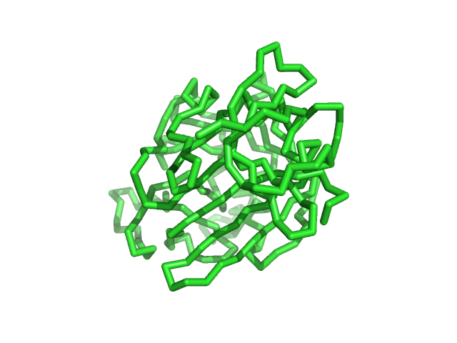

# 图像操作

- [图像操作](#图像操作)
  - [平滑处理](#平滑处理)
  - [出版质量图像](#出版质量图像)
    - [创建指定分辨率的图像](#创建指定分辨率的图像)
  - [参考](#参考)

## 平滑处理

`antialias` 用于设置 ray-tracing 中反锯齿程度。值越大，平滑效果越好，生成的图片效果越好，但是所需的 ray-trace 时间越长。例如：

- 将 antialias (AA) 设置为 0


- 将 AA 设置为 1



- 将 AA 设置为 2


可以发现，图像的整体质量随着 antialias 值的增加而提高。

设置语法：

```sh
set antialias,0  # 关闭反锯齿
set antialias,2  # higher setting, better image quality
```

## 出版质量图像

### 创建指定分辨率的图像


## 参考

- https://pymolwiki.org/index.php/Category:Image_Manipulation
