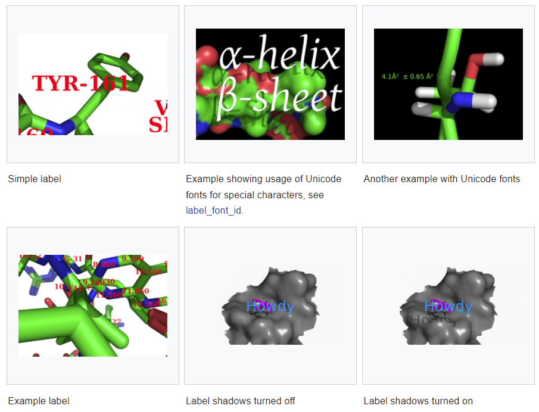

# 标签

- [标签](#标签)
  - [简介](#简介)
  - [移动 label](#移动-label)
  - [内置对象属性](#内置对象属性)
  - [label_font_id](#label_font_id)
  - [Label size](#label-size)
  - [Label color](#label-color)
  - [label_position](#label_position)
  - [label_distance_digits](#label_distance_digits)
  - [label_angle_digits](#label_angle_digits)
  - [label_dihedral_digits](#label_dihedral_digits)
  - [参考](#参考)

## 简介

`label` 命令有用于绘制文本标签。语法：

```sh
label [ selection[, expression]]
```

添加标签是很重要的功能，因此 PyMOL 提供了强大添加标签功能。可以修改：

- 标签大小
- 标签颜色
- 标签位置
- 字体
- 标签边框颜色

等。可以让 PyMOL 根据属性或任意字符串来标记原子；对 $\alpha$, $\beta$ 等特殊符号，还可以用 Unicode 字体。

下图展示了 label 的各种应用



## 移动 label

edit 模式下，Ctrl+鼠标左键移动。


## 内置对象属性

除了任意字符串标签，也可以使用如下内置的分子属性：

|属性|说明|
|---|---|
|name|the atom name|
|resn|the residue name|
|resi|the residue number/identifier|
|chain|the chain name|
|q|charge|
|b|the occupancy/b-factor|
|segi|the segment identifier|
|type (ATOM,HETATM)|the type of atom|
|formal_charge|the formal charge|
|partial_charge|the partial charge|
|numeric_type|the numeric type|
|text_type|the text type|

可以按照如下方式使用属性：

```sh
# simple example: label residue 22's atoms with their names
label i. 22, name

# Label residue #44's alpha carbon with it's residue name, residue number and B-factor.
label n. CA and i. 44, "(%s, %s, %s)" % (resn, resi, b)
```

## label_font_id

https://pymolwiki.org/index.php/Label_font_id

`label_font_id` 用于设置原子标签的字体。

```sh
# use "Serif Bold" font family
set label_font_id, 10
```

可用的 Font Families：

|Name|label_font_id|
|---|---|
|Sans|5|
|Sans Oblique|6|
|Sans Bold|7|
|Sans Bold Oblique|8|
|Serif|9|
|Serif Oblique|17|
|Serif Bold|10|
|Serif Bold Oblique|18|
|Mono|11|
|Mono Oblique|12|
|Mono Bold|13|
|Mono Bold Oblique|14|
|Gentium Roman|15|
|Gentium Italic|16|

## Label size

设置 label 的大小的命令：

```sh
# set the label size to 10pt
set label_size, 10

# set the label size to 1.5 Ang.
set label_size, -1.5 # set label sizes to 1.5 Angstroms -- large!
```

正整数设置为 point 大小，负数表示 angstrom 大小。

默认为 14 pt。

## Label color

设置命令：

```sh
# set object's color to colorName
set label_color, colorName, object

# example showing two different objects
# each with their own coloring.
pseudoatom foo
label foo, "foo"
pseudoatom another
label another, "Another label"
set label_color, green, foo
set label_color, lightpink, another
translate [0, -10, 0], object=another
set label_size, -2
zoom foo or another, 10
```

如果标签的颜色与你期望的不完全一样（比如黑色变为黑色，红色变成粉色），可以尝试如下设置：

```sh
unset depth_cue
unset ray_label_specular
```

## label_position

`label_position` 设置标签相对原子的位置。例如：

```sh
set label_position,(3,2,1)
```

表示相对原子在 X、Y、Z 轴的偏差分别为 3 Å，2Å 和 1Å。 

## label_distance_digits 

设置距离标签的小数点位数，例如设置距离标签的小数点后位数为 2：

```sh
set label_distance_digits, 2
```

## label_angle_digits

https://pymolwiki.org/index.php/Label_angle_digits

设置角度标签的小数点位数。

```sh
# set angle labels to display 2 decimals places to the right of the period
set label_angle_digits, 2
```

## label_dihedral_digits 

`label_dihedral_digits` 设置显示二面角的小数点位数：

```sh
# set dihedral labels to display 2 decimals places to the right of the period
set label_dihedral_digits, 2
```

## 参考

- https://pymolwiki.org/index.php/Category:Labeling
