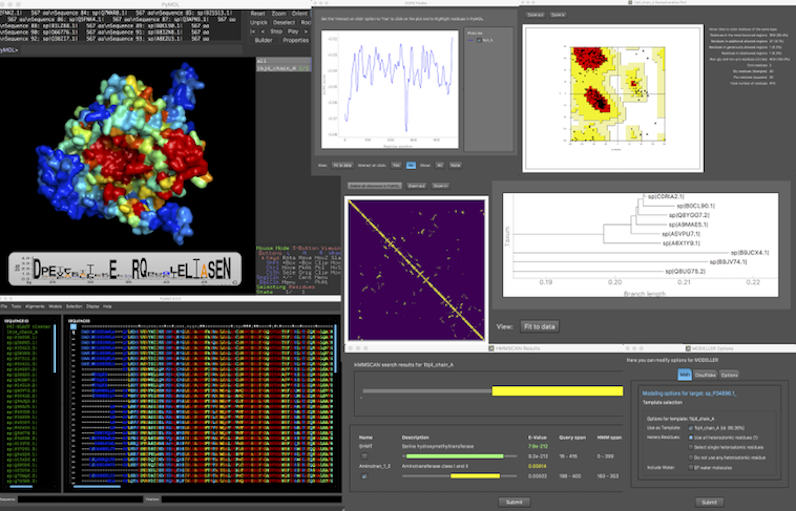

# PyMod3

2022-04-15, 10:04
***

## 简介

PyMod 3 插件提供 PyMOL 和几种生物信息学工具（PSI-BLAST, Clustall Omega, HMMER, MUSCLE, CAMPO, PSIPRD, MODELLER）。PyMod 3 在 PyMod 2.0 基础上提供了丰富的功能，特别是可以使用 MODELLER 进行同源建模。

从靶蛋白的序列开始，用户可以使用 PyMod 3 按照三步执行同源建模，即模板搜索、目标模板序列比对和构建模型。

另外，PyMod 3 还可以执行相似序列搜索、多序列结构比对、进化分析。

## 安装

下载地址：https://github.com/pymodproject/pymod/releases/download/v3.0/pymod3.zip

## 参考

- https://pymolwiki.org/index.php/PyMod
