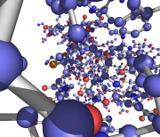
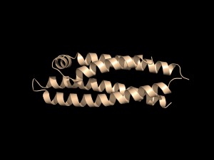
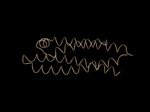
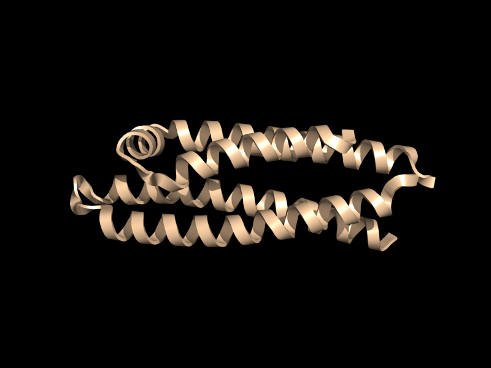
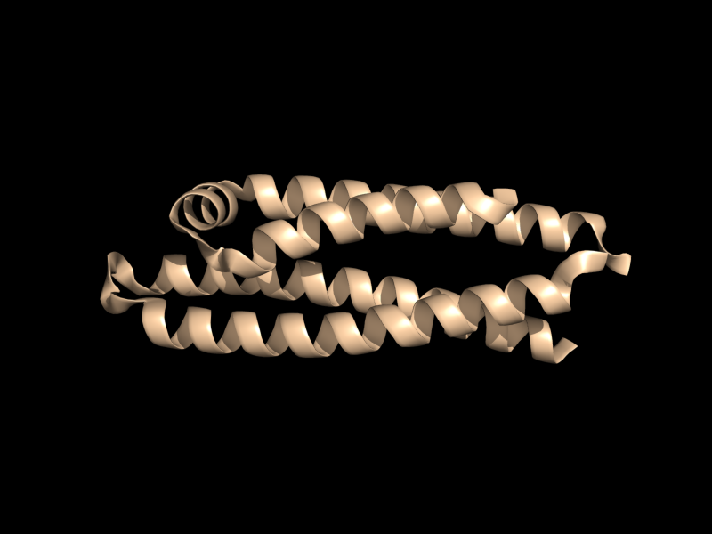
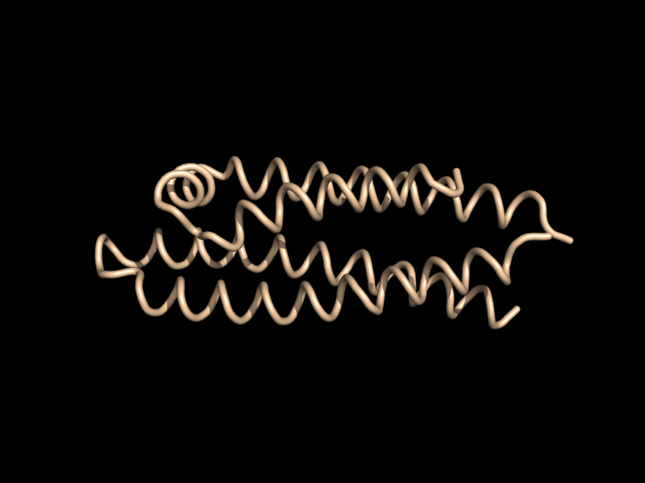
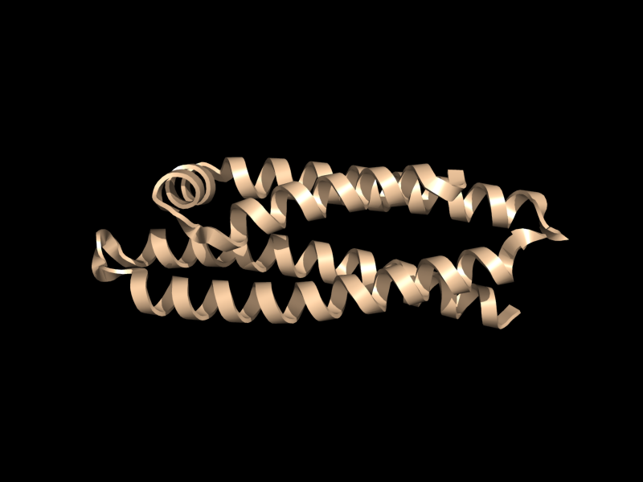
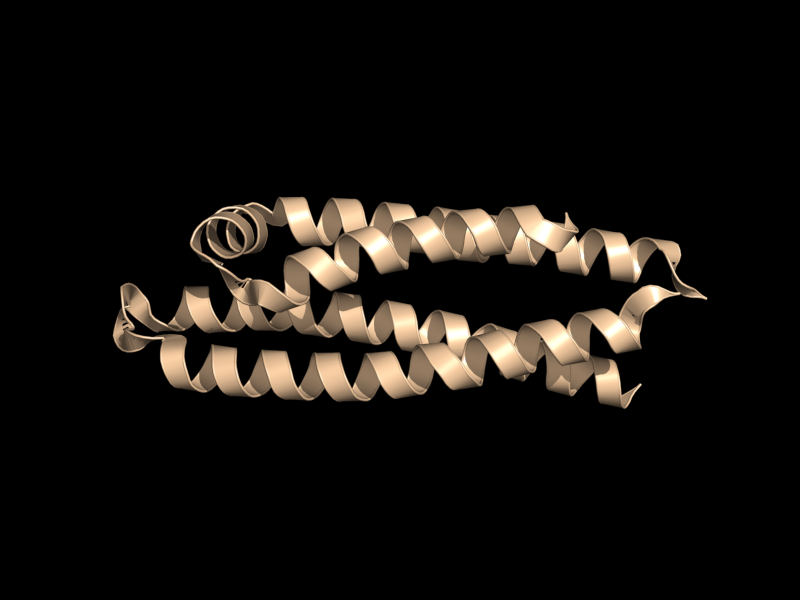
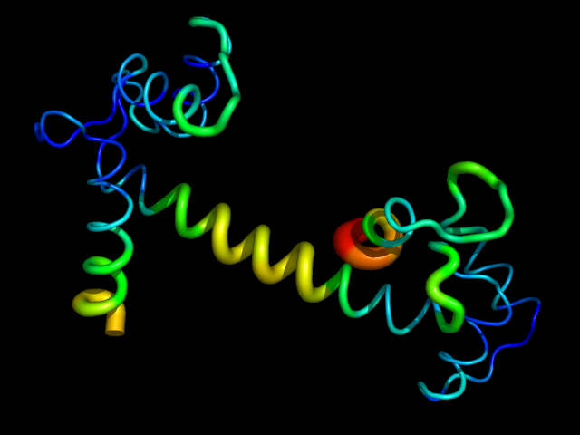

# 结构表示

- [结构表示](#结构表示)
  - [简介](#简介)
  - [Ball and Stick](#ball-and-stick)
  - [Cartoon](#cartoon)
    - [设置 cartoon 宽度](#设置-cartoon-宽度)
    - [香肠表示](#香肠表示)
  - [参考](#参考)

## 简介

表示（Representation）指 PyMOL 绘制结构的方式。PyMOL 支持如下的表达方式：

- 球棍模型（ball and stick）
- 

## Ball and Stick

球棍模型（ball and stick）一般用来表示大分子。PyMOL 可以将部分结构展示为球棍模型，如下图所示：



- **GUI 设置方式**

`A > Preset > ball and stick`。

- **API 方式**

将所有对象设置为球棍模型：

```python
preset.ball_and_stick(selection='all', mode=1)
```

## Cartoon

`cartoon` 用于设置 cartoon 样式。

- **设置命令**

```sh
cartoon type, (selection)
```

`type` 用于设置样式。

|type 值|样式|
|---|---|
|skip (-1)| |
|automatic (0)| |
|loop (1)||
|rectangle (2)||
|oval (3)||
|tube (4)||
|arrow (5)||
|dumbbell (6)||
|putty (7)|(b-factor scaling)|
|dash (8)||

- **设置 API**

```python
cmd.cartoon(string type, string selection )
```

- **示例**

```sh
cartoon rectangle,(chain A)
cartoon skip,(resi 145:156)
```

### 设置 cartoon 宽度

对 β 链：

```sh
cartoon_rect_length
cartoon_rect_width
```

对 α 螺旋：

```sh
cartoon_oval_length
cartoon_oval_width
```

### 香肠表示

在 PyMOL 中，香肠表示也称为 "putty"。启用 putty 视图：

```sh
show cartoon
cartoon putty
unset cartoon_smooth_loops
unset cartoon_flat_sheets
```



## 参考

- https://pymolwiki.org/index.php/Category:Representations
