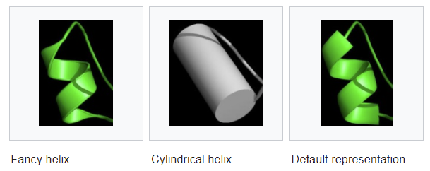
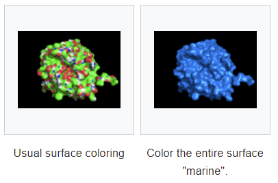

# Settings

- [Settings](#settings)
  - [简介](#简介)
  - [cartoon_fancy_helices](#cartoon_fancy_helices)
  - [unset](#unset)
  - [solvent_radius](#solvent_radius)
  - [surface_color](#surface_color)
  - [参考](#参考)

## 简介

PyMOL 有大量可调节参数，使其强大而灵活的重要原因之一。

`set` 是最常用的命令之一。PyMOL 的表示、状态、选项等都可以使用 `set` 修改。简而言之，`set` 用来设置 PyMOL 的状态变量，目前 PyMOL 有 600 多个状态变量。

## cartoon_fancy_helices

设置 cartoon helices 渲染样式：

- 默认样式是一个具有椭球截面的螺旋线
- fancy 模式螺旋是带有管状边缘
- Cylindicial 模式以实心圆柱展示。

如下所示：



- 例1，开启 Fancy helices

```sh
set cartoon_fancy_helices, 1
```

- 例 2， 开启 cylindrical helices

```sh
set cartoon_cylindrical_helices, 1
```

- 例 3，返回默认 helice 样式

```sh
set cartoon_fancy_helices, 0
set cartoon_cylindrical_helices, 0
```

## unset

```sh
unset name [,selection [,state ]]
```

`unset` 有两种行为方式。

如果没有提供选择：

- 从 PyMOL 2.5 开始，将命名的全局设置恢复为默认值；
- 在 PyMOL 2.5 之前，将命名全局设置设为 0 或 off。

如果提供了选择，

## solvent_radius

https://pymolwiki.org/index.php/Solvent_radius

溶剂半径，修改溶剂半径会影响

## surface_color

https://pymolwiki.org/index.php/Surface_color

`surface_color` 控制 surface 的颜色。



语法：

```sh
set surface_color, (color), (selection)
```

例如：

```sh
# color the surface white
set surface_color, white, *

# return surface coloring to the default scheme
set surface_color, default, *
```

## 参考

- https://pymolwiki.org/index.php/Settings
- https://pymolwiki.org/index.php/Set
- https://pymolwiki.org/index.php/Category:Settings
- https://pymolwiki.org/index.php/Unset
