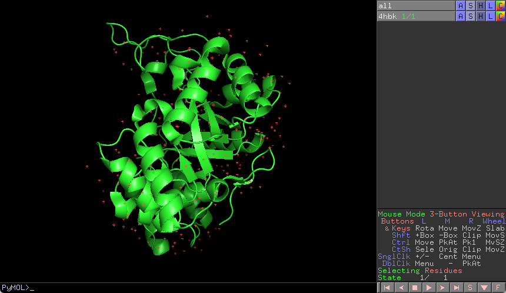
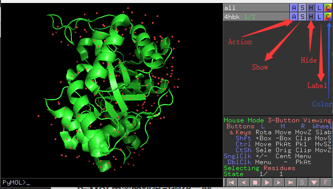

# 蛋白视图

- [蛋白视图](#蛋白视图)
  - [界面](#界面)
  - [命令](#命令)
  - [show](#show)
    - [lines](#lines)
    - [ribbon](#ribbon)
  - [show as](#show-as)
  - [hide](#hide)

## 界面



如图所示，载入蛋白 `4hbk`，在对象列表可以看到两个对象名称：

- `all`，表示真实的 object,代表所有的 object；
- `4hbk`，载入的蛋白

每个对象都有 `ASHLC` 操作，如下图所示：



操作说明：

- `Action`，包含对象的常用操作，如复制、删除、加氢等
- `Show`，将对象渲染为 cartoon, line, stick sphere 等模式
- `Hide`，隐藏

## 命令

`as lines`

`as sticks`

`as spheres`

`as surface`

`as mesh`

`as dots`

`as ribbon`

`as cartoon`

## show

```sh
show
show reprentation [,object]
show reprentation [,(selection)]
show (selection
```

- **例 1**，设置指定残基的表示

```sh
show sticks, resi 333
```

将第 333 个残基显示为 sticks。

### lines

https://pymolwiki.org/index.php/Lines

lines 是 PyMOL 中原子和化学键的基本表现形式，化学键用单一线条表示，原子以化学键的交点显示。

```sh
# show everything as lines
show lines

# only show residues 50-80 as lines
show lines, i.50-80
```

### ribbon

```sh
show ribbon
```

显示 alpha 碳原子（CA）。如果结构不仅仅是 CA 主干，用 cartoon 表示看起来就不大对，此时用 Ribbon 显示 CA 轨迹更好。

## show as


## hide

https://pymolwiki.org/index.php/Hide

隐藏选择的部分，或其它图形对象，如原子、化学键等。

```sh
hide representation [,object]
hide representation [,(selection)]
hide (selection)
```

可用的 representations 包括：

- lines
- spheres
- mesh
- ribbon
- cartoon
- sticks
- dots
- surface
- labels
- nonbonded
- nb_spheres

例如：

```sh
# hides all lines
hide lines,all

# hides all ribbons
hide ribbon

# hides all distances
hide dashes

# hides sticks in protA and all residues that aren't in the range of 40-65
hide sticks, protA and not i. 40-65

# hide hydrogen atoms
hide (hydro)  # or hide (h.)
```
