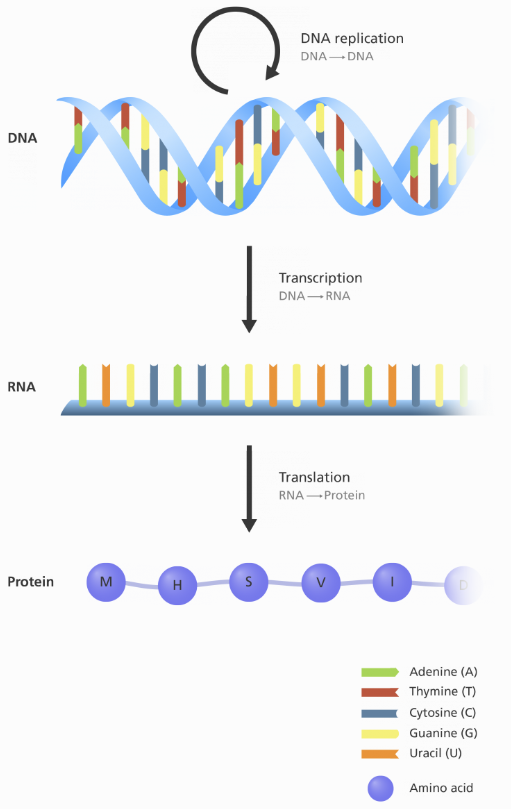

# DNA 翻译成蛋白质

- [DNA 翻译成蛋白质](#dna-翻译成蛋白质)
  - [简介](#简介)
  - [中心法则（Central Dogma）](#中心法则central-dogma)
  - [真核与原核比价](#真核与原核比价)
  - [参考](#参考)

@author Jiawei Mao
***

## 简介

已知 DNA 序列，可以使用遗传密码子将其转换为相应的蛋白质序列。这与细胞产生蛋白质的机制相同。

## 中心法则（Central Dogma）

分子生物学中的中心法则解释了遗传信息从 DNA 到 RNA，并产生蛋白质的过程。中心法则表明 DNA 包含制造我们所有蛋白质所需的信息，RNA 是将这些信息带到核糖体的使者。核糖体充当细胞中的工厂，从 mRNA 解码信息生产蛋白质。

DNA 从起始密码子（start codon）到终止密码子（stop codon）编码多肽的核苷酸序列称为编码序列（CoDing Sequence, CDS）。

## 真核与原核比价

根据定义，原核生物不具有将染色体 DNA 从细胞质中分离开的亚细胞结构，细胞核。因此，DNA 转录成 mRNA 和 mRNA 翻译成肽链可以同时发生。

## 参考

- https://en.wikipedia.org/wiki/Central_dogma_of_molecular_biology
- https://omicstutorials.com/converting-dna-to-protein-sequence/
- https://www.khanacademy.org/science/biology/gene-expression-central-dogma
