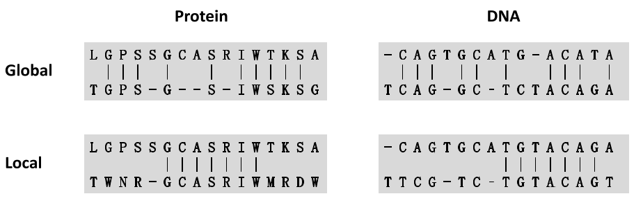
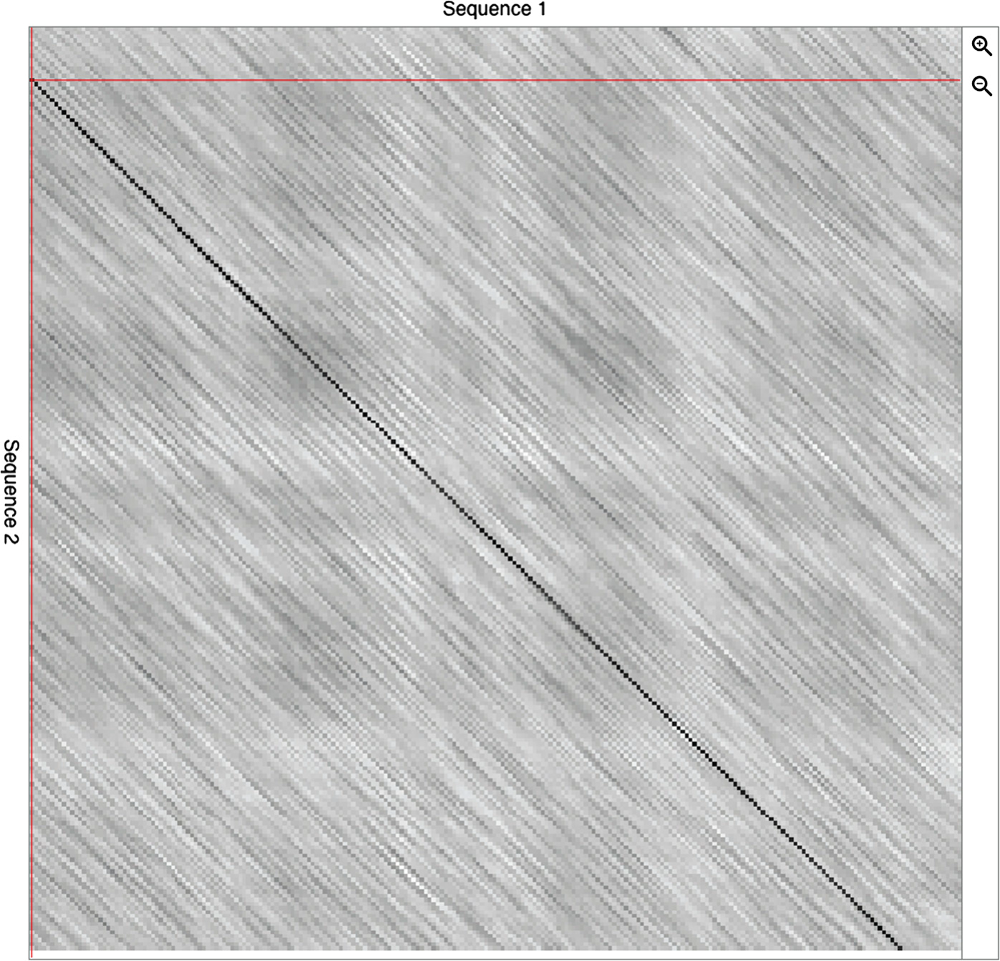

# Pairwise Alignment

- [Pairwise Alignment](#pairwise-alignment)
  - [简介](#简介)
  - [点图](#点图)
  - [双序列全局比对](#双序列全局比对)

2021-09-23, 14:53
***

## 简介

生物信息学给生物研究带来的主要贡献之一是帮助阐明给定基因或它们编码的蛋白质的功能。这些该任务的常见方法是根据其序列与其他具有确定功能的序列的相似性获得有关其生物学功能的假设，然后通过实验进行验证。

这种方式其实就是根据序列的相似性推断同源性。这些概念并不等同，不过实践证明，具有高度相似性的序列具有同源性和类似功能的概率很高，概率值随着序列相似度的增加而增加。

由于突变的存在，序列比对不能单纯的按照位置逐一比对，还需要引入间隙（gap）使得两个序列之间的共享字符数最大化。

常见的序列有 DNA、RNA 和蛋白质。蛋白质序列比对主要用于序列注释、而 DNA 序列除了注释外，还用于其它与基因分析相关的应用。

序列比对可以分为两类：全局比对（global）和局部比对（local），如下图所示：

- 全局比对最大化两个序列的共享字符；
- 局部比对找到两个序列最接近的部分。

## 点图

点图是表示两条序列相似性的矩阵点图示。如下图所示：

行和列分别表示一条序列，图中的对角黑线为高度相似度的地方。网页工具 [dotlet](https://dotlet.vital-it.ch/) 可以创建类似的图。

## 双序列全局比对

经典的全局比对算法是 Needleman-Wunsch 算法。1970 年，Needleman 和 Wunsch 首先将动态规划法应用于两条序列的全局比对，后来这个算法就称为 Needleman-Wunsch 算法。今天，所有比对软件使用的算法都是从这个经典算法衍生出来的。

