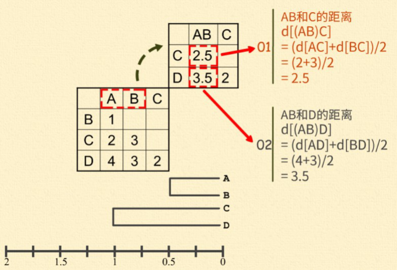
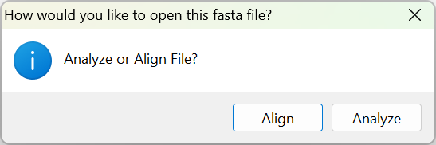
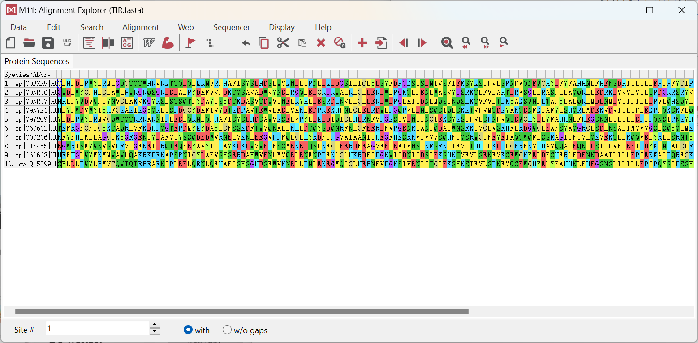
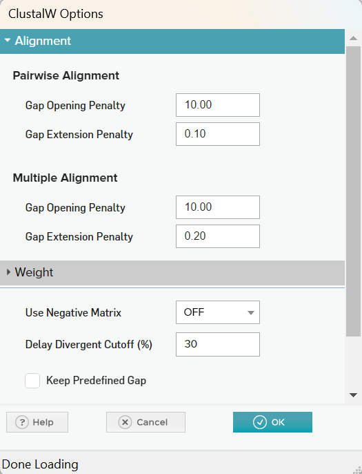
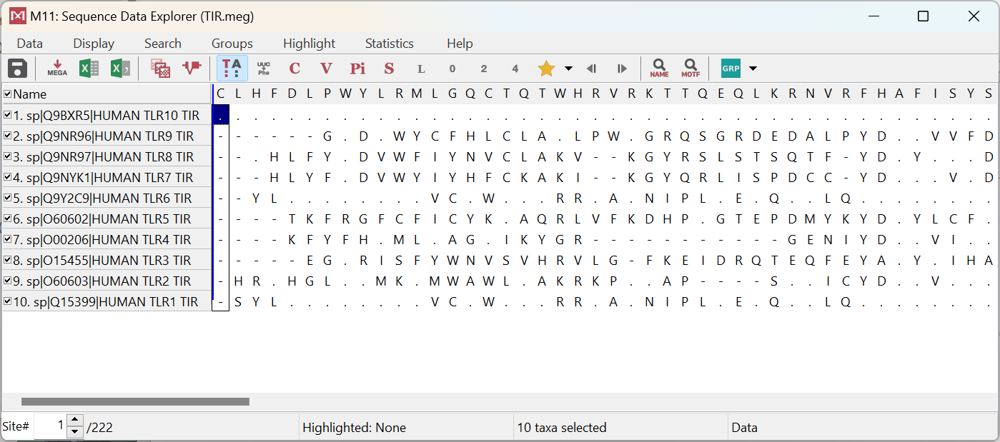
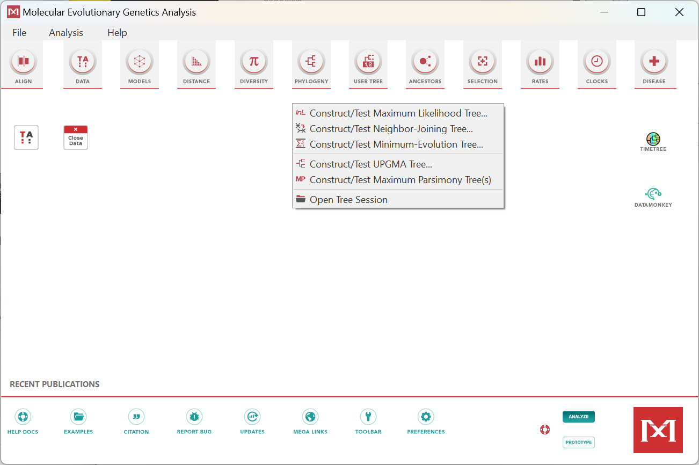
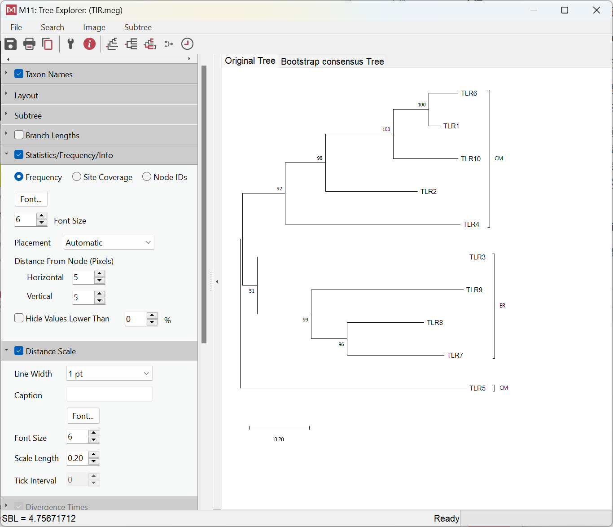

# 系统发生树的构建

- [系统发生树的构建](#系统发生树的构建)
  - [简介](#简介)
  - [UPGMA 算法](#upgma-算法)
  - [用什么序列构建树？](#用什么序列构建树)
  - [用 MEGA 构建 NJ 树](#用-mega-构建-nj-树)
    - [准备](#准备)
    - [构建树](#构建树)

2024-07-12
@author Jiawei Mao
***

## 简介

 构建系统发生树的方法很多。最常用的有:

1. 基于距离的构建方法——最快

   - 非加权分组平均法（Unweighted Pair Group Method with Arithmetic mean, UPGMA）

   - 最近邻居法（Neighbor-Joining method, NJ）
   - 最小二乘法（Generalized Least Squares, GLS）

2. 最大简约法（Maximum Parsimony, MP）
3. 最大似然法（Maximum Likelihood, ML）
4. 贝叶斯推断（Bayesian Inference, BI）：最慢


| 软件    | 说明                         | 网址                                                 |
| ------- | ---------------------------- | ---------------------------------------------------- |
| PHYLIP  | 免费的、集成的进化分析工具   | http://evolution.genetics.washington.edu/phylip.html |
| MEGA    | 图形化、集成的进化分析工具   | http://www.megasoftware.net/                         |
| PAUP    | 商业软件，集成的进化分析工具 | http://paup.csit.fsu.edu/                            |
| PHYML   | 最快的 ML 建树工具           | http://www.atgc-montpellier.fr/phyml/                |
| MrBayes | 基于贝叶斯方法的建树工具     | http://mrbayes.csit.fsu.edu/                         |

目前流行的建树软件（上表），比如 PHILIP 和 MEGA，基本能够包括上述所有算法。如果想要构建 ML 树，也可以尝试专门构建 ML 树的 PHYML。贝叶斯的算法以 MrBayes 为代表，只是计算速度比较慢。如果构建的系统发生树要用于发表生物信息学领域的文章，需要两种以上的构建方法锁定同一个结果才能审稿通过。如果是用于发表以生物实验为主的文章用一种构建方法就可以了。


## UPGMA 算法

虽然软件可以快速自动地完成系统发生树的构建，但是对于基本算法的了解还是必不可少的。以非加权分组平均法（UPGMA 法）为例，介绍如何通过计算所有序列两两间的距离，再根据距离远近构建系统发生树。

序列两两间的距离可以用双序列比对得出的一致度/相似度代表，或用其他简化值代替。

比如，有如下 A、B、C、D四条序列：

```
A：TAGG
B：TACG
C：AAGC
D：AGCC
```

接下来，我们用序列间不同的碱基数目作为序列间遗传距离的度量。首先，计算出每两条序列间有几个碱基不同，并以用矩阵的形式记录下这些距离。 

|      | A    | B    | C    |
| ---- | ---- | ---- | ---- |
| A    | 1    |      |      |
| B    | 2    | 3    |      |
| C    | 4    | 3    | 2    |

找出距离最小的一对序列。A 和 B 之间的距离最小，d[AB]=1。然后将 A 与 B 合并聚集，其分支点为 d[AB]/2=1/2=0.5。即 A、B 之间的距离等于 1，从中间折叠后每边各 0.5。 

现在，把(AB)看成一个整体，分别计算它们与 C 和 D 的距离。(AB) 和 C 的距离等于 A 和 C 的距
离加上 B 和 C 的距离除以 2，即，d[(AB)C]=(d[AC]+d[BC])/2=(2+3)/2=2.5。同样，(AB) 和 D
的距离等于 A 和 D 的距离加上 B 和 D 的距离除以 2， 即 d[(AB)D]=(d[AD]+d[BD])/2=(4+3)/2=3.5。



据此，计算出新的距离矩阵，并找出新矩阵中最小的距离。C 和 D之间的距离最小，d[CD]=2。将 C 和 D进行合并聚集，其分支点为 d[CD]/2=2/2=1。

接下来，把(CD) 看成一个整体，计算它们与 (AB) 之间的距离。(CD) 与 (AB) 之间的距离等于 C 和 (AB) 的 距离加上 D 和 (AB)的距离除以 2，即 d[(CD)(AB)]= (d[C(AB)]+d[D(AB)])/2=(2.5+3.5)/2=3。最后，将(AB)与 (CD) 进行合并聚集，归为一类，分支点为 d[(CD)(AB)]/2=3/2=1.5。这样，A、B、C、D 四条序列的系统发生树就构建好了。树上，枝的长短直接反应了它们与共同祖先的距离。 


## 用什么序列构建树？

分子进化的研究对象是核酸和蛋白质序列。如果要研究某个基因的进化，是应该选用它的 DNA 序列，还是翻译后的蛋白质序列呢？序列的选取要遵循以下原则：

1）如果 DNA 序列两两间的一致度≥70%，选用 DNA 序列。

因为，如果 DNA 序列都如此相似，它们对应的蛋白质序列会相似到几乎看不出区别。这对于构建系统发生树是不利的。所以这种情况选用 DNA 序列，而不选蛋白质序列。

2）如果 DNA 序列两两间的一致度<70%，DNA 序列和蛋白质序列都可以选用。

## 用 MEGA 构建 NJ 树

MEGA 特点：

- 免费
- 操作简单，默认设置效果也很好
- 被业界普遍认可，可用于发表文章
- 支持多操作系统

下载 MEGA：https://www.megasoftware.net/dload_win_gui

### 准备

TIR.fasta 里存储了 10 条人的不同 Toll 样受体胞内域的氨基酸序列。

只有具有一定亲缘关系，也就是彼此比较相似，但又存在一定差别的序列拿来做多序列比对，或拿来构建系统发生树才有意义。

点击 MEGA 主窗口的 File > Open A File 打开 TIF.fasta 文件，MEGA 弹窗：



想要做系统发生树，先要做多序列比对，所以点击 Align：



MEGA 此时没有直接做多序列比对，而是直接显示所有序列。需要从 Alignment 菜单中选择比对方法


这里直接选择 ClustalW 方法，弹出多序列比对设置窗口：



MEGA 的默认参数效果一般可以，如果不了解这么参数，可以采用默认参数。点击 OK，得到多序列比对结果：


保存多序列比对结果：Data > Export Alignment > MEGA Format

MEGA Format 就是一个纯文本文件。双击用 MEGA 打开，会拖到 MEGA 的主窗口打开。



**点击 TA 按钮**：

- 可以从多序列比对结果中提取共有序列，即每一列中出现最多的字母。
- 下面的序列，如果其字母与共有序列一样，就是一个点，如果不一样，就标出对应字母。

**点击 C 按钮：**

- 可以了解序列的保守程度，完全保守列标黄；
- 点击 V，则反转，不保守的列标黄。

通过对比对结果的进一步分析，可以淘汰掉一些序列。比如海选的序列里有有一些明显不合群的序列，就可以把它们前面的钩去掉，不让它们参与建树，以免影响建树质量。

此外，还可以对这些序列进行分组标记。点击分组按钮（Edit/Select Taxa and Groups）。我们让 TLR 3、7、8、9 这四个内质网上的蛋白质序列在一组 ，组名为 “ER”。然后按住 Ctrl 键同时选中 Ungrouped Taxa 列表里的 TLR 3、7、8、9 四条序列的名字。选中后点击 ，将选中的序列归入 ER 组。再次点击 ，创建第二组，更名为 CM，即细胞膜上的蛋白质。按住 Ctrl 选中 Ungrouped Taxa 列表里剩下的所有序列，点击 ，将它们归入 CM 组。当序列数量较多的时候，人为分组，可以从树上更加清楚的看出组内哪些成员叛逃了去了别组。

此外，输入序列的名字较长。这样的名字如果作为构建的系统发生树上叶子的名字，会破坏树的外观也不利于信息的解读。因为，需要人为修改一下序列的名字。选中序列后点击 ，把名字改为能区分彼此的关键词，比如只保留 TLR*。全部更改好之后，点  Ok，准备工作全部完成。 

### 构建树

点击主窗口PHYLOGENY：



选择 Neighbor-Joining 方法，弹窗设置窗口。

参数设置对构建的系统发生树的准确程度来说非常重要。在树构建好之后，还经常需要根据树的具体情况，重新设置参数，并重新建树，如此反复，直至结果令人满意为止。

如果不知道应该怎样设置参数，那么继续使用 MEGA 的默认参数，也能做出基本满意的系统发生树。如果想要做出更好的树，至少应该掌握其中三个参数的设置。

1. **Test of phylogeny（建树的检验方法）**

默认值为不进行检验。这显然比较偷工减料，不检验怎么知道建出来的树质量如何？

检验方法可以选常用的Bootstrap method（步长检验）。步长检验需要设定检验次数，通常为100 的倍数，比如设置为 500。 

步长检验是根据所选的建树方法，计算并绘制指定次数株系统发生树。因为大多数建树方法的核心算法都是统计概率模型，所以每次计算出的树都会有所差别。而建好的系统发生树上每个节点上都会标记一个数字，它代表了指定次数次计算所得出的系统发生树中有多少比例的树含有这一节点。一般来说，绝大多数节点上的数值都大于 70% 的树才可信。个别低于 70%的节点可以暂且容忍，或通过添加，删减序列来改善质量。 

2. **Substitution Model**

它是选择计算遗传距离时使用的计算模型。理论上应该尝试各种模型，根据检验结果选择最合适的模型进行计算。但在实际操作中，可先尝试选用较简单的距离模型，比如 p-distance。 

3. **Gap/Missing Data Treatment**

大多数建树方法会要求删除多序列比对中含有空位的列。但是根据遗传距离度量方法的不同，删除原则也不同。

- 如果是以序列间不同残基的个数来度量遗传距离的话，这里需要选择 Complete deletion（全部删除）
- 如果是其他方法，比如这里选用的 NJ 方法，可以选择 Partial deletion（部分删除）。删除程度定在 50%，即，保留一半含有空位的列。

完成设置，点击 Ok。由于序列较少，迅速生成结果：



输出有两棵树，原始树和 Bootstrap 树。


可以看到，当前构建的这株系统发生树中，绝大多数节点处的数值都是≥70 的，所以这株树整体上是可信的。

Original Tree 是步长检验构建的 500 株树中的一株，未经过多棵树合并，所以树枝的长短可以精确代表遗传距离。此外，从这株树也可以看出之前的人为分组情况是不是发生了意想不到的变化。比如，TLR5 似乎脱离了CM 组，成为了外类群，从而确定了树根。
