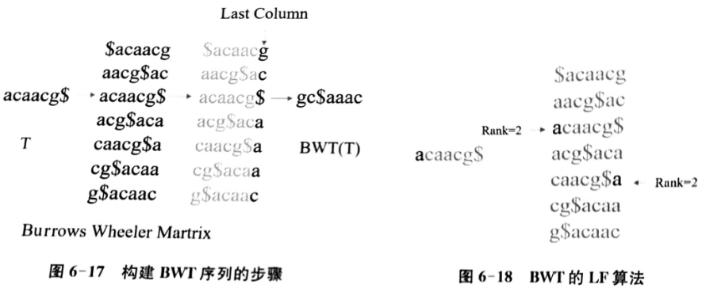

# 测序读段回帖

- [测序读段回帖](#测序读段回帖)
  - [简介](#简介)
  - [参考基因组选择](#参考基因组选择)
  - [回帖算法-BWT](#回帖算法-bwt)
    - [回帖与序列两两比对的区别](#回帖与序列两两比对的区别)
    - [Burrows-Wheeler Transform (BWT)](#burrows-wheeler-transform-bwt)
    - [BWT 的性质](#bwt-的性质)
    - [用 LF 算法从 BWT(T) 重构原序列](#用-lf-算法从-bwtt-重构原序列)
  - [BWA](#bwa)
  - [局部重比对](#局部重比对)
  - [标记重复](#标记重复)
  - [碱基质量重新评估](#碱基质量重新评估)
  - [sam, bam](#sam-bam)
  - [vcf 和 bcf](#vcf-和-bcf)

***

## 简介

**基因组重测序**是对有参考基因组物种的不同个体进行的基因组测序，并在此基础上对个体或群体进行差异性分析。

**测序读段回帖**(reads mapping)是指将测序得到的 reads 定位至参考基因组的过程。回帖可分为参考基因组选择和序列比对回帖这两个步骤。

## 参考基因组选择

目前常用的人类参考基因组主要有两种版本，即 hg9(对应 GRCH37)和 hg38(对应GRCH38)。这两种版本的区别主要在于 hg38 在 hgl9 的基础上纠正了之前的一些测序错误和组装错误，并填补了很多遗留下来的 gap 区域，这使得 hg38 版本的参考基因组序列相对于 hg19 有了较大的改变和坐标上的偏移，相应的，其注释文件也有了对应的改动。hg38 中所包含的信息更全面。有工具可以实现 hg19 和 hg38 之间的版本转换,研究者可根据研究需要自行选择。

参考基因组的序列和注释信息可从多个主流国际生物信息学数据库 [NCBI](https://www.ncbi.nlm.nih.gov/)、[GENCODE](https://www.gencodegenes.org/)、[Ensembl](https://asia.ensembl.org/index.html) 和 [UCSC](https://www.genome.ucsc.edu/)获取。不同数据库中存储的文件信息大致相同，只是版本和格式上有细微差别。除了人类的参考基因组外，也可以在这些数据库中获取小鼠、斑马鱼、酵母、拟南芥等生物的基因组。

## 回帖算法-BWT

### 回帖与序列两两比对的区别

测序读段(reads)的回帖就是找出 reads 在参考基因组上的位置。回帖可认为是全局范围内的序列两两比对。但是，这种回帖与经典的序列比对有较大的不同:

- 首先，回帖的对象是测序 reads 和整个基因组，两者的长度有着数量级上的差异，且在基因组上存在较多的重复序列区域，这使得 reads 定位困难。
- 其次，reads 文件大小从几 GB 到几百 GB 不等，这给比对效率提出了挑战。
- 另外，测序错误和可能存在的突变以及 SNP 等，要求算法能对存在错配的 reads 进行合理地处理。
- 此外，转录组测序 reads 的回帖,需要针对pre-RNA 加工和可变剪接等生物学过程设计合适的模型。

因此，经典的序列比对策略不适用于高通量测序数据的序列比对回帖。

### Burrows-Wheeler Transform (BWT)

BWT 算法可以实现高效回帖，该算法在对参考基因组序列构建索引的基础上实现。构建索引的过程通过 BWT 实现。

如图所示，给定参考基因组序列 $T$，首先，在序列末尾添加 `$` 字符。然后，将 T 最左边的 1 个字符移动到最右端，形成一个新的序列，重复此过程，直到 `$` 出现在最左端。接着，将这些新序列按照其第一个字符的 ASCII 码进行排序，形成 BW 矩阵(Burrows-Wheeler Martrix)，这个矩阵的最后一个字符从上到下形成的字符串为 BWT(T)。

### BWT 的性质

BWT有以下两点性质：

1. BW 矩阵的每条序列，其最后一个字符是第一个字符的前缀。
2. BW 矩阵中，如果一个字符在最后一列(last 列)中第 i 次出现，则在第一列(first列)中,也是第 i 次出现，即这两个字符是同一个字符。如字符 “a” 在最后列和第一列中出现的序(rank)都是 2。这个性质正是 BWT 的 LF(Last to First)算法的核心，其中 BWT(T)序列被称为 L，而第一列被称为 F。

### 用 LF 算法从 BWT(T) 重构原序列

## BWA

## 局部重比对

## 标记重复

## 碱基质量重新评估

## sam, bam

## vcf 和 bcf

