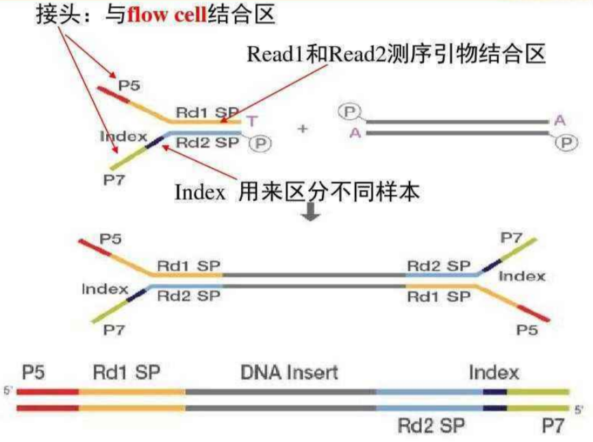
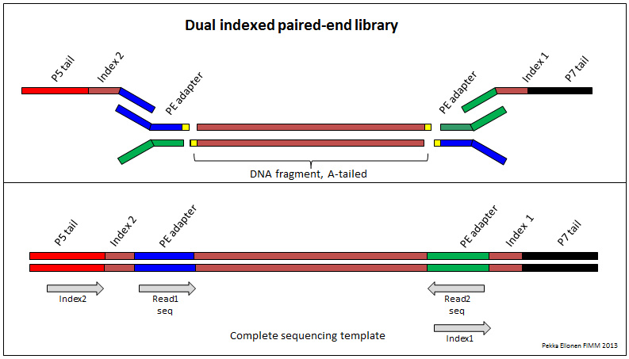

# Illumina 测序原理

## 简介

NGS 是一种高通量测序方法。Illumina 测序包含 4 步：

1. 分离核酸
2. 文库制备
3. 测序
4. 数据分析

### 分离核酸

在 NGS 工作流中，不管是对基因组 DNA（gDNA）、总 RNA 或不同 RNA 类型，核酸分离是至关重要的第一步。

NGS 核酸分离要考虑以下因素：

- 产量：制备文库需要 ng 到 ug 量级的 DNA 或 RNA，因此要尽量分离出高质量的核酸；
- 纯度：

### 文库制备

1. DNA 片段化：使用超声、酶或者加热的方式将 DNA 样品打碎成小片段，一般在 300 ~ 800bp 之间，除非有特殊要求。
2. 末端修复（End Repair）：补平片段化时导致的不平末端。
3. 3' 末端加 A，转换为粘性末端，与 adapter 互补配对，因为adapter 3‘ 端有一个突出的 T。
4. 接头连接（ ligation adaptor）

## Flowcell

## 桥式 PCR

脱氧核糖核苷三磷酸（dNTP）

## 单端测序

## Barcode

Barcode 或 Index 是在建库时，接头上就含有的序列。

## 双端测序（Paired-end Sequencing）

## 概念

### 接头

- 用酶、激光或超声把 Genomic DNA (gDNA)或者由 RNA 反转录得到的双链 cDNA 打成小片段
- 打断是随机打断，有可能末端不平整，还需要用酶补平
- 补平之后，需要在 3’ 端加 A 碱基
- 加上 A 之后，再加 adapter

接口包含：

- P5 和 P7 序列，与 flow cell 结合
- Rd1 SP 和 Rd2 SP，启动测序的测序引物结合位点
- Index1 和 Index2，用于区分样本的 index 序列

Illumina 提供多种接口试剂来实现灵活和多样的 index 策略，这些接头试剂的主要在支持的样本数量、index 的长度和序列以及连接到插入片段的化学方法的不同。

## 参考

- https://www.thermofisher.cn/cn/zh/home/life-science/cloning/cloning-learning-center/invitrogen-school-of-molecular-biology/next-generation-sequencing/illumina-workflow.html
- https://support.illumina.com.cn/bulletins/2020/06/chinese-illumina-adapter-portfolio.html