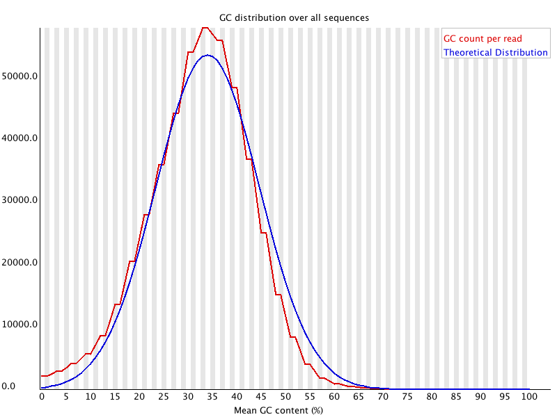
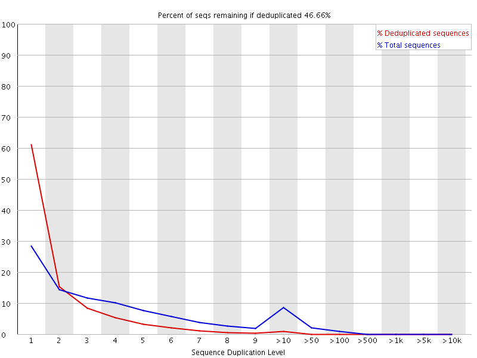

# 分析模块

- [分析模块](#分析模块)
  - [Basic Statistics](#basic-statistics)
  - [Per Base Sequence Quality](#per-base-sequence-quality)
  - [Per Base Sequence Content](#per-base-sequence-content)
  - [Per Sequence GC Content](#per-sequence-gc-content)
  - [Duplicate Sequences](#duplicate-sequences)
  - [Overrepresented Sequences](#overrepresented-sequences)
  - [参考](#参考)

## Basic Statistics

## Per Base Sequence Quality

说明：

- 横坐标为碱基在序列上的位置
- 纵坐标表示碱基得分 Q 值。

$$Q=-10\times \log_{10} P$$

其中 $P$ 表示错误概率，值越低说明测序结果越可靠。

得到 Q 值后再加上 33，得到 phred33 值，再将其转换为 ASCII 上对应的字符。

- 当 Q 值为 20，测序错误率为 1% (Q20 标准)
- 当 Q 值为 30，测序错误率为 0.1% (Q30 标准)

每个箱线图是该位置所有读段序列的测序质量统计：

- 红线表示中位数
- 蓝线表示平均值
- 箱线图的上下边缘为 10% 和 90% 分位数

碱基质量高度主要看每个位置碱基质量的 10% 分位点：

- 低于 10 或者中位数低于 25，警报
- 低于 5 或者中位数低于 20，报错

一般用 Q20 作为测序质量好坏的判断标准。

## Per Base Sequence Content

碱基含量统计：

- 横坐标表示碱基位置
- 纵坐标表示碱基含量百分比

由于测序仪的系统误差，前 5~6 bp 通常不准确，可以在后续环节中去除。

合格的碱基含量统计报告应该表现出 G 和 C 含量相等，A 和 T 含量相等，即四条曲线相对平行且稳定。

## Per Sequence GC Content

GC 含量统计，不同物种的整体序列中 GC 含量不同，因此此项评估也是关注重点。

该项计算每个样本中每条序列总体 GC 含量，并将其与 GC 含量的建模正态分布进行比较。

- 横坐标是 GC 含量
- 纵坐标是 GC 含量的读段数目

正常的样本 GC 含量应该接近正态分布，而多峰等曲线形态表明可能存在样本污染或测序系统误差。

## Duplicate Sequences

该项为序列重复水平，计算每个序列的重复程度：

- 横坐标为序列重复次数
- 纵坐标为重复读段的数目

显示不同重复程度的读段的相对数量。

低水平的重复表明相关靶序列在基因组上的覆盖率较高，但高水平的重复则可能表明某种系统富集偏差或者存在测序文库污染。

当重复序列比例高达 20% 发出警告，超过 50% 则报错。

## Overrepresented Sequences

此项为过表达序列，指大量出现的序列。

FastQC 评判过表达序列的标准是某个序列出现次数超过所有读段数的 1%。

- 当存在任何序列出现此处超过 0.1% 发出警告
- 当出现次数超过 1% 评价为不合格

## 参考

- https://www.bioinformatics.babraham.ac.uk/projects/fastqc/Help/3%20Analysis%20Modules/