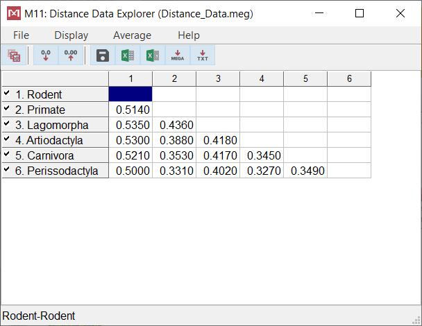
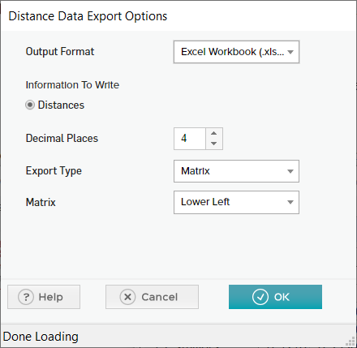
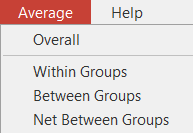
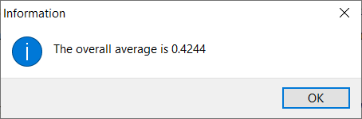

# MEGA 基础

- [MEGA 基础](#mega-基础)
  - [简介](#简介)
  - [文本编辑器](#文本编辑器)
  - [打开数据文件](#打开数据文件)
  - [查看序列数据](#查看序列数据)
  - [翻译序列](#翻译序列)
  - [导出序列数据](#导出序列数据)
  - [保存会话](#保存会话)
  - [查看距离数据](#查看距离数据)
  - [导出距离数据](#导出距离数据)
  - [计算平均距离](#计算平均距离)

2022-04-08, 11:27
****

## 简介

在 MEGA 中执行任何计算、分析都需要提供数据文件。对已有序列文件进行分析，需要确保在分析之前对齐序列（序列长度必须相同）。

下面介绍如何打开和操作数据文件，以及保存结果文件。

## 文本编辑器

在 MEGA 中可以打开及编辑任何文本文件，虽然该功能在 MEGA 中使用不多，但需要手动编辑文件时很有用。

打开文本编辑器：**File | Edit a Text File**

在打开的窗口中，选择 **File | Open** 打开文件。

例如，打开MEGA示例文件 "Drosophila_Adh.meg"：

```text
#mega
!Title Adh-sequence data from 11 species;
!Format DataType=DNA indel=- CodeTable=Standard;
!Description
    Thomas, R. H., and J. A. Hunt 1993. Mol. Biol. Evol. 10(2):362-374.
    This sequence data is not neccessarily identical to
    Thomas and Hunt (1993), but contains the same species.
    Note the use of underscore ( _ ) for including a blank in 
    and OTU label.
    Alignment gap symbol = '-'
    Interleaved sequences;

!Gene=Adh Property=Coding CodonStart=1;
#D._melanogaster    ATG TCG TTG ACC AAC AAG AAC GTG ATT TTC GTG GCC GGT CTG GGA 
#D._pseudoobscura   ATG TCT CTC ACC AAC AAG AAC GTC GTT TTC GTG GCC GGT CTG GGC
#S._lebanonensis    ATG GAT TTG ACC AAC AAG AAC GTT ATT TTC GTT GCC GCT CTG GGC 
#S._albovittata     ATG TGT ATC GCT GGC AAG AAT ATC ATC TTT GTC GCT GGT CTC GGT 
#D._crassifemur     ATG TTC ATC GCT GGC AAG AAC ATC ATC TTT GTC GCT GGT CTC GGC
#D._mulleri         ATG GCC ATC GCT AAC AAG AAC ATC ATC TTC GTC GCT GGA CTC GGT 
#D._affinidisjuncta ATG GTT ATC GCT AAC AGT AAC GTC ATC TTT GTC GCT GGT CTG GGT 
#D._heteroneura     ATG GTT ATC GCT AAC AGT AAC ATC ATC TTT GTG GCT GGT CTG GGT 
#D._mimica          ATG GTT ATC GCT AAC AGT AAC ATC ATC TTT GTG GCT GGT CTG GGT 
#D._adiastola       ATG GTT ATC GCT AAC AGT AAC ATC ATC TTT GTC GCT GGT CTG GGT 
#D._nigra           ATG GTT ATC GCT AAC AGT AAC ATC ATC TTT GTC GCT GGT CTG GGC 
```

文件格式说明：

- `#mega` 指定格式，这里为 MEGA 格式，MEGA 支持 MEGA 和 FASTA 两种格式；
- `!Title` 指定文件名称，到分号结尾；
- `!Description` 文件描述信息，到下一个分号结尾；
- `!Gene` 指定基因名称和属性，分号结尾；
- `#` 指定序列数据。

使用 **File | Exit Editor** 退出编辑器。

## 打开数据文件

打开文件方法：

- 工具栏 `Data | Open a File/Session`
- 菜单栏 `File | Open a File/Session`
- 在菜单栏选择一个分析，此时会弹窗提示打开文件。

例如，选择 `Data | Open a File/Session` 打开示例文件 "Drosophila_Adh.meg"，此时在 MEGA 窗口出现两个图标，“TA” 和 “Close Data”。单击 “TA” 可以查看文件，点击 “Close Data” 关闭文件。

> 一次只能打开一个文件。使用 `Data | Open a File/Session` 可以打开不同文件，此时会提示已有文件打开，是否关闭。

## 查看序列数据

使用 *Sequence Data Explorer* 查看序列数据，还可以对数据进行统计分析。打开 *Sequence Data Explorer* 的方法：

- 点击 MEGA 窗口里的 `TA` 图标；
- `F4` 快捷键
- 工具栏 `Data | Explore Active Data`

## 翻译序列

在 `Sequence Data Explorer` 中可以将蛋白质编码序列转换为氨基酸序列，也可以反向转换，操作方法有多种：

- 选择 `Data | Translate Sequences`
- 快捷键 `T`
- 点击工具栏 `UUC->Phe` 按钮

完成翻译后，在菜单栏的 `Data | Translate Sequeences` 前面有个 √，如下：


对氨基酸序列，可以使用菜单 `Statistics | Amino Acid Composition` 计算每条序列中不同氨基酸的比例。

## 导出序列数据

在 `Sequence Data Explorer` 导出序列，支持格式：Mega，Nexus (PAUP 4.0), Nexus(PAUP 3.0/MacClade), Phylip 3.0, Excel, CSV。

点击 `Export Data` 图标，出现导出选项：


## 保存会话

用于保存当前的状态。在 `Sequence Data Explorer` 使用 `Data | Save Session` 保存。

使用主窗口工具栏的 `Data | Open a File / Session…` 打开会话文件。

## 查看距离数据

使用 MEGA 格式 `.meg` 可以保存距离数据，并可以用 `Distance Data Explorer` 查看数据。

流程：

- `Data | Open a File/Session…` 打开文件
- 打开示例数据 `Distance Data.meg`
- `Data | Explore Active Data` 查看数据，自动打开 `Distance Data Explorer` 窗口



最左侧是为类别（taxa)名称。点击 `0.0` 可以减少显示的小数点位数，`0.00` 可以增加显示的小数点位数。

## 导出距离数据



## 计算平均距离

在 `Distance Data Explorer` 界面 `Average` 菜单栏下提供了计算序列之间平均距离的多种方式：



当然，要基于分组进行计算，首先要定义分组，后面会介绍分组。

选择 `Average | Overall`，弹窗显示所有序列之间距离的总体平均值：


