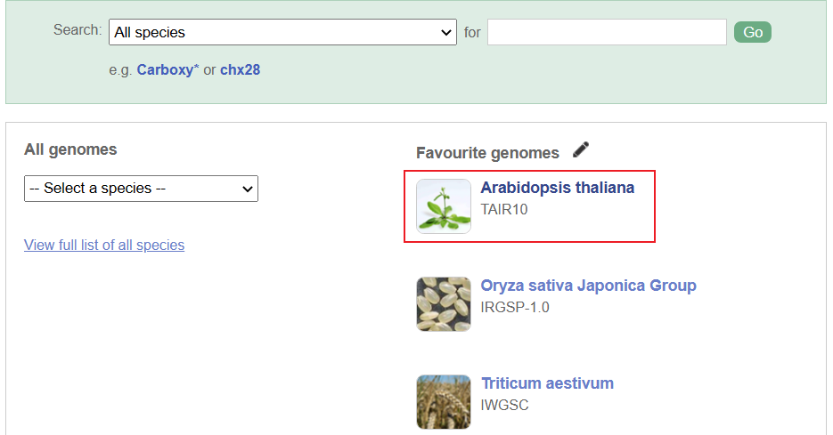

# 基因组注释概述

- [基因组注释概述](#基因组注释概述)
  - [简介](#简介)
  - [基因组注释方法](#基因组注释方法)
  - [基因组结构预测工具](#基因组结构预测工具)
  - [基因组注释实例](#基因组注释实例)
    - [基于 AUGUSTUS 进行从头注释基因](#基于-augustus-进行从头注释基因)
    - [基于 tblastn 与 GenomeThreader 进行同源基因注释](#基于-tblastn-与-genomethreader-进行同源基因注释)
    - [](#)

***

## 简介

基因组 DNA 信息是细胞、个体、生物最核心的遗传信息。对一个新物种，通过基因组测序和组装，获得完整基因组序列数据之后的首要任务是注释基因结构，确定各个基因在基因组中的位置，确定基因的编码序列。而对于有参考基因组的个体进行再测序后，则需要确定每个个体基因组与参考基因组的差异，识别个体或者癌细胞中发生的各类序列变异，包括简单变异和结构变异。

基因组注释(Genome annotation)是利用生物信息学算法和工具，对基因组中全部基因的结构和功能进行批量注释的过程，是功能基因组学的一个研究热点。

## 基因组注释方法

对基因组进行高通量注释与功能预测，主要有以下三种方法：

1. 从头计算(Ab initio)：通过已有的概率模型来预测基因结构，搜索特定的基因信号并且发现编码序列的统计特征。
2. 基于同源比对方法(homology-based prediction)：利用近缘物种已知基因进行序列比对，找到同源序列。然后在同源序列的基础上，根据基因信号，如剪切信号、基因起始和终止密码子对基因结构进行预测。
3. 基于转录组预测(RNA-Sequencing annotation): 通过物种的 RNASeq 数据辅助注释,能够较为准确地定位基因的剪切位点以及外显子区域。

## 基因组结构预测工具

对于预测基因组结构信息，已经有许多生物信息学工具可用。例如：GENSCAN、AUGUSTUS、GeneWise、GenomeThreader、MAKER2 等。

[GENSCAN](http://argonaute.mit.edu/GENSCAN.html) 是一个基于隐马尔可夫链(Hidden Markov Model，HMM)的从头计算工具，用于预测各种生物体基因组序列中基因的位置与外显子结构。GENSCAN 分为脊椎动物和无脊椎动物版本。后者的准确性较低，因为最初的工具主要是为检测人类和脊雄动物基因组序列中的基因而设计的。

[AUGUSTUS](http://bioinf.uni-greifswald.de/augustus/) 是一个预测真核基因组序列中基因的工具。AUGUSTUS 基于广义隐马尔可夫模型(Generalized Hidden Markov Model，GHMM) 定义了真核生物基因组序列的概率分布。AUGUSTUS 可以重新训练，它可以预测改变剪接,以及 5'UTR 和 3'UTR，包括内含子。在一篇对比各种基因组注释工具的文献中，AUGUSTUS 是它所训练的物种中最准确的非初始基因预测程序之一。该软件可以在线上执行，也可以下载到服务器中。在线版网址： https://bioinf.uni-greifswald.de/augustus/submission.php 。源代码地址: https://github.com/Gaius-Augustus/Augustus。

GeneWise 是较为经典的基于同源样本基因信息进行基因组注释的工具，该工具使用相似的蛋白质序列预测对基因组进行注释。GeneWise 被 Ensembl 等注释系统大量使用。GeneWise 的准确度很高，在使用质量较高的测序信息时可以提供较为准确且完整的基因注释信息。目前该工具已经停止更新，最新版本为 2.4.1，是 2007 年更新的版本GeneWise 的下载地址:https://www.ebi.ac.uk/~birney/wise2/wise2.4.1.tar.gz。


GenomeThreader 使用 cDNA、基因表达序列标签信息以及蛋白质序列，通过拼接比对预测基因结构。GenomeThreader 的主要算法贡献是内含子切除技术，它可以预测延伸到基因组或染色体区域的基因结构。这种基因结构经常出现在脊椎动物的基因组中。内含切除技术包括一个有效的过滤步骤和一个动态编程步骤，GenomeThreader 将它们结合起来。该工具的介绍请见网址:http://genomethreader.org/。

MAKER2 能够使用转录组数据来提高注释的质量。MAKER2 使用从头算的预测方法来进行基因组注释,如AUGUSTUS，这些工具能够通过仅分析基因组序列与统计模型来进行基因结构预测，与此同时，该工具可以使用转录组数据来更新传统的注释，大大改善了基因组注释结果的质量。该软件的介绍请见网址: http://www.yandell-lab.org/softwaremaker,htmlo

## 基因组注释实例

下面通过使用“从头算方法”,“基于同源比对方法”以及“基于转录组预测”的生物信息学工具,介绍基因组注释的过程。

### 基于 AUGUSTUS 进行从头注释基因

目前，从头预测软件大多是基于 HMM 和贝叶斯理论，通过已有物种的注释信息对软件进行训练，从训练结果中去推断一段基因序列中可能的结构。以下示例 AUGUSTUS 的注释。使用 anaconda 可以安装 AUGUSTUS。

```bash
$ conda install -c bioconda augustus
```

下面使用拟南芥的一段基因序列让 AUGUSTUS 预测。序列地址：http://plants.ensembl.org/index.html



ftp 地址：https://ftp.ensemblgenomes.ebi.ac.uk/pub/plants/release-56/fasta/arabidopsis_thaliana/dna/Arabidopsis_thaliana.TAIR10.dna.toplevel.fa.gz

取拟南芥前 8000 bp 序列，命名为 TAI_8k.fa：

```bash

```


这里，通过使用已知的拟南芥一段基因序列让 AUGUSTUS 预测，下载拟南芥的序列 TAIR10.fa(下载地址: https://www.arabidopsis.org/download/),取拟南芥的前 8000 bp 序列，命名为 TAI_8K.fa。

### 基于 tblastn 与 GenomeThreader 进行同源基因注释

同源基因注释是利用近缘物种已知基因进行序列比对，首先找到同源序列，然后在同源序列的基础上,根据基因信号，如剪接位点信号、基因起始和终止密码子对基因结构进行预测。

在本节中，可以使用 tblastn 与 GenomeThreader 对同源基因进行预测。tblastn 是 NCBI 中的 blast+ 软件包的一部分。该工具将给定的核酸序列与蛋白质数据库中的序列按不同的阅读框进行比对，对于寻找数据库中序列没有标注的新编码区很有用。

在本次分析中需要注释的基因是一种真菌 pudorinus。因此，可以使用同为真菌的生物同源基因组注释。在本节中，Saccharomyces_cerevisiae、Laccaria_bicolor、Amanita.thiersi、Pleurotus_pulmonarius、Pterula_gracilis 等五种真菌被用来注释 pudorinus。下载以上基因组数据后将其整合为一个 fasta 文件，命名为 all.pep.fa。

### 