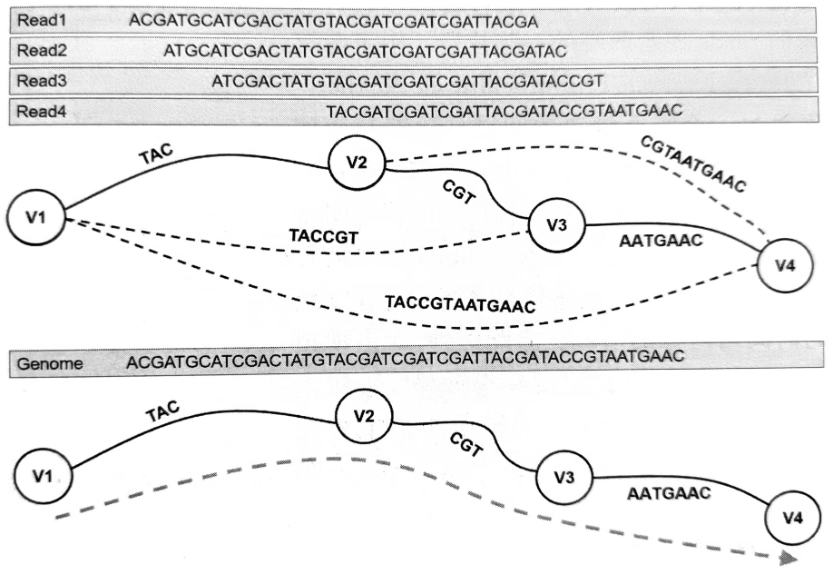
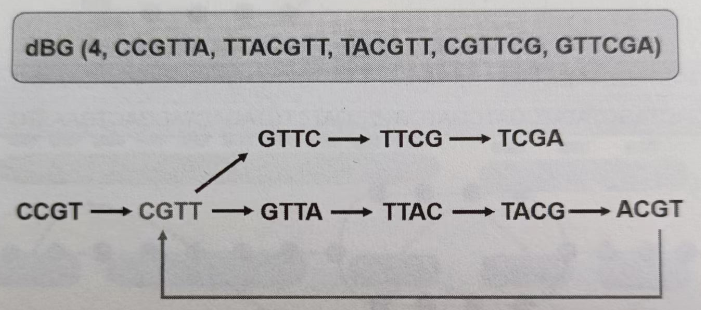
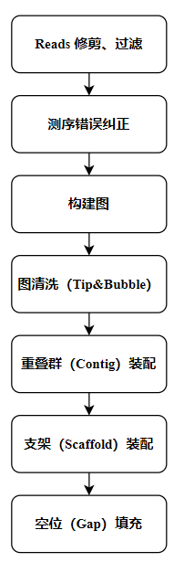
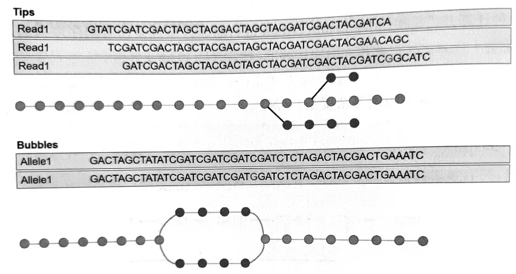
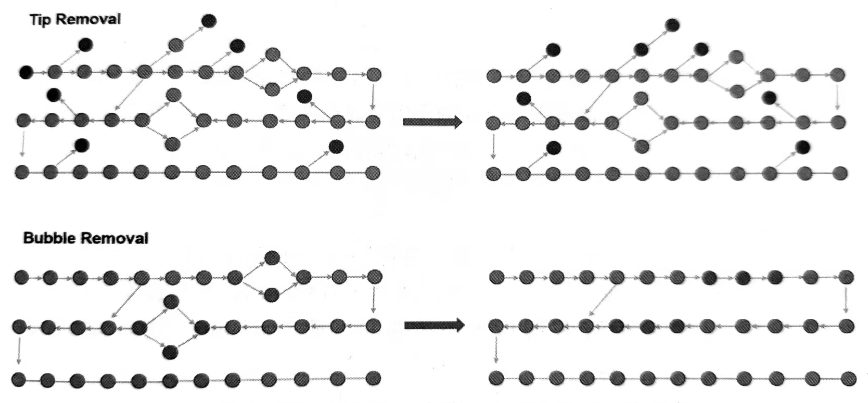
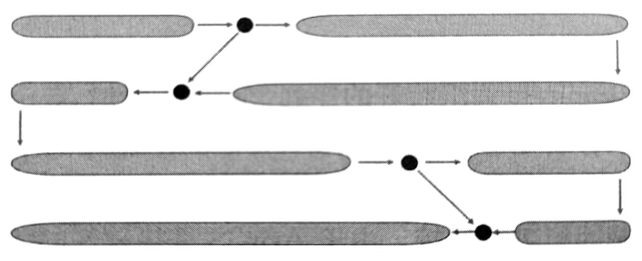
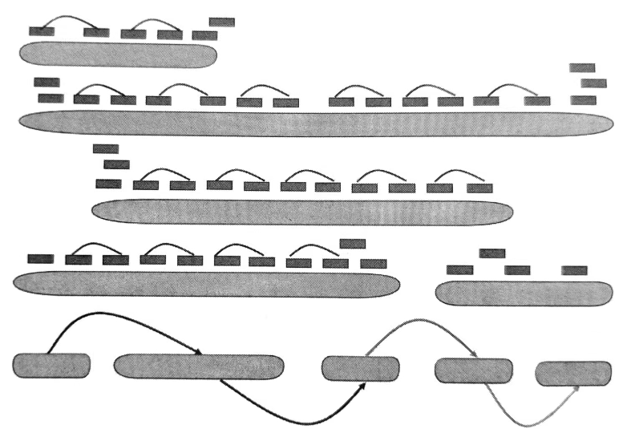

# 基因组序列组装概述

- [基因组序列组装概述](#基因组序列组装概述)
  - [简介](#简介)
  - [短序列组装中的两种构图](#短序列组装中的两种构图)
  - [组装流程](#组装流程)
  - [组装评估](#组装评估)
  - [组装工具](#组装工具)
    - [ABySS](#abyss)
  - [参考](#参考)

***

## 简介

序列组装（Sequence Assembly）指将短 DNA 片段通过比对和拼接，重构出原始的全长 DNA 序列的操作。

## 短序列组装中的两种构图

序列组装通过寻找前后缀的重叠来将同一段区域的测序序列组装到一起。获取了序列对的重叠关系后，将这种重叠关系以图论的方式表现出来，寻找一条最短路径，该路径就是最终想要的序列。

寻找前后缀重叠区域可以通过对测序序列 $x$ 建立后缀树，然后另一个测序序列 $y$ 从 $x$ 的后缀树的根部开始进行遍历，确定匹配的序列以及长度。建立后缀树的时间复杂度是 $O(N)$，遍历后缀树的时间复杂度也是 $O(N)$，而后缀树可能有 $a$ 种匹配序列，找到最长序列的时间复杂度为 $O(a)$，因此全部的时间复杂度是 $O(N+a)$。

由于测序错误的可能，实际工作中并不是所有序列都能够进行完全的前后缀匹配。虽然动态规划算法是将全局优化过程转化为一系列阶段性局部优化问题，从而可以解决这个问题，但是其时间复杂度 $O(N^2)$ 偏高。在实际应用中倾向结合这两种策略，先使用后缀树筛选出不重叠的序列对，再使用动态规划算法来做进一步的比对。

将重叠方法表现出来的常用图有两种：String Graph 和 De Bruijn Graph。在组装过程中一般使用有向多边图(Directed Multigraph)，用 $G(V,E)$ 表示。与有向图相比，有向多边图允许重复边。组装是为了找到一条最短路径表示全部测序序列的原始来源序列。

String Graph 说明：

- 节点数等于测序 reads 数
- 如果两个节点之间存在重叠，则用一条边来表示
- 遍历这个图，就能够获取原始基因组序列



> String Graph 示意图

这种重叠图通常庞大且复杂，首先需要合并一些可以与别的边信息冗余的边，例如 $E(V1,V3)$ 和 $E(V1,V2)+E(V2,V3)$ 可以合并。但是合并后的图无法解决短重复序列区域的组装问题，只能把那段区域舍弃成为分隔的 Contig。

另一种计算方式是使用 De Bruijn Graph 进行组装。节点是所有测序序列的长度为 $k$ 的子串,称为 k-mer；如果 x 和 y 两段序列的前后缀 (k-1)mer 匹配，那么 x 与 y 之间存在一条边。下图选取的 k-mer 为 4，则重叠长度为 3 的k-mer 被连接起来。构建 De Bruijn Graph 的时间复杂度是 O(N)。



> De Bruijn Graph

e Bruijn Graph 由于 reads 被切割成 k-mer，实际上无法识别和组装出重复序列区域，而且因为只有在足够短的情况下才能精确匹配，因此无法很好避免测序错误。

## 组装流程

用 String Graph 和 De Bruijn Graph 进行实际的组装工作需要进行更多的处理，组装流程如下图所示。首先，序列扩增加人的接头需要进行过滤;其次，需要过滤低质量的reads或者两端的一些片段。用于此类过滤修剪的工具有：Kraken、Trimmomatic 和 Scythe。



测序错误是另一个需要解决的问题。随着测序深度的增加，构建图的时间成本会逼近于一个 GB，但是当测序错误达到 1% 或者 5%，构建图的成本明显上升。因此错误纠正(Error Correction)是必要的，不仅可以缩减序列装配中图的大小，还可以减少序列装配的时间与内存消耗。除此以外，对出现频率低的 k-mer 的位点进行纠正可以在很大程度上纠正测序的错误。常见的基于 k-mer 的错误纠正工具有 Quake，SGA，SOAPdenovo，BFC，BLESS，Lighter 和 Musket。

在完成序列过滤和错误校正后，构建 String Graph 和 De Bruijn Graph。由于测序错误或者变异位点的存在，图中会出现分支(Tips)或冒泡(Bubbles)，如下图所示。因此，需要对 Tips 进行剪枝，对 Bubbles 进行合并。需要说明的是：

- 如果测序错误或者单核酸的变异(SNV)发生在读段的末尾，将会在图中出现 Tips；
- 如果测序错误或者 SNV 出现在读段的中间，则会出现 Bubbles。



> 分支（Tips）和冒泡（Bubbles）结构



> 分支的剪枝和冒泡的合并

完成上述操作后，图中呈现出了一条无分支且无相交节点的单边路径，这就是组装出来的Contigs。在细菌的基因组中 Contigs 的长度大约为 100 kb；在大型真核生物基因组中 Contigs的长度大约在10~20 kb。



> Contigs 示意图

由于测序读段的长度是固定的，通过测序对的位置,可以将长度较短的 Contig 连接起来，成为更长的Scaffold，这一步被称为 **Scaffolding**。其中 Scaffold 由 Contigs 和 Gaps 组成，可以通过配对末端或插入片段的长度(insert size)来估计 Gap 长度。在 Scaffolding 中，首先会将序列对比对到 Contigs 上去，接着再构建一个 Scaffold Graph。在 Scaffold Graph 中，可以通过片段大小的分布来估计 Contigs 之间的距离。



> Scaffolding 流程

最后，由于测序扩增或者计算方法的问题，很多基因组区域无法被测序组装出来，可以通过局部组装来填补这些区域，常见工具有 SGA gapfill 和 SOAPdenovo 中的 GapCloser。如果仍无法完成，则用 N 代替碱基填补空缺的 Gap 区域。当然，现在由于三代测序的技术已经相当成熟，可以直接用三代测序组装出长度远超于二代测序的 Scaffold，将二代测序与三代测序的序列结合在一起能够组装出较长且正确率高的基因组序列。

## 组装评估

完成组装后，需要对组装后基因组的质量进行评估。评估的指标主要包含了 N50 和 NG50。

N50 是针对无参考基因组的组装(从头组装)的评价指标，N50 是一个 Contig 的长度，长度大于等于这个 Contig 长度的 Contigs 覆盖 50% 的 Scaffold 长度。

NG50 是针对有参考基因组的装配，NG50 也是一个 Contig 的长度，长度大于等于这个 Contig 长度的 Contigs 覆盖 50%的参考基因组长度。

N50 和 NG50 越大，说明组装的质量越好。

## 组装工具


SOAPdenovo2 是一种新的组装短 reads 的方法,它以 k-mer 为节点单位，利用 De Bruijn Graph 方法实现全基因组的组装，和其他短序列组装软件相比,它可以进行大型基因组，比如人类基因组，可以通过组装的结果鉴别出基因组上序列的结构性变异。SOAPdenovo2 需要用户手动构建配置文件,在网址 https://github.com/aquaskyline)SOAPdenovo2 中可以获取 SOAPdenovo2 软件、配置文件的设置方法、软件使用手册以及常见问题。

除了 ABySS 和SOAPdenovo2 外，Velvet 也是极为常见的新一代测序技术组装拼接软件。Velvet 对短序列的拼接效果比较好，所以多用于 Illumina 等产生的短序列片段的组装拼接。相对于 SOAPdenovo2，Velvet 拼接的完整性更好，并同时支持 fasta、fastq 格式的数据，同时支持多个文库数据的使用。

### ABySS

主流的 NGS 基因组组装工具都是先将序列划分成 k-mer，然后基于 De Bruijn Graph, 得到组装好的序列。程序运行时，k-mer 字符串存储在内存中，所以要求计算机的内存要足够大。

[ABySS](https://github.com/bcgsc/abyss) (Assembly By Short Sequences)基于布隆过滤器，不直接储存字符串，减少了内存的消耗。ABySS 最初用于基因组的从头拼接，特别是对大型基因组进行拼接。由于 ABySS 拼接软件可以进行平行运算，同时运行多拼接任务，因此可以处理的基因组比 Velvet 大得多。

- ABySS 安装

```bash
$ sudo apt-get install abyss
```

- 组装一个小的合成数据集

```bash

```

## 参考

- https://github.com/bcgsc/abyss