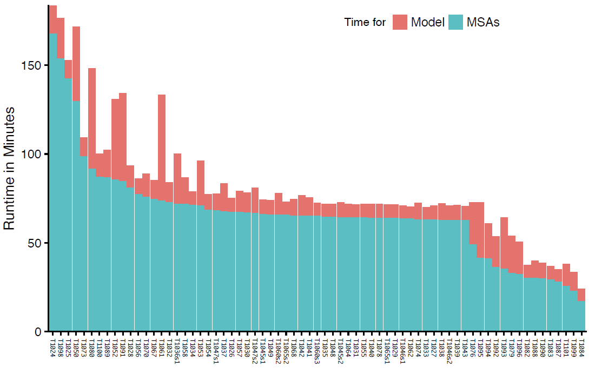
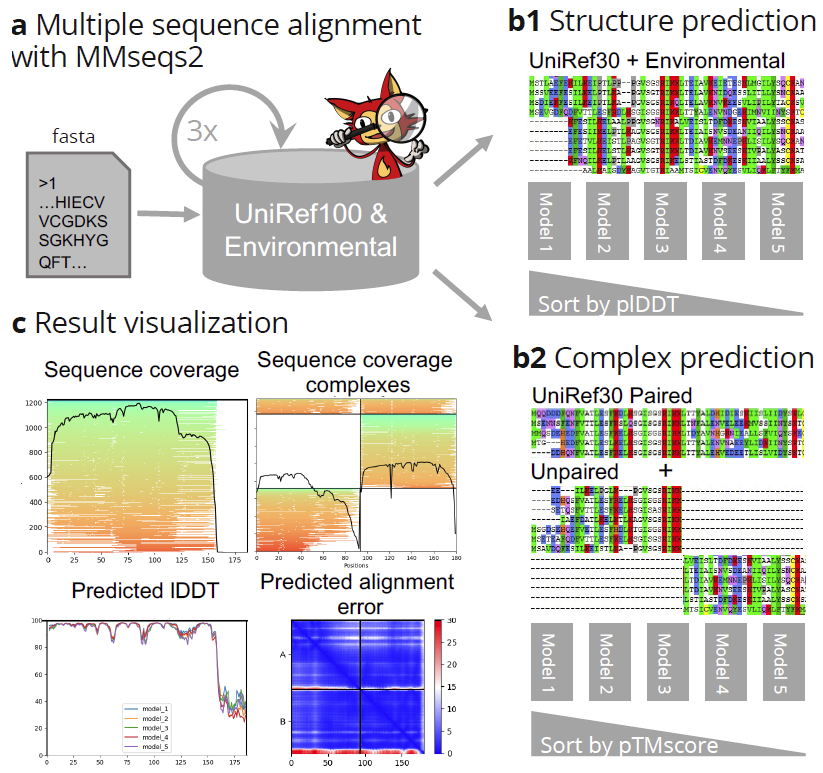
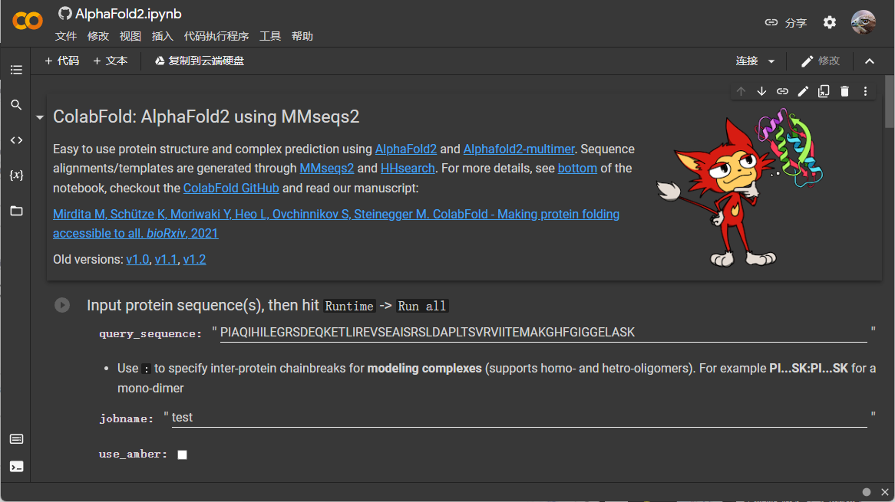

# ColabFold

- [ColabFold](#colabfold)
  - [简介](#简介)
  - [概述](#概述)
  - [使用](#使用)
    - [Colab](#colab)
  - [参考](#参考)

2022-01-12, 15:38
***

## 简介

ColabFold 将快速同源搜索工具 MMseqs2 和 AlphaFold2 或 RoseTTAFold 结合，加快了蛋白质结构和复合物的预测。ColabFold 的搜索速度快了 20-30x，与优化的模型结合，在一台 GPU 服务器上每天可以预测上千种蛋白质。ColabFold 与 Google Colaboratory 结合，称为一个非免可访问的蛋白质折叠预测平台。ColabFold 免费开源，GitHub 地址：https://github.com/sokrypton/ColabFold 。其环境数据库在 https://colabfold.mmseqs.com/ 。

## 概述

仅从蛋白质序列来预测蛋白质的三维结构仍然是个未解决的问题。但是，AlphaFold2 利用相关蛋白的多序列比对（multiple seequence alignment, MSA）信息作为端到端训练的原始输入特征，在最近的 CASP14 比赛中，其预测的蛋白质结构的 3D 原子坐标 GDT-TS 达到 92.4%。许多预测结果的准确性在实验误差范围之内。

RoseTTAFold 独立重现和实现了许多 AlphaFold2 的想法。除了预测单链，RoseTTAFold 还可以预测蛋白质复合物。Evans 等还发布了一个 AlphaFold2 的改进版本 [AlphaFold-Multimer](https://www.biorxiv.org/content/10.1101/2021.10.04.463034v1)，可用于蛋白质复合物的预测。因此，目前有两种高精度的开源的预测工具可供使用。

但是要使用上面的工具，需要强大的算力：

- 为了构建多样化的 MSAs，需要使用灵敏的同源性检测方法 HMMer 和 HHblits 从数据库中检索大量蛋白质序列。由于数据库规模大，检索一个蛋白质就需要超过 2TB 的存储空间，几个小时的检索时间；
- 运行深度神经网络需要大量的 GPU。

总体来说，MSA 过程占据大部分时间。下图是 AlphaFold2 预测和生成 MSA 所需的时间分布，使用 AlphaFold2 预测了 69 个 CASP14 的靶蛋白，在 2x16 核、192GB RAM 和 4x NVIDIA RTX5000 （仅一个用于 model inference） 的 Intel Xeon 6242 上执行。

如此惊人的算力需求，可能大部分研究人员都没有，为了能让大家都能使用 AlphaFold2，于是开发了基于谷歌的 Colab 的平台。Colab 是由 Google 托管的 Jupyter Notebook 版本。登录之后可以免费使用，关键是提供了免费使用的 GPU。Tunyasuvunakool 等为 Colab 开发了一个 [AlphaFold2 Jupyter Notebook](https://colab.research.google.com/github/deepmind/alphafold/blob/main/notebooks/AlphaFold.ipynb)，不过其输入 MSA 是使用 HMMer 对聚类 UniProt （缩小了 8 倍）进行搜索而构建，导致预测不准确，而且所需时间依然很长。

于是就有了 ColabFold，ColabFold 易于使用，可用于蛋白质和复合物结构的预测，可以在 Google 的 colab 使用，也可以通过命令行界面在本地使用。ColabFold 使用 MMseqs2 替代 AlphaFold2 特征生成阶段所用工具，从而加快速度。通过避免重新编译和添加早期停止标准，加快了对多个结构的预测。经验证，在 CASP14 上 ColabFold 性能优于 AlphaFold-Colab，与  AlphaFold2 近似，但是速度快 20-30 倍。ColabFold 可以在消费级 GPU 上在 41 小时内计算一个蛋白质组（不包含长度 > 1000 的蛋白质）。

ColabFold 包含三部分：

1. 一个基于 MMseqs2 的同源序列搜索服务器，用于构建 MSAs、寻找模板。该服务器根据 UniRef100、PDB70 和环境序列集有效地对齐输入序列。
2. 与 MMseqs2 通信、为结构预测准备输入特征的 Python 库，该库还实现了一个命令行接管口。
3. 用于基本、高级和批量分析的 Jupyter 笔记本。

ColabFold 用 MMseqs2 替代了 HMMer 和 HHblits。使用 MMseqs2 优化 MSA 生成过程，使其：（1）MSA 生成快速；（2）MSA 可以很好的捕获差异；（3）占用内存要小。

## 使用

AlphaFold2_mmseqs2

基础功能，支持蛋白质结构预测：

- 使用 MMseqs2 生成 MSA
- 自定义上传 MSA
- 使用模板信息
- 使用 amber force fields 松弛预测的结构
- monomer complex 预测

### Colab

打开链接：

https://colab.research.google.com/github/sokrypton/ColabFold/blob/main/AlphaFold2.ipynb

打开页面，是下面的样子：

参数说明：

- `use_amber`，表示折叠后进行结构优化，选择或增加计算时间；
- `use_templates`，使用可以增加折叠的精度；
- `homooligomer`，同一段蛋白的多聚体，如果是二聚体，填 2；

## 参考

- https://www.biorxiv.org/content/10.1101/2021.08.15.456425v2
- https://github.com/sokrypton/ColabFold
- https://colab.research.google.com/github/sokrypton/ColabFold/blob/main/beta/AlphaFold2_advanced.ipynb
- https://colab.research.google.com/github/sokrypton/ColabFold/blob/main/AlphaFold2.ipynb
- https://docs.hpc.sjtu.edu.cn/app/bioinformatics/alphafold2.html
