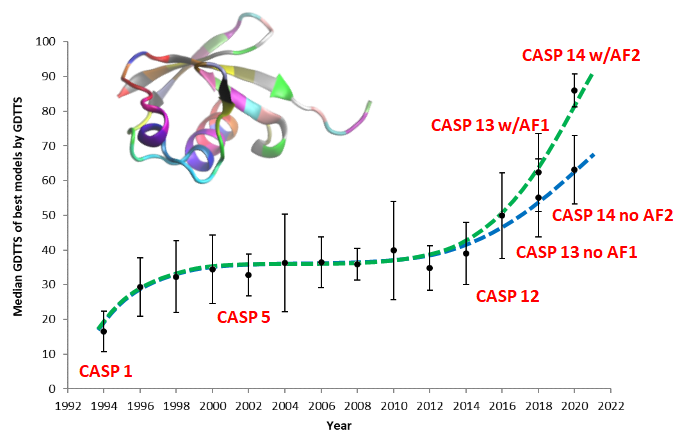
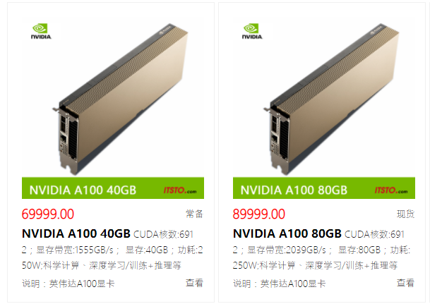
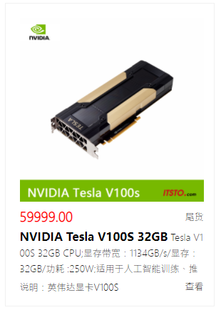

# AlphaFold 蛋白结构数据库

- [AlphaFold 蛋白结构数据库](#alphafold-蛋白结构数据库)
  - [简介](#简介)
  - [CASP](#casp)
  - [AlphaFold](#alphafold)
    - [AlphaFold 缺点](#alphafold-缺点)
    - [ColabFold 使用](#colabfold-使用)
    - [完整版使用](#完整版使用)
  - [硬件要求](#硬件要求)
  - [参考](#参考)

## 简介

AlphaFold 是由 DeepMind 开发的一款人工智能系统，它可以根据蛋白质的氨基酸序列预测蛋白质的 3D 结构。实验表明，该方法具有较高的准确性。

DeepMind 和 EMBL-EBI 合作创建了 AlphaFold DB，从而将预测结果免费提供给科学界。第一版包含人蛋白质组合其它几个重要生物的蛋白质组。第二版增加了大部分人工注释的 UniProt 蛋白（Swiss-Prot），并计划在 2022 年扩大数据库，以涵盖目前所有的蛋白质（UniRef90 包含 1 亿多个）。

AlphaFold DB 目前提供下表所示的预测的蛋白结构数据库。

可以在蛋白对应页面下载单个蛋白的结构，例如 https://alphafold.ebi.ac.uk/entry/F4HVG8

也可以使用下表提供的链接下载整个物种的蛋白结构数据库。对所有物种的预测结构，可以在 FTP 站点下载：http://ftp.ebi.ac.uk/pub/databases/alphafold/

|Species|Common Name|Reference Proteome|Predicted Structures|Download|
|---|---|---|---|---|
|Arabidopsis thaliana|Arabidopsis|UP000006548|27,434|Download (3642 MB)|
|Caenorhabditis elegans|Nematode worm|UP000001940 |19,694|Download (2601 MB)|
|Candida albicans|C. albicans|UP000000559 |5,974|Download (965 MB)|
|Danio rerio|Zebrafish|UP000000437 |24,664|Download (4141 MB)|
|Dictyostelium discoideum|Dictyostelium|UP000002195 |12,622|Download (2150 MB)|
|Drosophila melanogaster|Fruit fly|UP000000803 |13,458|Download (2174 MB)|
|Escherichia coli|E. coli|UP000000625 |4,363|Download (448 MB)|
|Glycine max|Soybean|UP000008827 |55,799|Download (7142 MB)|
|Homo sapiens|Human|UP000005640 |23,391|Download (4784 MB)|
|Leishmania infantum|L. infantum|UP000008153 |7,924|Download (1481 MB)|
|Methanocaldococcus jannaschii|M. jannaschii|UP000000805 |1,773|Download (171 MB)|
|Mus musculus|Mouse|UP000000589 |21,615|Download (3547 MB)|
|Mycobacterium tuberculosis|M. tuberculosis|UP000001584 |3,988|Download (421 MB)|
|Oryza sativa|Asian rice|UP000059680 |43,649|Download (4416 MB)|
|Plasmodium falciparum|P. falciparum|UP000001450 |5,187|Download (1132 MB)|
|Rattus norvegicus|Rat|UP000002494 |21,272|Download (3404 MB)|
|Saccharomyces cerevisiae|Budding yeast|UP000002311 |6,040|Download (960 MB)|
|Schizosaccharomyces pombe|Fission yeast|UP000002485 |5,128|Download (776 MB)|
|Staphylococcus aureus|S. aureus|UP000008816 |2,888|Download (268 MB)|
|Trypanosoma cruzi|T. cruzi|UP000002296 |19,036|Download (2905 MB)|
|Zea mays|Maize|UP000007305 |39,299|Download (5014 MB|

## CASP

蛋白质结构预测的关键评估（Critical Assessment of protein Structure Prediction, CASP）旨在推进从蛋白序列预测蛋白质结构的方法。CASP 通过盲预测提供预测方法的客观测试。

CASP 比赛已进行 14 届，从1994年开始，每 2 年一次。第 15 届预计在 2022 年春开始。这些实验的完整数据可以在官网找到：https://www.predictioncenter.org/ 。

## AlphaFold

AlphaFold 骨架准确性中位数为 0.96 Å RMSD$_{95}$（95% 残基覆盖率下 $C_{\alpha}$ 的均方根偏差）（95% CI=0.85 Å - 1.16 Å）,而次优的方法骨架精度中位数为 2.8 Å RMSD$_{95}$（95% CI=2.7Å - 4.0Å）。

### AlphaFold 缺点

吃硬件：对于传统的计算生物学和生物信息学而言，一般的软件用一个普通的电脑即可跑通。而AlphaFold2 的部署，需要 “3TB储存空间、85GB内存、和 Navidia GPU”，这不是一个普通的电脑能带动的。

过于大的蛋白质或者蛋白质复合体，可能会跑不动：过于大的蛋白质或者蛋白质复合体，可能会跑不动

对PDB数据存在一定程度上的过拟合：AlphaFold2是完全基于PDB数据库训练并测试，但是对于PDB没有的蛋白质（只能通过实验手段单独确定结构的蛋白质）泛化能力比较低

目前AlphaFold2只能预测静态解：实际上很多蛋白质的结构是高度动态的，而并非一个静态的稳定的结构。

AlphaFold 对超级复合物准确，但对膜蛋白的误差较大。

### ColabFold 使用

https://colab.research.google.com/github/deepmind/alphafold/blob/main/notebooks/AlphaFold.ipynb

使用 Colab 笔记本可以使用简化的 AlphaFold V2.1.0 版本预测蛋白质的结构。

与 AlphaFold V2.1.0 相比，这个 Colab 没有使用模板（同源结构）和 [BFD 数据库](https://bfd.mmseqs.com/)的选定部分。DeepMind 团队在最近的几千个 PDB 结构上验证了这些变化，大部分预测结果和 AlphaFold 几乎完全相同，但由于MSA 较小、缺乏模板，小部分的精度有很大下降。要获得最佳的结果，建议使用完全开源的 AlphaFold，或者 AlphaFold 蛋白质结构数据库 。

### 完整版使用

RTX2080ti 小一些蛋白跑起来还行，但序列长度到 500 就可能会挂，最好有 V100，A100 显存 10G 以上，多多益善。

如果没有 GPU，推荐使用 ColabFold。

## 硬件要求

参考：https://github.com/deepmind/alphafold

DeepMind 在 Google 云上的配置：

- 12 vCPUs, vCPU 即 virtual centralized processing unit，虚拟 CPU
- **85 GB** of RAM
- **100 GB** boot disk, 
- the databases on an additional **3 TB** disk
- 1 个 A100 GPU

NVIDIA A100：https://www.nvidia.cn/data-center/a100/

NVIDIA A100 Tensor Core GPU 可针对 AI、数据分析和 HPC 应用场景，在不同规模下实现出色的加速，有效助力全球高性能弹性数据中心。NVIDIA A100 由 NVIDIA Ampere 架构提供支持，提供 40GB 和 80GB 两种配置。作为 NVIDIA 数据中心平台的引擎，A100 的性能比上一代产品提升高达 20 倍，并可划分为七个 GPU 实例，以根据变化的需求进行动态调整。A100 80GB 将 GPU 内存增加了一倍，提供超快速的内存带宽（每秒超过 2TB），可处理超大模型和非常庞大的数据集。

价格：http://www.itsto.com/product/tesla_gpu.html

也有用 4 张 Tesla V100S 32GB*4 配置环境，单张价格：

> 玩不起，我不配。。。

## 参考

- https://alphafold.ebi.ac.uk/download
- https://www.predictioncenter.org/
