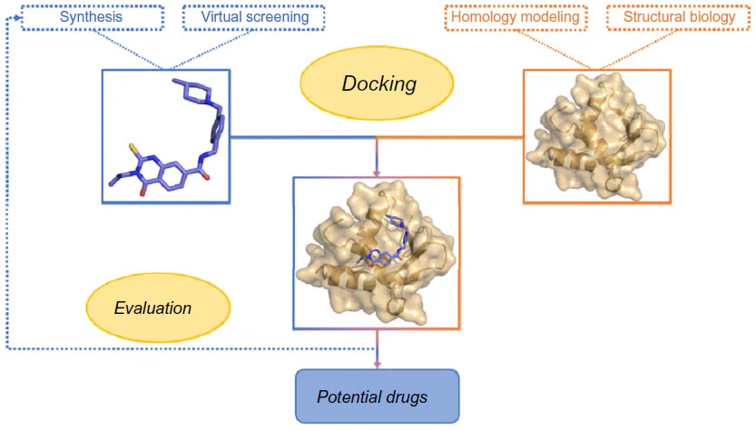
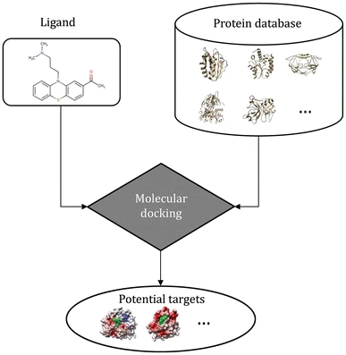
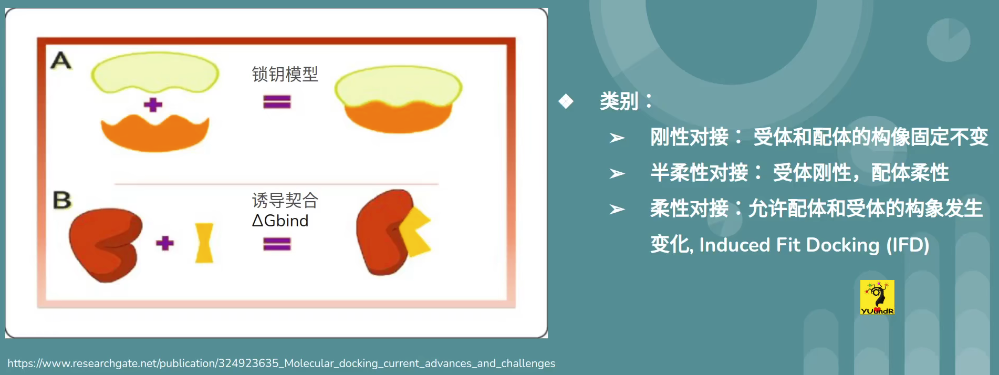
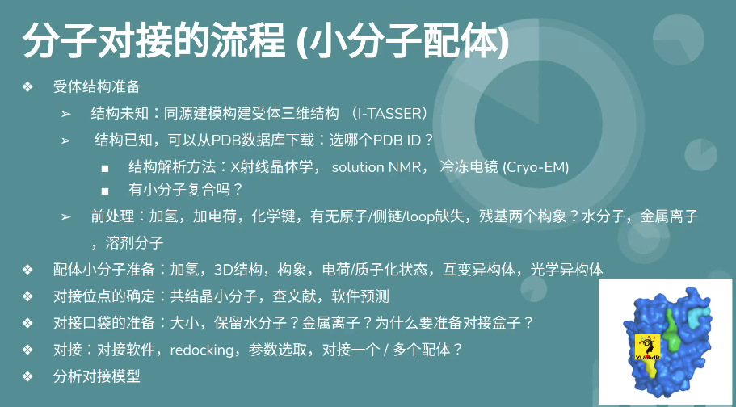
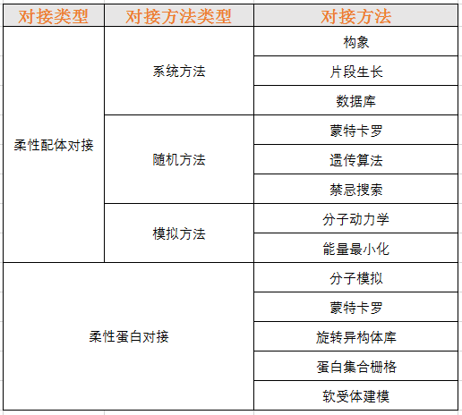

# 分子对接

- [分子对接](#分子对接)
  - [什么是分子对接？](#什么是分子对接)
  - [分子对接用途](#分子对接用途)
  - [对接原理](#对接原理)
  - [分子对接的流程（小分子配体）](#分子对接的流程小分子配体)
  - [参考](#参考)

## 什么是分子对接？

分子对接（molecular docking）是分子模拟的重要方法之一，其本质是两个分子之间的识别过程，其过程涉及分子之间的空间匹配和能量匹配。分子对接方法在药物设计、材料涉及等领域有广泛的应用。

用化学小分子和受体蛋白来举例，分子对接主要做两件事：

1. 预测结合模式（binding mode）：配体小分子能不能结合到蛋白的结合口袋？如果可以，结合到口袋的哪里？以什么样的方式和构象结合？
2. 预测结合强弱（亲和力）：如果以预测的模式结合，结合强弱如何？

## 分子对接用途

主要用于新药研发：

1. 已知靶点

基于靶点结构设计的药物设计（structure-based drug design）：

- 筛选可以与靶点结合的先导化合物（基于对接的虚拟筛选）
- 指导合理地优化药物分子结构

https://www.dovepress.com/molecular-docking-as-a-popular-tool-in-drug-design-an-in-silico-travel-peer-reviewed-fulltext-article-AABC

2. 靶点未知

基于对接的反向虚拟筛选（docking-based virtual screening）：

- 药物有活性，探索药物小分子的潜在靶点，探索药物小分子和大分子受体的具体作用方式，解释药物分子产生活性的原因；
- 天然化合物，筛选潜在靶点，探索活性。

https://link.springer.com/article/10.1007/s41048-017-0045-8

药物再利用（drug repositioning / drug reepurposing），寻找新靶点。

解释药物副作用，非特异性。

指导探索天然化合物的合成通路等等。

## 对接原理

刚性对接，适合蛋白质-蛋白质这种大分子之间的对接。

半柔性对接，适合大分子和小分子之间的对接，小分子的构象可以在指定范围之内变化。

柔性对接，允许配体和受体都发生自由变化，一般用于精确研究分子之间的

## 分子对接的流程（小分子配体）

1. 受体结构准备

- 结构未知，同源建模构建受体三维结构（I-TASSER）
- 结构已知，可以从 PDB 数据库下载：选哪个 PDB ID？
  - 结构解析方法：X 射线晶体学（**首选**），solution NMR （用哪个构象？），冷冻电镜（Cryo-EM）
  - 有小分子复合物吗？
- 前处理：加氢，加电荷，化学键，有无原子/侧链/loop缺失，残基两个构象？水分子，金属离子，溶剂分子

2. 配体小分子准备：加氢、3D结构，构象，电荷/质子化状态，hubian

刚性对接

## 参考

- https://www.bilibili.com/video/BV1v5411H7Th
