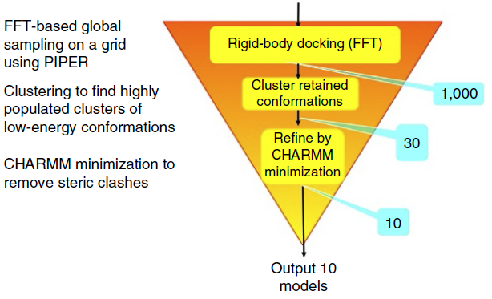
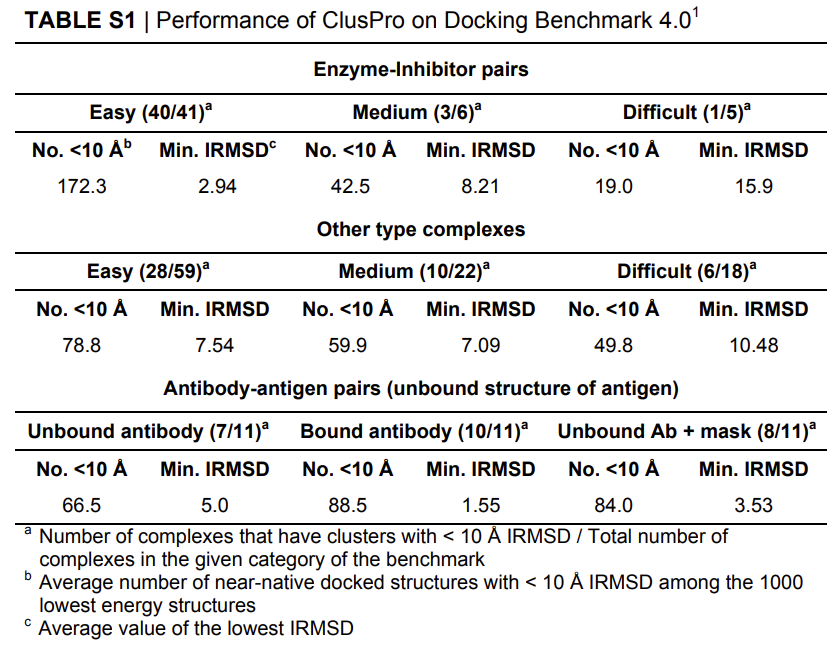
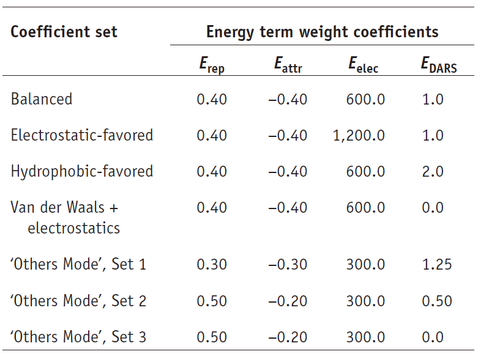
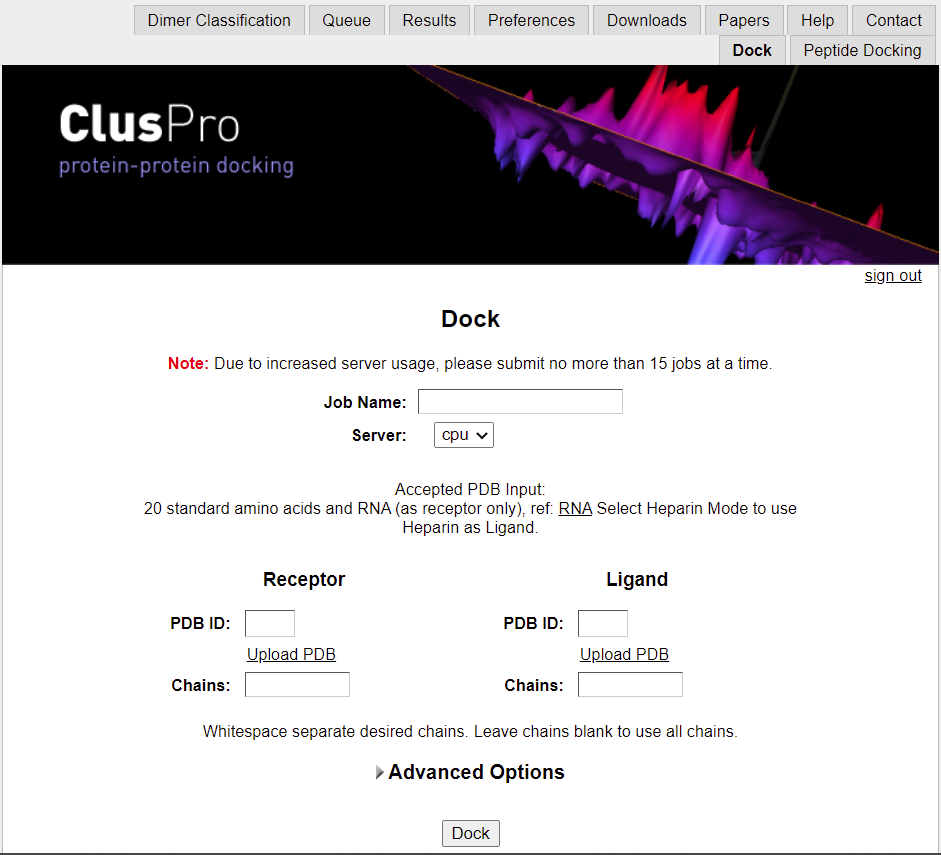
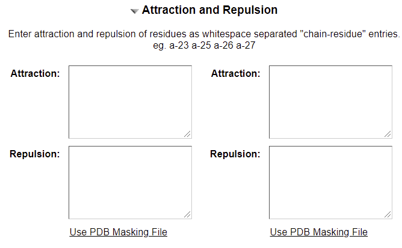

# ClusPro

- [ClusPro](#cluspro)
  - [简介](#简介)
    - [第一步-刚体对接](#第一步-刚体对接)
    - [PIPER 对接算法](#piper-对接算法)
    - [基于聚类的模型选择](#基于聚类的模型选择)
  - [方法应用](#方法应用)
    - [对接蛋白质的 X-ray 或 NMR 结构](#对接蛋白质的-x-ray-或-nmr-结构)
    - [抗体-抗原相互作用建模](#抗体-抗原相互作用建模)
    - [蛋白-肽段对接](#蛋白-肽段对接)
  - [使用流程](#使用流程)
    - [输入数据](#输入数据)
    - [高级选项](#高级选项)
      - [Structure Modification](#structure-modification)
      - [Attraction and Repulsion](#attraction-and-repulsion)
  - [参考](#参考)

2022-01-25, 13:29
***

## 简介

如下图所示，ClusPro 计算分三步：

1. 通过采样数十亿个构象进行刚体对接；
2. 对生成的 1000 个能量最低的结构进行 RMSD（root-mean-square-deviattion）聚类，找到最大的聚类，作为最可能的复合物模型；
3. 使用能量最小化来细化选择的结构



> 蓝色框里是每一步保留的结构数目。

### 第一步-刚体对接

第一步刚体对接采用基于快速傅里叶变换（FFT）的软件 PIPER。

包括 PIPER 在内的刚体对接方法对密集网络上的构象空间进行详尽的采样，因此肯定会对一些接近 native 的结构进行采样。然而，由于对接未结合的蛋白质结构需要耐受一些空间冲突，因此打分函数对构象改变不能太敏感，当然这样会降低特异性。因此，接近原生结构的构象不一定具有最低的能量，低能构象可能与 X 射线结构相距甚远。

PIPIE 保留了 1000 个能量最低的对接结构做下一步处理，期望这一组结构中至少包含一些接近复合物结构的 native 结构。ClusPro 的另一个独特之处在于，选择低能量结构中高度密集的聚类中心，而不是简单的最低能量结构。虽然最大的聚类不一定包含最接近 naive 结构，但是研究表明 30 个最大的聚类包含 92% 复合物的最接近 native 的结构。对某些类别的复合物，如酶抑制剂对，覆盖率更高，因此通常保留 10 个或更少的类别就足够了。下表是 ClusPro 2.0 在不同类别复合物上的性能，其中数字含义分别是：

- 至少有一个对接结构 cluster 与 native 复合物的界面 RMSD （IRMSD）在 10 Å 内时复合物的数量；
- 在 1000 个最低能量结构中小于 10 Å IRMSD 结构数量平均值；
- 达到的最低 IRMSD 的最低值。



这里需要注意的是，为了定义天然结构和 docked 结构的 IRMSD，ClusPro 首先选择界面残基作为配体残基，界面残基的特征是包含与受体原子距离在 10 Å 内的原子。然后将两个结构中的受体叠加，并计算所选界面原子 α 碳的 RMSD。从上表可知，大部分酶-抑制剂属于 "easy" 类，其它类型复合物和抗体-抗原效果则要差一些。不过后面我们会看到，如果屏蔽抗体的 non-CDR 区域，使其不能出现在界面，性能会得到改善。

### PIPER 对接算法

ClusPro server 使用 PIPER 执行采样。受体的质心固定在坐标系的原点，配体在一定的离散水平上对可能的旋转和平移位置进行评估。

- 旋转空间在基于球的网格上采样，该网格对球面进行划分，每个划分具有相同面积。PIPER 考虑的 70,000 个旋转相当于 ~5° 欧拉角。
- 平移网格的步长为 1 Å。

对一个平均大小的蛋白质，就相当于取样 $10^9 - 10^{10}$ 个构象。

PIPER 使用 

$$E = w_1E_{rep}+W_2E_{attr}+W_3E_{elec}+w_4E_{DARS}$$ 

表示两个蛋白质之间的相互作用能。其中：

- $E_{rep}$ 和 $E_{attr}$ 表示排斥和吸引范德华相互作用，
- $E_{elec}$ 表示静电能，
- $E_{DARS}$ 是通过 "decoys as the reference state"(DARS) 方法构建的成对势能，主要用于表示去溶剂贡献，例如，从界面去除水分子导致的势能变化。

参数 $w_1$, $w_2$, $w_3$, $w_4$ 定义对应项的权重，对不同类型的对接问题分别进行优化。

除非在 "Advanced Options" 中进行设置，否则 ClusPro server 使用打分方案生成四套模型：

1. 平衡模型
2. 静电优先模型
3. 疏水优先模型
4. 范德华+静电

如下表所示：



不属于上述 4 个类别的，在基准测试中归类中其它，ClusPro 使用三组不同的参数生成结构。

DARS 电势参数在一组包含大量酶抑制剂对和多亚基蛋白质复合物上获得，因此产生的具有良好的形状和静电互补性。当 $E_{DARS}$被缩放到蛋白质-蛋白质结合自由能，$w_4 = 1.0$ 对应中性。

$E_{elec}$ 有一个截断和平滑的库伦表达式表示，也定义在网格上。由于电荷是电子带电量的倍数，原子间距离单位为 Å，利用库伦表达式获得静电相互作用能，单位为千卡每摩尔，此时需要系数 $w_3 = 332$。但是，截断和平滑处理减小了 $E_{elec}$ 在库伦表达式中的增幅，因此在平衡模型使用 $w_3 = 600$。`Balanced` 参数对 酶-抑制剂 复合物效果很好。

- 如果两个蛋白质的结合主要是静电相互作用，选择静电权重加倍；
- 如果主要由疏水相互作用稳定复合物，则将去溶剂项加倍；

### 基于聚类的模型选择

ClusPro 的第二步是使用成对的 IRMSD 作为距离，对能量最低的 1000 个对接结构进行聚类。计算 1000 个结构中两个之间的 IRMSD 值，找到 9Å IRMSD 半径内邻居最多的结果，该结构作为第一个 cluster 的中心，该结构 9Å IRMSD 的邻居一起作为第一个 cluster。将第一个 cluster 的结构移除，对余下的结构执行同样操作，以该方式最多生成 30 个 clusters。

After clustering, we minimize the energy of the retained structures for 300 steps with fixed backbone, using only the van der Waals term of the CHARMM potential。最小化过程去除空间重叠，但构象变化一般很小。在 ClusPro 的基本操作中，会输出 10 个最密集 clusters 中心的结构。

使用密集 cluster 的中心，而不是简单的能量低的结构，是 ClusPro 特有的，该设置隐含地解释了一些熵效应。基于用户提出的请求，ClusPro 还输出 cluster 中心的 PIPER 能量，以及每个 cluster 的最低 PIPER 能量。但是，有些该值不包含熵的贡献，能量部分的权重被用来选择接近自然的结构，而不会热力学最稳定的结构，因此不适合用来对模型进行排序。

## 方法应用

### 对接蛋白质的 X-ray 或 NMR 结构

这是 ClusPro 最基本也是最直接的应用。例如，Chance 等构建了 cofilin 的 3D 结构，cofilin 是一种重要的肌动蛋白结合蛋白，与几栋蛋白单体结合。该结合模型通过羟基自由基介导的氧化蛋白印迹得到验证，并确定了结合界面上的关键离子和疏水相互作用。

模型常可以用于解释机制。例如，Luxan 等对接 JAG1，一个在哺乳动物 Notch 信号通路和受体相互作用的细胞表面蛋白...

### 抗体-抗原相互作用建模

抗体-抗原相互作用是一个特别重要的建模和对接问题，在生物技术和疫苗设计中十分重要。例如，Tran 等将两种疫苗诱导的和 HIV-1 gp120 结合的单克隆抗体的 Fab 片段结晶。对它们的互补决定区域进行丙氨酸扫描，推测可能的接触残基，使用该信息将 Fabs 和 gp120 对接。结合对 mAb-gp120 复合物的电镜重建，对接结果表明抗体对 HIV-1 的主要受体结合位点使用了一种完全不同的方法，该信息被用于疫苗的重新设计。

### 蛋白-肽段对接

尽管 ClusPro 目前不适合将非常灵活的肽段与蛋白质对接，但是如果有肽段与蛋白质结合的结构信息，还是可以用的。

## 使用流程

https://cluspro.org/

### 输入数据



- (Optional)提供 job 名称，如果不填，会随机生成一个
- 选择 server 类型
  - 'cpu' 使用 Massachusetts 的绿色高性能计算中心（MGHPC）的计算机集群
  - 'gpu' 使用 MGHPC 的 GPU

由于这些资源的使用情况无法预测，所以使用哪个更好不确定。不过 'cpu' 时间更多，一般提交就能运行。

- 输入受体的 PDB 文件

只保留 20 个标准氨基酸残基和核苷酸的原子，所有杂原子，包括水、配体和辅因子，或被自动删除。

> 非标准氨基酸和核酸或导致错误。

> 作为受体的蛋白质放在固定的网格上，而配体放在可以旋转和平移的网格，因此将较大的蛋白质作为受体在计算上更有利。

> 如果目标是 protein-RNA 复合物，必须将 RNA 定义为受体

输出结构的方式有两种：

1. 直接输入 PDB ID
2. 上传 PDB 文件

- "Chains" 字段

"Chains" 字段定义你希望包含在对接中受体的链。使用 Chain ID 列出链，多个链用空格分开。如果不指定，则 PDB 文件中所有链都被用于对接。

- 配体 PDB

同受体输入。

> 如果使用高级选项 "Multimer Docking"，则不需要输入配体结构
> 如果使用高级选项 "Heparin Docking"，则不需要输入配体结构

- "Chains"

配体参与 docking 的链。

### 高级选项

|选项|功能|
|---|---|
|‘Structure Modification’|Removal of unstructured terminal residues|
|‘Attraction and Repulsion’|Setting of attraction or repulsion on selected residues|
|‘Restraints’|Selection of pairwise distance restraints|
|‘Others Mode’|Selection of a special scoring scheme for ‘Others’ type complexes|
|‘Antibody Mode’|Selection of a special scoring scheme for docking antibody–antigen pairs|
|‘Multimer Docking’|Construction of homodimers or homotrimers|
|‘SAXS Profile’|Accounting for experimental SAXS data|
|‘Heparin Ligand’|Global docking of a generic heparin molecule|

#### Structure Modification

如果蛋白质包含非结构化末端区域，则建议进行结构修饰。


> 该模式可以与其它高级选项结合使用，不过，手动编辑 PDB 文件更加灵活，例如，移除可能干扰对接的柔性 loops。

#### Attraction and Repulsion

如果已有实验信息表明某些残基在结合界面上，则可以通过在这些残基上设置 **attraction** 来影响对接的结果。

同样的，如果有实验表明在结合后某些残基还在表面，则可以通过这支这些残基的 repulsion 来影响对接结果。



attracting 和 repulsing 残基指定方式：

```txt
a-23 a-25 a-26
```

多个残基用空格分开。


## 参考

- Kozakov,D. et al. (2017) The ClusPro web server for protein–protein docking. Nat Protoc, 12, 255–278.
