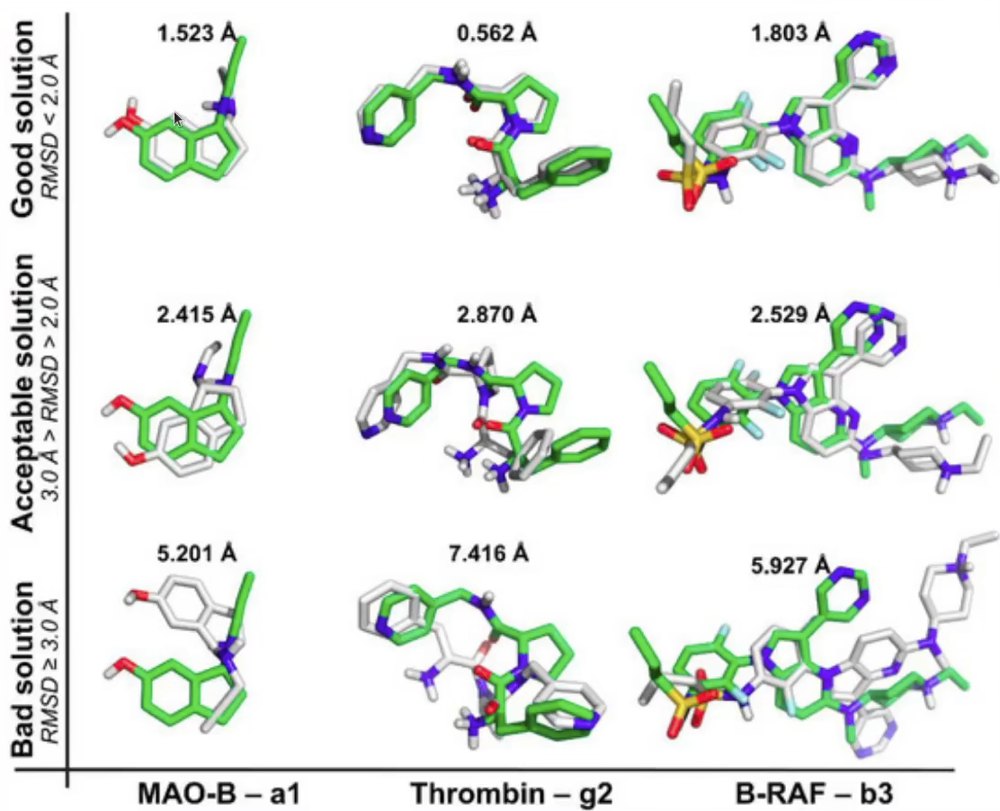
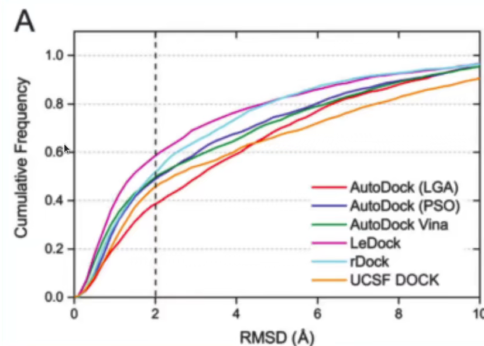
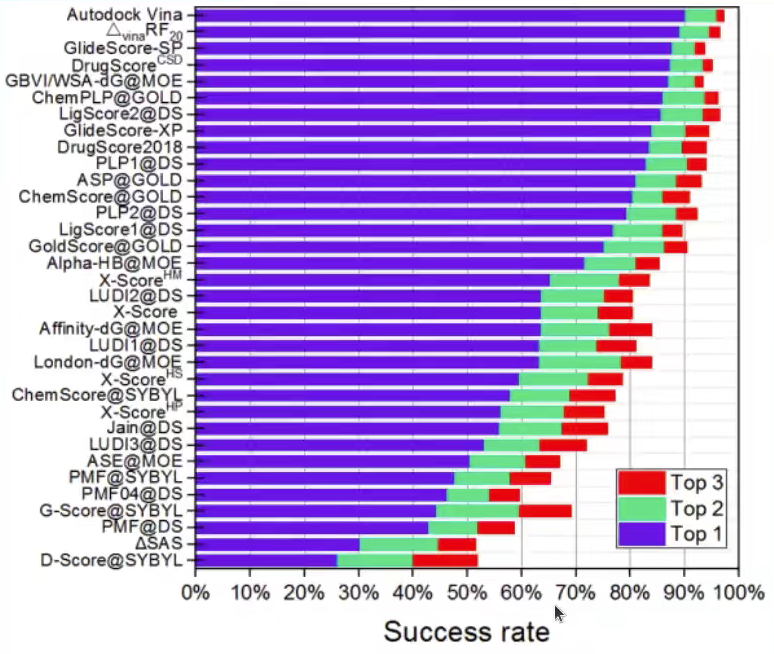
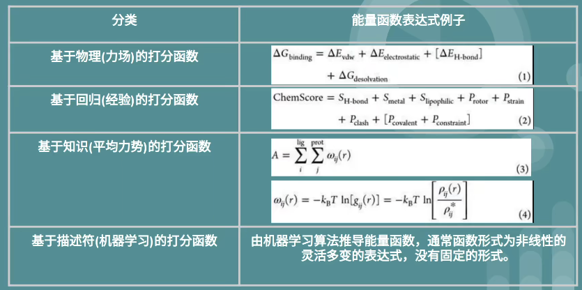
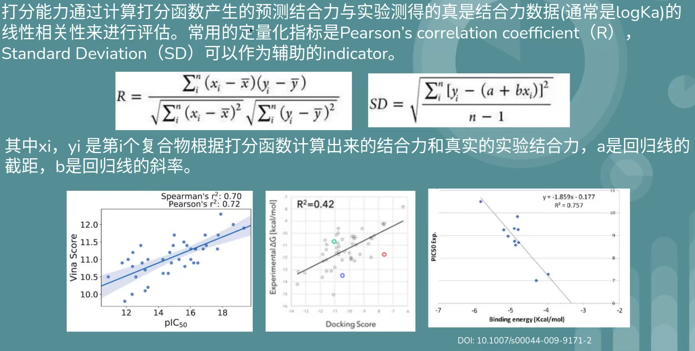
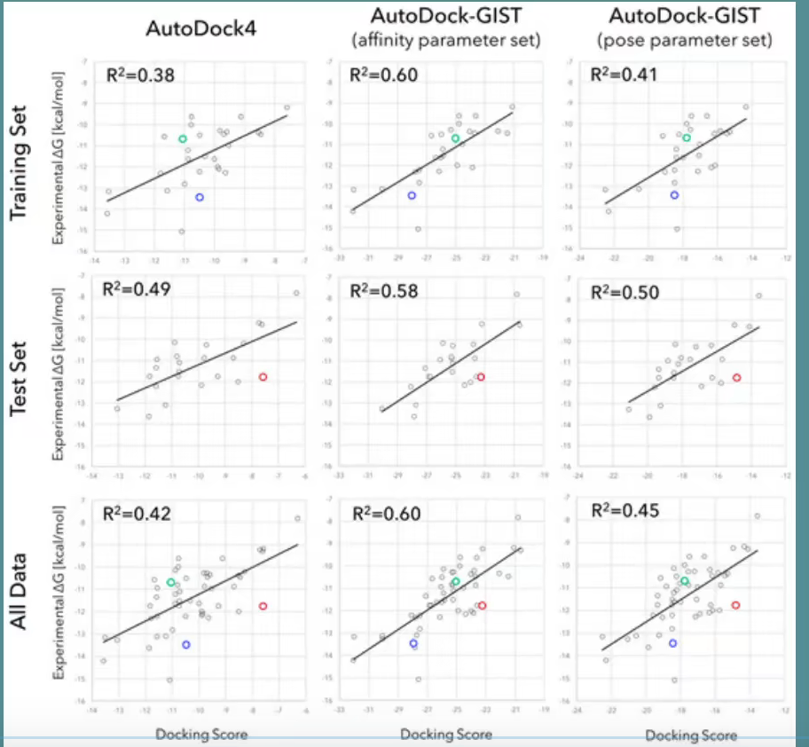
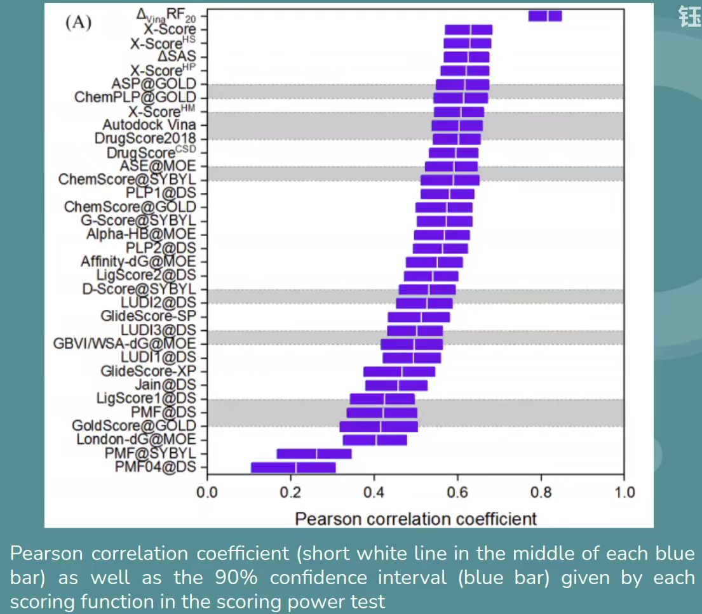
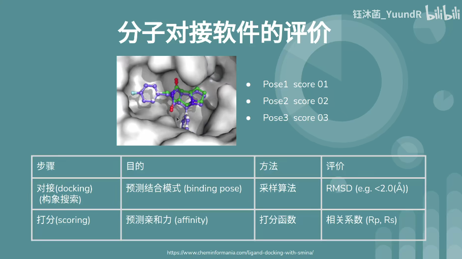

# Docking 软件

## 总结

http://www.vls3d.com/index.php/links/bioinformatics/protein-protein-interaction/protein-protein-docking

LeDock, http://www.lephar.com/download.htm

HADDOCK 蛋白质-蛋白质复合物，精度很高。

rigid body 

- ZDOCK
- pyDock
- ClusPro

flexible server

- SwarmDock
- HADDOCK

Desta,I.T. et al. (2020) Performance and Its Limits in Rigid Body Protein-Protein Docking. Structure, 28, 1071-1081.e3.

性能：SwarmDock > ZDOCK

## SwarmDock

https://link.springer.com/protocol/10.1007/978-1-0716-0708-4_11

## 指标

原子位置的均方根偏差（Root-mean-square deviation, RMSD）

$$RMSD=\sqrt{\frac{1}{N}\sum_{i=1}^N \delta_i^2}$$

$\delta$ 是 n 对等原子之间的距离。

一般认为 RMSD < 2，就认为预测是成功的。

如图所示，最上面的三个就匹配很好，RMSD 都小于 2.

下图则将 2 A 作为阈值，小于 2A 才认为对接成功，从纵坐标看，在 2A 处纵坐标值越大，说明该预测软件的成功率越大。

还有下图这种形式，横坐标是 $RMSD < 2A$，Top 1 表示用打分最高的匹配，Top 2 表示打分前 2 的 2 个结果。

## 打分函数

|分类|函数|
|---|---|
|基于物理（力场）的打分函数|$$

R 值越接近 1，打分函数越好。

这里白线表示 R，紫色条带表示 90% 置信区间。

软件筛选：

- 首先，看哪些软件是可以用的
- 看 PDB 数据库有没有你分析蛋白的结晶结构
  - 如果有，对该晶体结构，使用所有软件进行 redocking
  - 看哪个软件 redocking 效果最好
- 如果没有晶体结构，但是有该蛋白的亲和性数据
  - 用每个软件进行 docking
  - 看哪个软件构效关系、对接打分和真实亲和数据更相关

## 对比

https://www.bilibili.com/video/BV1tV411B7Sn

本研究基于PBDbind数据库(2014版)的2002个蛋白-配体复合物结构，评估了10个对接软件的采样性能和评分性能。

(1)  GOLD和LeDock具有最好的采样性能(GOLD:59.8%的最高分pose准确率；LeDock:80.8%的最佳pose准确率)。

(2)  AutoDockVina、GOLD与MOE Dock的评分性能最好，最高分pose的rp/rs 分别是 0.564/0.580、0.500/0.515和0.569/0.589。

## 蛋白-蛋白对接

Hex Protein Docking, ZDock, rDock 以及 Rosetta 等：

- Hex Protein Docking 算法复杂，耗时长
- ZDock 一般作为前期的初对接
- rDock 为 ZDock 的升级算法，一般将 ZDock 对接后的前几个得分构象使用 rDock 进行进一步对接
- Rosetta

蛋白-蛋白对接也分为柔性对接和刚性对接两种。

- 刚性对接中蛋白质的主链固定，只进行移动或转动，这种方法精度较低，但是耗时短，计算量小。在实际操作中可以用蒙特卡洛算法产生的大量随机来达到期望的精度；
- 柔性对接中两个蛋白质的主链进行移动程度的摆动，更加符合实际情况，但是这种方法耗时长，不过可以用较小样本量达到预定的精度。

## 参考

- Pagadala,N.S. et al. (2017) Software for molecular docking: a review. Biophys Rev, 9, 91–102.
- https://www.computabio.com/molecular-docking-software.html
- https://click2drug.org/
- https://www.capri-docking.org/
