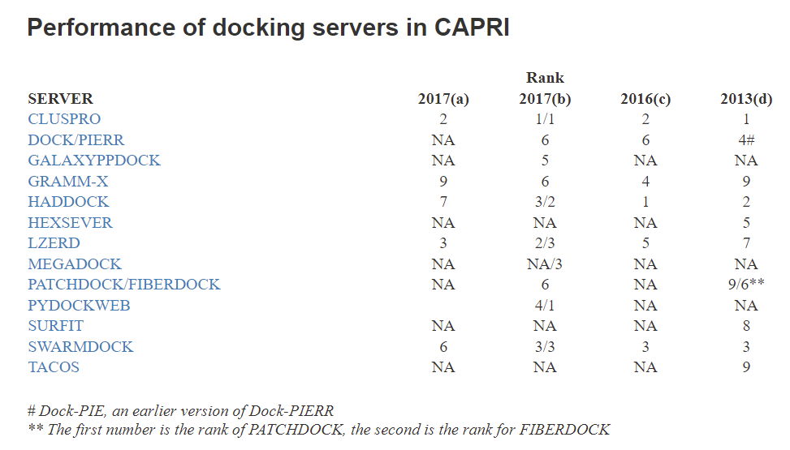

# 刚性对接

- [刚性对接](#刚性对接)
  - [简介](#简介)
  - [刚性对接精度](#刚性对接精度)
  - [流程](#流程)
  - [参考](#参考)

2022-01-25, 10:19
***

## 简介

刚性对接产生大量具有良好表面互补性的对接构象，然后利用近似自由能对这些构象进行排序。基于快速傅里叶变换（FFT）的方法利用静电相互作用和溶剂化项系统地探索连接构象空间，但其潜力受相关函数的限制。另外，还有使用计算机视觉、遗传算法、布尔算法等。傅里叶变换也可以使用球面调和分解来加速三维旋转空间的搜索，如 FRODOCK。为了进一步改进 FFT，**RDOCK** 加入原子接触能来估计脱溶剂能，**ZDOCK** 加入了静电校正。

还有其他类型的基于 FFT 的没有使用 3D 网格搜索的刚性对接工具，如 HEX。HEX 在旋转和平移空间都使用了球面极坐标傅里叶相关。此外，使用一些现代工具包（如 3D 卷积库）和硬件加速工具（如 GPU），基于 FFT 的算法计算效率进一步提高。对接软件 **DOT** 对一个分子进行系统的刚性搜索，对第二个分子进行平移和旋转定向，利用 FFT 有效地计算生成的所有构型的分子间静电能和原子脱溶能之和，作为相关函数。

**MEGADOCK** 与 ZDOCK 类似，它使用 FFT 在基于网格的 3D 空间中生成个对象构象。但是 MEGADOCK 的计算速度比 ZDOCK 快 8.8 倍，这是因为 MEGADOCK 的打分函数更简单，只考虑形状互补和静电效应。

后来，在 FFT 中发展了一种软对接方法，将配体和受体视为刚体，但是在计算构象变化时允许一定程度的蛋白间渗透（**pyDockTET**）。

其它程序，如 SOFTDOCK,BiGGER, SKE-DOCK 等。在进行网格搜索时，网格点被占据时标记为 1，否则为 0.基于网格的系统与基于 FFT 的网格搜索类似，只是网格上的值更简单。虽然配体-蛋白质的亲和力主要由互补的物理化学特征决定，但是形状互补已成为刚性对接程序的重要组成部分。除了静电相互作用，**MolFit FFT** 纳入基于几何的疏水互补性，以计算蛋白质-蛋白质复合物的界面。**PIPER** 使用原子之间的相互作用势预测两个蛋白质之间的相互作用。在离散 6D 空间评估形状互补、静电和脱溶能对打分函数的贡献。由于特征值特征向量的分解，PIPER 获得的结构与 native 构象非常接近(Kozakov et al. 2006)。

## 刚性对接精度

如果配体与活性位点的结合距离比 X 射线溶液的给定阈值更小，则认为对接成功。例如，使用 DOCK 程序发现一种 HIV 的天冬氨酸蛋白酶的高效抑制剂，但是实际效果低几个数量级，不适合临床使用。不过，这种分子可以作为先导化合物，用于设计更有效的抑制剂。

https://www.capri-docking.org/

https://www.capri-docking.org//resources/#performance-of-docking-servers-in-capri

根据 CAPRI 实验，ClusPro server 值得尝试。

## 流程

## 参考

- Pagadala,N.S. et al. (2017) Software for molecular docking: a review. Biophys Rev, 9, 91–102.
