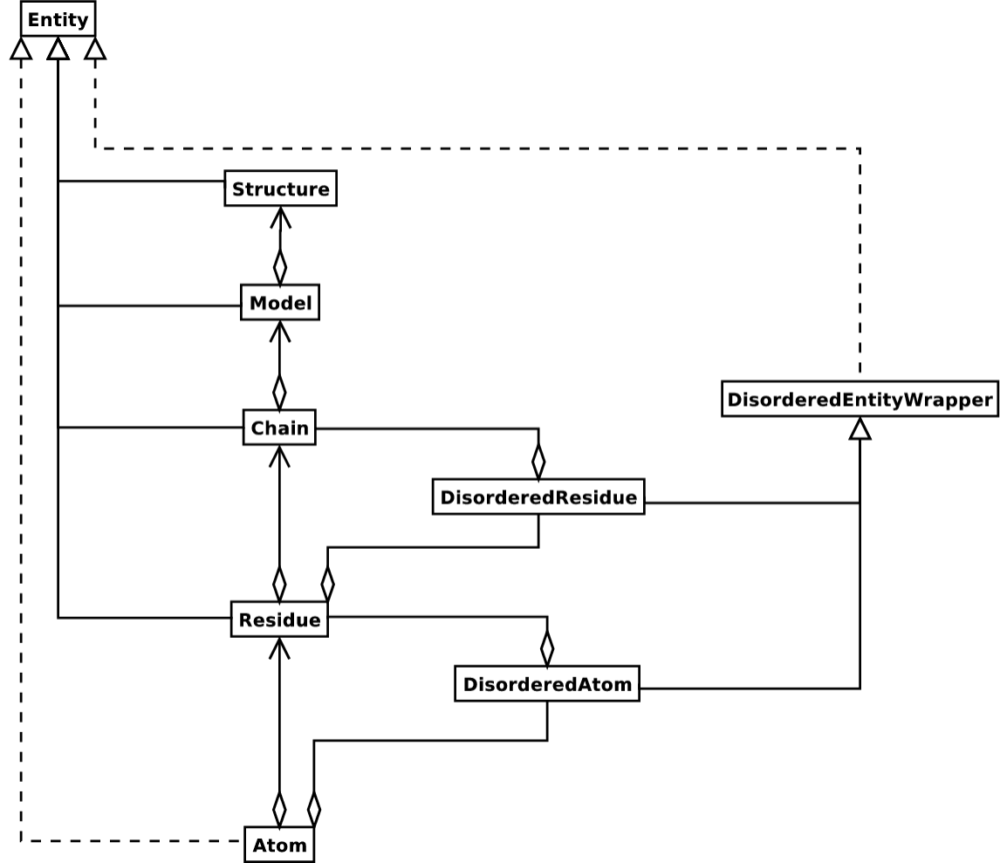

# PDB 格式

- [PDB 格式](#pdb-格式)
  - [简介](#简介)
  - [格式](#格式)
    - [语法和格式](#语法和格式)
    - [格式示例](#格式示例)
  - [常用字典项](#常用字典项)
    - [atom_site](#atom_site)
    - [audit_conform](#audit_conform)
    - [database_2](#database_2)
    - [entry](#entry)
  - [PDB 格式说明](#pdb-格式说明)
    - [Title Section](#title-section)
      - [HEADER](#header)
  - [BioPython 解析](#biopython-解析)
    - [晶体结构文件读写](#晶体结构文件读写)
      - [读 mmCIF](#读-mmcif)
      - [写 mmCIF](#写-mmcif)
    - [结构表示](#结构表示)
      - [Structure](#structure)
      - [Model](#model)
      - [Chain](#chain)
      - [Residue](#residue)
      - [Atom](#atom)
    - [无序](#无序)
      - [通用方法](#通用方法)
    - [结构分析](#结构分析)
      - [距离](#距离)
      - [计算角度](#计算角度)
    - [PDB 文件常见问题](#pdb-文件常见问题)
    - [访问 PDB](#访问-pdb)
      - [从 PDB 下载结构](#从-pdb-下载结构)
      - [下载整个 PDB](#下载整个-pdb)
      - [更新本地 PDB 副本](#更新本地-pdb-副本)
  - [参考](#参考)

2021-07-27, 10:39
***

## 简介

PDB 文件中存储的主要信息包括列出了每个结构的原子及其在空间中的 3D 位置的坐标文件，以及关于结构、序列和实验的摘要信息。有多种格式可用，包括 PDBx/mmCIF、PDB 和 XML。

## 格式

PDBx/mmCIF 文件格式和数据字典是 wwPDB 数据沉积、注释和打包的基础。

最初的 CIF（Crystallographic Information File）格式和字典是为存档小分子晶体实验开发的。1997 年，字典被扩展为包括大分子晶体实验相关数据（PDBx/mmCIF）。该格式克服了传统PDB文件的局限性，支持大型结构、复杂化学和新的混合实验方法的数据。传统的 PDB 格式不再更新，也不会扩展添加新的内容，后面会完全被 PDBx/mmCIF 格式取代。

PDBx/mmCIF 格式十分强大，PDBx/mmCIF 明确记录了常见数据项之间的关系，如原子，残基等。mmCIF/PDBx Exchange Dictionary 提供元数据（数据类型、范围、词汇表等）。可视化程序（Jmol, Chimera, OpenRasMol）和结构测定系统（CCP4、Phenix 等）都支持该格式。

格式要点：

- PDBx/mmCIF 采用上下文无关的无语。数据以 key-value 或表示样式表示，因此解析比 PDB 个容易；
- column 宽度没有限制；
- 在 [PDBx Exchange Dictionary](https://mmcif.wwpdb.org/dictionaries/mmcif_pdbx_v50.dic/Index/) 中明确定义了常见数据项之间的关系；
- mmCIF/PDBx Exchange Dictionary 提供元数据（数据类型、数值范围、词汇表等），可用于生成验证 mmCIF 解析器或数据库加载器；
- 可用的解析工具（C/C++, Java, Python, Perl, Fortran）和工具包（BioJaav, BioPython）；
- 每个条目都提供了实验样本残基和模型坐标之间的映射信息；
- PDB 化学参考数据以 PDBx/mmCIF 格式维护和分发。

### 语法和格式

PDBx/mmCIF 使用 ASCII 字符集。

所有数据项由名称标识，名称以下划线开头，包括类别名称和属性名称。

类别名称和属性名称以点号分隔:

```txt
_citation.year
```

这种类别和属性的组合成为 mmCIF token。

数据类别有两种呈现方式：key-value 和 表格。

在 key-value 样式中，mmCIF token 后面直接跟着相应的值。下面是 4hhb 的单元格参数：

```txt
_cell.entry_id           4HHB
_cell.length_a           63.150
_cell.length_b           83.590
_cell.length_c           53.800
_cell.angle_alpha        90.00
_cell.angle_beta         99.34
_cell.angle_gamma        90.00
_cell.Z_PDB              4
```

当一个 token 有多个值时，则使用表格样式。在该样式中，一个 `loop_token` 后面跟着数据项名称，然后是空格分隔的数值。下面是 4hhb 坐标记录的开头部分。其中 `atom_site` 类别中的数据项用于描述原子的识别符和坐标：

```txt
loop_
_atom_site.group_PDB
_atom_site.id
_atom_site.type_symbol
_atom_site.label_atom_id
_atom_site.label_alt_id
_atom_site.label_comp_id
_atom_site.label_asym_id
_atom_site.label_entity_id
_atom_site.label_seq_id
_atom_site.pdbx_PDB_ins_code
_atom_site.Cartn_x
_atom_site.Cartn_y
_atom_site.Cartn_z
_atom_site.occupancy
_atom_site.B_iso_or_equiv
_atom_site.pdbx_formal_charge
_atom_site.auth_seq_id
_atom_site.auth_comp_id
_atom_site.auth_asym_id
_atom_site.auth_atom_id
_atom_site.pdbx_PDB_model_num
ATOM   1    N  N   . VAL A 1 1   ? 6.204   16.869  4.854   1.00 49.05 ? 1   VAL A N   1
ATOM   2    C  CA  . VAL A 1 1   ? 6.913   17.759  4.607   1.00 43.14 ? 1   VAL A CA  1
ATOM   3    C  C   . VAL A 1 1   ? 8.504   17.378  4.797   1.00 24.80 ? 1   VAL A C   1
ATOM   4    O  O   . VAL A 1 1   ? 8.805   17.011  5.943   1.00 37.68 ? 1   VAL A O   1
ATOM   5    C  CB  . VAL A 1 1   ? 6.369   19.044  5.810   1.00 72.12 ? 1   VAL A CB  1
ATOM   6    C  CG1 . VAL A 1 1   ? 7.009   20.127  5.418   1.00 61.79 ? 1   VAL A CG1 1
ATOM   7    C  CG2 . VAL A 1 1   ? 5.246   18.533  5.681   1.00 80.12 ? 1   VAL A CG2 1
```

第一个数据项名称对应第一列数据，第二个数据线名称对应第二列数据，以此类推。因此，`_atom_site.type_symbol` 和第 3 列的原子类型对应。

### 格式示例

PDBx/mmCIF 格式的主要优点之一是对单个 PDB 条目中表示的原子、残基或链的数目没有限制。PDB 格式中定义的所有数据项在 PDBx/mmCIF 格式中都有[相应的数据项](https://mmcif.wwpdb.org/docs/pdb_to_pdbx_correspondences.html)，并且在 PDBx Exchange Data Dictionary 中精确定义了每个数据项。

例如，PDB 中 `AUTHOR` 包含记录的作者：

```txt
AUTHOR   G.FERMI,M.F.PERUTZ
```

在 PDBx/mmCIF 中以 `audit_author` 类别表示：

```txt
loop_

_audit_author.name
_audit_author.pdbx_ordinal
'Fermi, G.'    1
'Perutz, M.F.' 2
```

PDBx/mmCIF 以包含相关数据的类别来组织信息。在上例中，`audit_author` 类别包含数据项 `.name` 和 `.pdbx_ordinal`。`.name` 数据项包含作者的姓氏和首字母，`.pdbx_ordinal`定义了作者姓名在作者列表中的顺序。

如果同一个类别中的数据项有多列，则该类别前面以 `loop_token` 开始。然后数据名称后跟着重复数值行。

例如，PDB 文件中 4HHB 的 JRNL 记录中包括四个作者的引用：

```txt
JRNL        AUTH   G.FERMI,M.F.PERUTZ,B.SHAANAN,R.FOURME
JRNL        TITL   THE CRYSTAL STRUCTURE OF HUMAN DEOXYHAEMOGLOBIN AT 1.74 A
JRNL        TITL 2 RESOLUTION
JRNL        REF    J.MOL.BIOL.                   V. 175   159 1984
JRNL        REFN                   ISSN 0022-2836
JRNL        PMID   6726807
JRNL        DOI    10.1016/0022-2836(84)90472-8
```

然后，在PDB 格式中继续添加其它几个引用：

```txt
REMARK   1 REFERENCE 1
REMARK   1  AUTH   M.F.PERUTZ,S.S.HASNAIN,P.J.DUKE,J.L.SESSLER,J.E.HAHN
REMARK   1  TITL   STEREOCHEMISTRY OF IRON IN DEOXYHAEMOGLOBIN
REMARK   1  REF    NATURE                        V. 295   535 1982
REMARK   1  REFN                   ISSN 0028-0836
```

`_citation_author` 类别循环列出引用的作者：

```txt
loop_
_citation_author.citation_id
_citation_author.name
_citation_author.ordinal
primary 'Fermi, G.'     1
primary 'Perutz, M.F.'  2
primary 'Shaanan, B.'   3 
primary 'Fourme, R.'    4 
1       'Perutz, M.F.'  5 
1       'Hasnain, S.S.' 6 
1       'Duke, P.J.'    7 
1       'Sessler, J.L.' 8 
1       'Hahn, J.E.'    9 
2       'Fermi, G.'     10
2       'Perutz, M.F.'  11
3       'Perutz, M.F.'  12
4       'Teneyck, L.F.' 13
4       'Arnone, A.'    14
5       'Fermi, G.'     15
6       'Muirhead, H.'  16
6       'Greer, J.'     17
```

JRNL 记录中余下信息在 `related_citation` 类别中：

```txt
_citation.title
_citation.journal_abbrev
_citation.journal_volume
_citation.page_first
_citation.page_last
_citation.year
```

## 常用字典项

### atom_site

ATOM_SITE 类别中记录了大分子晶体结构中原子位置的相信信息，包括原子坐标、位移参数、磁矩和方向等。如果在 ATOM_SITE_ANTISOTROP 类别中没有给出各向异性原子位移参数，此处也会给出该信息。

示例：

```txt
loop_
_atom_site.group_PDB
_atom_site.type_symbol
_atom_site.label_atom_id
_atom_site.label_comp_id
_atom_site.label_asym_id
_atom_site.label_seq_id
_atom_site.label_alt_id
_atom_site.Cartn_x
_atom_site.Cartn_y
_atom_site.Cartn_z
_atom_site.occupancy
_atom_site.B_iso_or_equiv
_atom_site.footnote_id
_atom_site.auth_seq_id
_atom_site.id
ATOM N  N   VAL  A  11  .  25.369  30.691  11.795  1.00  17.93  .  11   1
ATOM C  CA  VAL  A  11  .  25.970  31.965  12.332  1.00  17.75  .  11   2
ATOM C  C   VAL  A  11  .  25.569  32.010  13.808  1.00  17.83  .  11   3
ATOM O  O   VAL  A  11  .  24.735  31.190  14.167  1.00  17.53  .  11   4
ATOM C  CB  VAL  A  11  .  25.379  33.146  11.540  1.00  17.66  .  11   5
ATOM C  CG1 VAL  A  11  .  25.584  33.034  10.030  1.00  18.86  .  11   6
ATOM C  CG2 VAL  A  11  .  23.933  33.309  11.872  1.00  17.12  .  11   7
ATOM N  N   THR  A  12  .  26.095  32.930  14.590  1.00  18.97  4  12   8
ATOM C  CA  THR  A  12  .  25.734  32.995  16.032  1.00  19.80  4  12   9
ATOM C  C   THR  A  12  .  24.695  34.106  16.113  1.00  20.92  4  12  10
ATOM O  O   THR  A  12  .  24.869  35.118  15.421  1.00  21.84  4  12  11
ATOM C  CB  THR  A  12  .  26.911  33.346  17.018  1.00  20.51  4  12  12
ATOM O  OG1 THR  A  12  3  27.946  33.921  16.183  0.50  20.29  4  12  13
ATOM O  OG1 THR  A  12  4  27.769  32.142  17.103  0.50  20.59  4  12  14
ATOM C  CG2 THR  A  12  3  27.418  32.181  17.878  0.50  20.47  4  12  15
ATOM C  CG2 THR  A  12  4  26.489  33.778  18.426  0.50  20.00  4  12  16
ATOM N  N   ILE  A  13  .  23.664  33.855  16.884  1.00  22.08  .  13  17
ATOM C  CA  ILE  A  13  .  22.623  34.850  17.093  1.00  23.44  .  13  18
ATOM C  C   ILE  A  13  .  22.657  35.113  18.610  1.00  25.77  .  13  19
ATOM O  O   ILE  A  13  .  23.123  34.250  19.406  1.00  26.28  .  13  20
ATOM C  CB  ILE  A  13  .  21.236  34.463  16.492  1.00  22.67  .  13  21
ATOM C  CG1 ILE  A  13  .  20.478  33.469  17.371  1.00  22.14  .  13  22
ATOM C  CG2 ILE  A  13  .  21.357  33.986  15.016  1.00  21.75  .  13  23
# - - - - data truncated for brevity - - - -
HETATM C C1 APS  C   .  1   4.171  29.012   7.116  0.58  17.27  1 300  101
HETATM C C2 APS  C   .  1   4.949  27.758   6.793  0.58  16.95  1 300  102
HETATM O O3 APS  C   .  1   4.800  26.678   7.393  0.58  16.85  1 300  103
HETATM N N4 APS  C   .  1   5.930  27.841   5.869  0.58  16.43  1 300  104
# - - - - data truncated for brevity - - - -
```

|字典项|说明|
|---|---|
|_atom_site.Cartn_x|原子 x 坐标|
|_atom_site.Cartn_y|原子 y 坐标|

### audit_conform

AUDIT_CONFORM 类别中的数据项描述当前数据中数据名称对应的字典版本。例如：

```txt
_audit_conform.dict_name         cif_core.dic
_audit_conform.dict_version      2.3.1
_audit_conform.dict_location
                        ftp://ftp.iucr.org/pub/cif_core.2.3.1.dic
```

### database_2

DATABASE_2 类别中的数据项记录中数据块的数据库标识符的信息。

这些数据项由数据库管理者分配，只有当数据块来源于此，才能分配给该数据块。

因为 DATABASE 类别已经被使用，所以才使用 DATABASE_2 名称。实例：

```txt
_database_2.database_id                'PDB'
_database_2.database_code              '5HVP'
```

|Item|说明|
|---|---|
|_database_2.database_id|数据库识别符|
|_database_2.database_code|数据库代码|

### entry

在 ENTRY 类别中只有一项，即 `_entry.id`。该项为此结构的名称。


## PDB 格式说明

PDB 格式是包含原子坐标文件的标准格式。它被用于蛋白质数据库中的结构存储。

### Title Section

该部分包含实验描述和生物大分子信息：HEADER, OBSLTE, TITLE, SPLIT, CAVEAT, COMPND, SOURCE, KEYWDS, EXPDTA, AUTHOR, REVDAT, SPRSDE, JRNL, and REMARK records.

#### HEADER

HEADER 的 idCode 字段提供唯一的 PDB 标识符、分类信息以及存档时间。

|COLUMNS|DATA  TYPE|FIELD|DEFINITION|
|---|---|---|---|
|1-6|Record name|"HEADER"||
|11-50|String(40)|classification|Classifies the molecule(s)|
|51-59|Date      |depDate       |Deposition date. This is the date the coordinates  were received at the PDB|
|63-66|IDcode|idCode|This identifier is unique within the PDB|

## BioPython 解析

Biopython 的 `Bio.PDB` 包提供了 pdb 格式文件解析功能。

### 晶体结构文件读写

#### 读 mmCIF

```py
>>> from Bio.PDB.MMCIFParser import MMCIFParser
>>> parser = MMCIFParser() # 创建 MMCIFParser 对象
>>> structure = parser.get_structure("1fat", "1fat.cif") # 创建结构对象

# 使用 MMCIF2Dict 类实现底层访问，将标签映射为列表
>>> from Bio.PDB.MMCIF2Dict import MMCIF2Dict
>>> mmcif_dict = MMCIF2Dict("1FAT.cif")
>>> y_list = mmcif_dict["_atom_site.Cartn_y"]
```

#### 写 mmCIF

使用 `MMCIFIO` 类将结构输出为 mmCIF 文件：

```py
>>> io = MMCIFIO()
>>> io.set_structure(s)
>>> io.save("out.cif")
```

### 结构表示

`Structure` 对象总体布局按照 SRCRA（Structure/Model/Chain/Residue/Atom）架构组织：

- structure 由 model组成；
- model 由 chain 组成；
- chain 由 residue 组成；
- residue 由 atom 组成。

如下图所示：



该数据结构不一定是最适合表示大分子结构的方式，但是对描述结构的文件数据（PDB 或 MMCIF）却是十分合适。如果该层次结构不能表示结构文件的内容，则肯定该文件包含错误或没有明确描述的结构内容。如果无法生成 SMCRA 数据结构，则有理由怀疑存在文件。

`Structure`, `Model`, `Chain` 和 `Residue` 都是 `Entity` 的子类。`Atom` 类部分实现 `Entity` 接口，因为 `Atom` 没有子项。

对每个 `Entity` 的子类，可以通过子项的 id 访问子项，例如可以使用原子名称从 `Residue` 对象提取 `Atom` 对象，使用链的识别符从 `Model` 对象获得 `Chain` 对象。

无序的原子和残基分别由 `DisorderedAtom` 和 `DisorderedResidue` 类表示，两者都是 `DisorderedEntityWrapper` 的子类。它们隐藏和无序相关的复杂性，其行为与 `Atom` 和 `Residue` 完全相同。

一般来说，`Entity` 子项（`Atom`, `Residue`, `Chain`, `Model`）可以通过 `id` 作为 key 从其父对象提取：

```py
>>> child_entity = parent_entity[child_id]
```

也可以直接获得 `Entity` 的所有子项，返回的列表以特定方式排序（例如识别符）：

```py
>>> child_list = parent_entity.get_list()
```

也可以获得子节点的父对象：

```py
parent_entity = child_entity.get_parent()
```

在 SMCRA 层次结构的所有级别上，可以提取一个完整 id。完整 id 是一个 tuple 对象，包含从顶部对象（Structure）到当前对象的所有 id。例如，一个 `Residue` 的完整 id：

```py
>>> full_id = residue.get_full_id()
>>> print(full_id)
("1abc", 0, "A", ("", 10, "A"))
```

说明：

- "1abc" 为 `Structure` id；
- 0 为 `Model` id；
- "A" 为 `Chain` id;
- ("", 10, "A") 为 `Residue` id。

`Residue` 的 id 表明它不是杂原子，因为其 hetero 字段为空，其序列识别符为 10，插入代码为 “A”.

> 在 PDB 数据文件格式中，每个原子被指定为 `ATOM` 或 `HETATM`（表示杂原子）。`ATOM` 用于蛋白质、DNA或RNA中标准残基的原子。`HETATM` 则用于非标准残基以及其它类型基团的原子，如碳水化合物、底物、配体、溶剂以及金属原子。
> 同时，标准氨基酸、核苷酸如果作为配体，也被指定为 `HETATM`。

使用 `get_id` 获得 `Entity` 的 id:

```py
>>> entity.get_id()
```

使用 `has_id` 方法查看是否包含指定子项：

```py
>>> entity.has_id(entity_id)
```

`Entity` 的长度对应包含的子项数：

```py
>>> nr_children = len(entity)
```

可以从父项中删除、重命名、添加子项等操作，但是没有检查功能，例如可以在一条链中添加 id 相同的两个残基。

#### Structure

`Structure` 对象的 id 是字符串，包含多个 `Model` 子项。不过大多数晶体结构只包含一个 `Model`，而 NMR 结构一般包含多个 `Model`。

晶体结构的无序也会产生多个 `Model`。

#### Model

`Model` 的 id 为整数类型，直接从 `Model` 在文件中的位置派生而来，从 0 开始自动编号。许多 PDB 解析器默认只有一个 model，但是 Bio.PDB 可以处理多个 `Model`，例如，获取 `Structure` 的第一个 Model:

```py
>>> first_model = structure[0]
```

#### Chain

`Chain` 对象的 id 派生自 PDB/mmCIF 文件中的 chain 识别符，为单个字符，一般是一个字母。`Model` 的每条 `Chain` 都有一个唯一的 id。例如，从 `Model` 对象获取识别符为 "A" 的 `Chain` 对象：

```py
>>> chain_A = model["A"]
```

#### Residue

residue 的 id 是包含三个元素的 tuple:

- `hetero-field` 字段
  - 'W' 表示水分子；
  - 'H_' 后面跟着其它杂残基的名字，如 'H_GLC' 表示葡萄糖分子；
  - 空表对应标准氨基酸或核酸
- 序列识别符（resseq），一个整数，用于描述残基在链中的位置；
- 插入码（icode），字符串，如 'A'。插入码有时用来表示某种残基编号方案。例如 Ser 80 插入突变（插入 Thr 80 和 Asn 81 之间）

`Residue` 包含一组 `Atom` 子对象，同时包含字符串名称。

例如，Asn 10 插入码为空的残基 id 为 ('', 10, '')。Water 10 的残基 id 为 （'W', 10, ''）。葡萄糖分子（hetero 名称为 GLC），如果序列识别符为 10，则其残基 id 为 ('H_GLC', 10, '')。采用该方法，这三个残基可以是同一条的一部分（相同序列 id 和插入码），因为它们的残基 id 不同。

大多情况，hetflag 和插入码为空，如 ('', 10, '')。此时可以使用序列识别符代替完整 id:

```py
# use full id
>>> res10 = chain[(" ", 10, " ")]
# use shortcut
>>> res10 = chain[10]
```

`Chain` 对象中的每个 `Residue` 对象都应该有一个唯一 id。不过，无序残基作特殊处理。

`Residue` 对象还有许多额外方法：

```py
>>> residue.get_resname() # returns the residue name, e.g. "ASN"
>>> residue.is_disordered() # returns 1 if the residue has disordered atoms
>>> residue.get_segid() # returns the SEGID, e.g. "CHN1"
>>> residue.has_id(name) # test if a residue has a certain atom
```

可以使用 `is_aa(residue)` 测试 `Residue` 对象是否为氨基酸。

#### Atom

`Atom` 对象存储原子相关的信息，没有子项。原子的 `id` 就是原子名称，例如 Ser 的侧链氧原子用 "OG" 表示。一个残基中的原子 id 必须唯一。

原子 id 就是原子名称，Bio.PDB 通过去除 PDB 文件中原子名称空格创建 id。

但是在 PDB 文件中，空格也是原子名称的一部分。例如，钙原子表示为 'CA..'，从而和 Cα 原子区分 '.CA.'。对这种情况 Bio.PDB 保留空格。

在 PDB 文件中南，原子名字以 4 个字符标识，包括首尾的空格。氨基酸的 Cα 原子以 ".CA." 表示，点号表示空格。一般移除空格生成原子 name，除了生成重复 name。

存储的原子数据包括原子名称、原子坐标（可能还有标准偏差）、B 因子（各向异性 B 因子和标准偏差）、altloc 说明符和完整的原子名称。不存储使用较少的内容，如 PDB 文件中存储原子的元素号和电荷。

可以使用 `Atom` 的 `transform` 方法操作原子坐标，使用 `set_coord` 方法直接指定原子坐标。

`Atom` 对象还包括如下方法：

```py
>>> a.get_name() # atom name (spaces stripped, e.g. "CA")
>>> a.get_id() # id (equals atom name)
>>> a.get_coord() # atomic coordinates
>>> a.get_vector() # atomic coordinates as Vector object
>>> a.get_bfactor() # isotropic B factor
>>> a.get_occupancy() # occupancy
>>> a.get_altloc() # alternative location specifier
>>> a.get_sigatm() # standard deviation of atomic parameters
>>> a.get_siguij() # standard deviation of anisotropic B factor
>>> a.get_anisou() # anisotropic B factor
>>> a.get_fullname() # atom name (with spaces, e.g. ".CA.")
```

### 无序

Bio.PDB 可以处理无序原子和点突变（如 Gly 和 Ala 残基在同一位置）。

#### 通用方法

无序可以从两个角度来处理：原子和残基。总的来说，我们试图概括无序带来的所有复杂性。

### 结构分析

#### 距离

重载的 minus 运算符用于计算两个原子之间的距离：

```py
# Get some atoms
>>> ca1 = residue1["CA"]
>>> ca2 = residue2["CA"]
# Simply subtract the atoms to get their distance
>>> distance = ca1-ca2
```

即计算两个原子之间的欧氏距离。

#### 计算角度

使用向量表示原子的坐标，然后使用 `Vector` 模块的 `calc_angle` 函数计算角度：

```py
>>> vector1 = atom1.get_vector()
>>> vector2 = atom2.get_vector()
>>> vector3 = atom3.get_vector()
>>> angle = calc_angle(vector1, vector2, vector3)
```

### PDB 文件常见问题

众所周知，许多 PDB 文件包含语义错误（并非结构错误，而是它们在 PDN 文件中的表示有误）。Bio.PDB 通过两种模式处理该问题。`PDBParser` 对象有两种行为方式：

- 严格模式
- 宽松模式（默认）

默认采用宽松模式。例如：

```py
# 宽松模式
>>> parser = PDBParser(PERMISSIVE=1)
>>> parser = PDBParser() # The same (default)
# 严格模式
>>> strict_parser = PDBParser(PERMISSIVE=0)
```

在宽松模式下，PDB 中明显的错误会被修正，这类错误包括：

- 具有相同识别符的多个残基；
- 具有相同识别符的多个原子（包括 altloc 识别符）

在严格模式下，解析带有错误的 PDB 文件抛出错误，这对发现 PDB 文件中的错误很有用。

不过有些错误是可以自动纠正的。通常，每个无序原子都应该有一个非空的 altloc 标识符。然而有许多结构不遵循该约定，并且对同一原子的两个无序位置可能一个空白一个非空。该错误可以自动纠正。

有时一个结构依次包含属于 A 链的一列残基、属于B 链的一列残基，然后又是属于 A 链的一列残基，导致 A 链断开，这类错误也可以自动纠正。

### 访问 PDB

#### 从 PDB 下载结构

可以使用 `PDBList` 的 `retrive_pdb_file` 方法从 PDB 下载结构。其参数为结构的 PDB 识别符：

```py
>>> pdbl = PDBList()
>>> pdbl.retrieve_pdb_file("1FAT")
```

也可以通过命令行使用 `PDBList`:

```shell
python PDBList.py 1fat
```

默认下载 PDBx/mmCIF 格式。

#### 下载整个 PDB

下面的命令将整个 PDB 下载到 '/data/pdb' 目录：

```shell
python PDBList.py all /data/pdb

python PDBList.py all /data/pdb -d
```

对应的 API 方法为 `download_entire_pdb`。添加 `-d` 选项表示将文件保存在相同目录。否则它们根据 PDB ID 保存在 PDB-样式子目录结构。根据网速，下载整个 PDB 需要 2-4 天。

#### 更新本地 PDB 副本

指定本地 PDB 目录，使用 `update_pdb()` 方法更新本地副本：

```py
>>> pl = PDBList(pdb="/data/pdb")
>>> pl.update_pdb()
```

## 参考

- https://www.wwpdb.org/documentation/file-format
- https://pdbeurope.github.io/pdbecif/
- https://mmcif.wwpdb.org/dictionaries/mmcif_pdbx_v50.dic/Items/index.html
