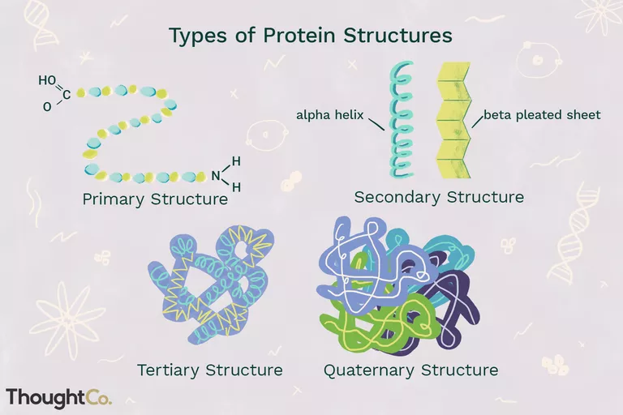
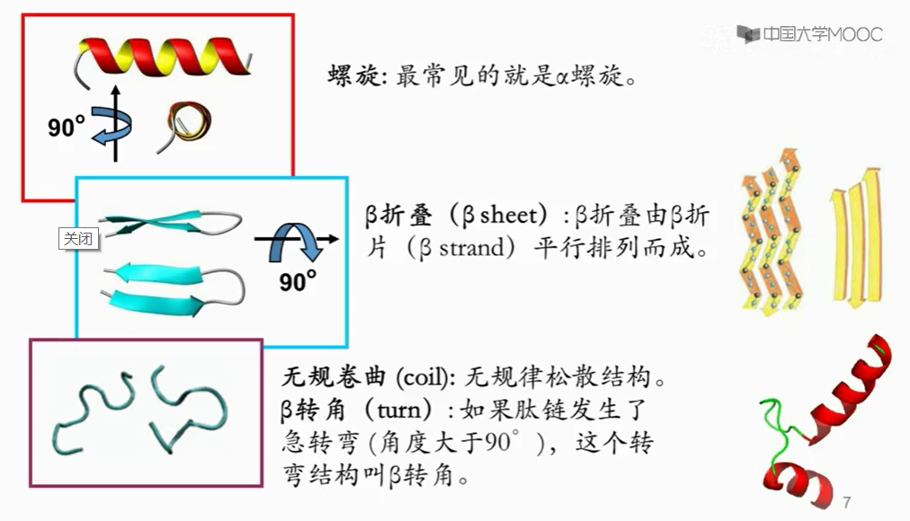
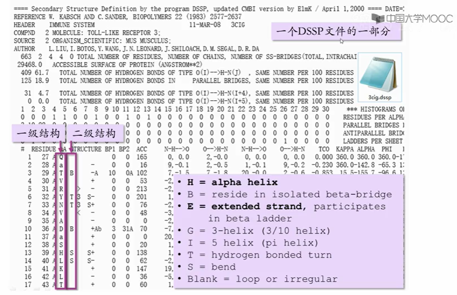
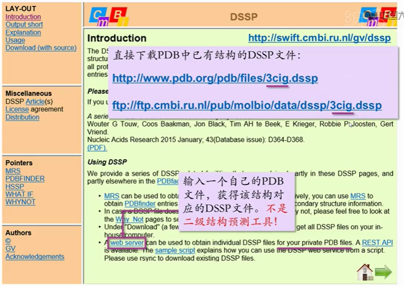
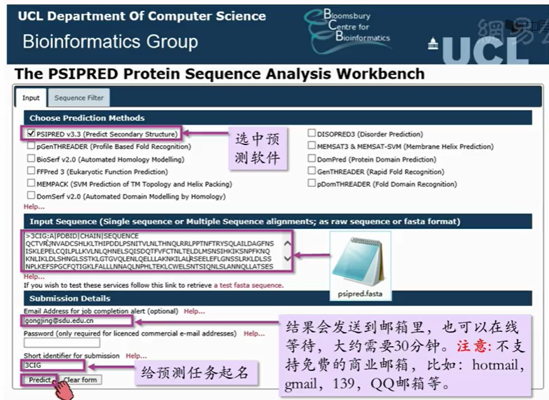
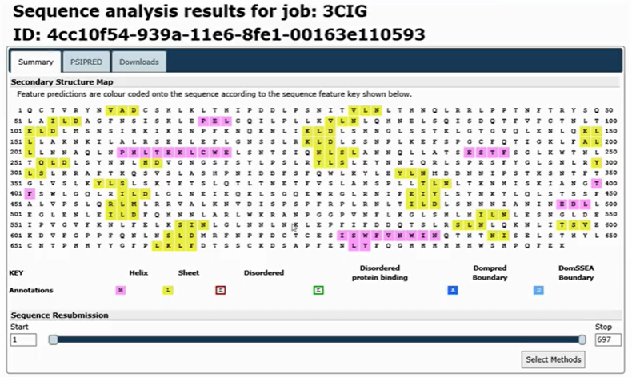
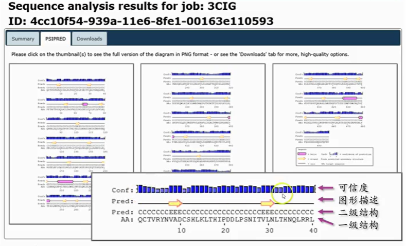

# 蛋白质结构

- [蛋白质结构](#蛋白质结构)
  - [结构分级](#结构分级)
  - [二级结构](#二级结构)
    - [DSSP](#dssp)
    - [二级结构预测](#二级结构预测)
  - [三级结构](#三级结构)

## 结构分级

蛋白质结构可以分为四级：

- 一级结构（Primary structure）为氨基酸序列；
- 二级结构（Secondary structure）为周期性的结构构象；
- 三级结构（Tertiary structure）为整条多肽链的三维空间结构；
- 四级结构（Quaternary structure），多个亚基形成的复合体结构。

## 二级结构

蛋白质经过折叠后会形成规则的片段，这些规则的片段构成了蛋白质的二级结构单元
（上图）。三种常见的二级结构单元包括螺旋、β折叠、和转角：

- 螺旋中最常见的就是α螺旋，但不只有α螺旋，还有其他的螺旋，比如 3 转角螺旋，5 转角螺旋等。
- β折叠由平行排列的β折片组成。这些折片在序列上可能相隔很远，但是在空间结构上并排在一起，彼此间形成氢键。
- 除了螺旋和折叠外，蛋白质结构中还存在大量的无规律松散结构 **coil**。
- 如果这些无规律的肽链突然发生了急转弯，这个转弯结构就叫做 **β转角**。

### DSSP

DSSP （Definition of Secondary Structure of Proteins），即蛋白质二级结构定义词典。DSSP 并不预测二级结构，而是根据二级结构的定义对已经测定三级结构的蛋白质的各个位置指认出是哪种二级结构。

https://swift.cmbi.umcn.nl/gv/dssp/

 
> 🔥 TODO：DSSP 转换工具

### 二级结构预测

|软件名称|网址链接|
|---|---|
|PSIPRED|http://bioinf.cs.ucl.ac.uk/psipred|
|Jpred3|http://www.compbio.dundee.ac.uk/www-jpred/|
|PREDICTPROTEIN|http://www.predictprotein.org/|
|SSpro|http://scratch.proteomics.ics.uci.edu/|
|PSSpred|http://zhanglab.ccmb.med.umich.edu/PSSpred/|
|PREDATOR|http://mobyle.pasteur.fr/cgi-bin/portal.py?#forms::predator|
|GOR V|http://gor.bb.iastate.edu/|

以 PSIPRED 为例：

输出结果：

结果解释：

## 三级结构

三级结构是指整条多肽链的三维空间结构，即，包括骨架和侧链在内的所有原子的空间排列。

