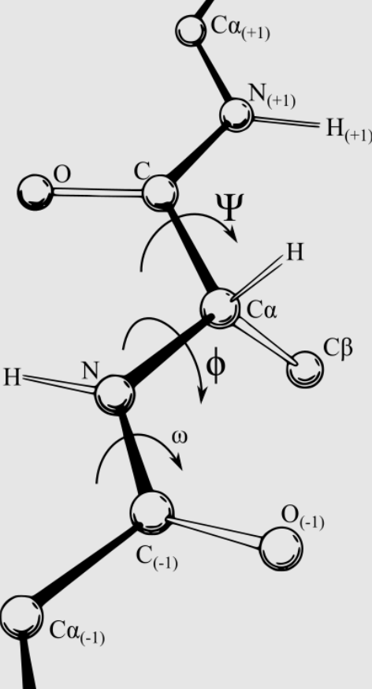

# Ramachandran Plot (拉氏图)

- [Ramachandran Plot (拉氏图)](#ramachandran-plot-拉氏图)
  - [简介](#简介)
  - [参考](#参考)

2022-05-16, 12:51
***

## 简介

拉氏图（Ramachandran plot）最初由 G. N. Ramachandran, C. Ramakrishnan 和 V. Sasisekharan 于 1963 年开发，是一种可视化蛋白质结构中氨基酸残基骨架在能量允许区域的二面角 ψ 和 φ。

下图是二面角 ψ 和 φ 的定义：

肽键的部分双键特性使 ω 角通常为 180°。

拉氏图主要有两种使用方式。一种是显示蛋白质氨基酸残基理论上可能的 ψ 和 φ 的值。另一种是显示单个结构中残基的二面角的分布，用于验证结构。

拉氏图分析每个残基的几何结构和整体的结合结构，判断蛋白质的立体化学质量。 

拉氏图检查 C $\alpha$

## 参考

- https://swissmodel.expasy.org/assess
- https://en.wikipedia.org/wiki/Ramachandran_plot
