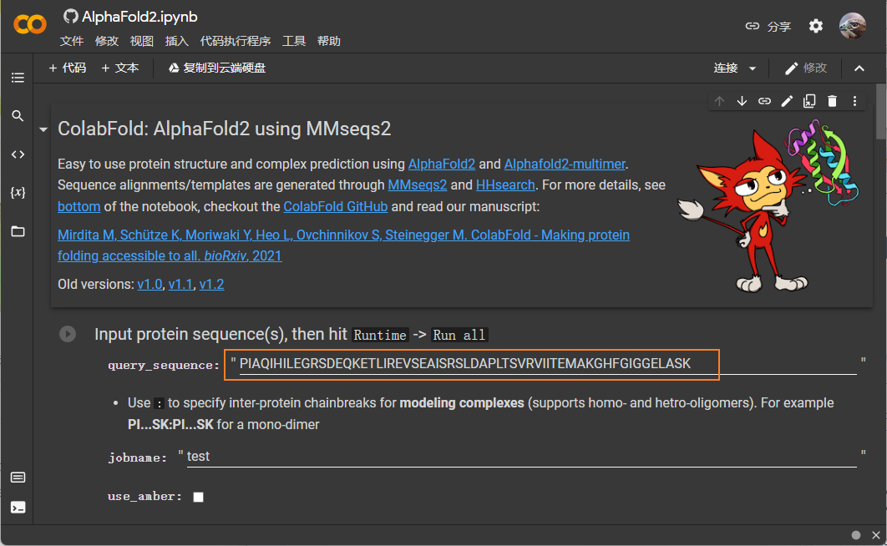

# 蛋白结构预测

## 简介

蛋白结构预测有许多可用的工具，其中 AlphaFold2 精度最高，但是部署 AlphaFold2 对硬件要求很高，大部分人没有配置该硬件。

ColabFold 针对 AlphaFold2 存在的文件，将多序列比对部分进行了加速，并在 Google Colab 上部署了服务，可以满足大部分人的需求。

## 使用工具

对单个蛋白，使用 ColabFold 的 AlphaFold2.ipynb:

https://colab.research.google.com/github/sokrypton/ColabFold/blob/main/AlphaFold2.ipynb

如果预测复合物，使用 ColabFold 的 AlphaFold2_complexes.ipynb：

https://colab.research.google.com/github/sokrypton/ColabFold/blob/main/AlphaFold2_complexes.ipynb

## 使用流程

最基本的使用很简单，打开上面的 jupyter 后：

将序列贴如上面的窗口，然后选择 "代码执行程序" -> "全部执行" 就可以了。
